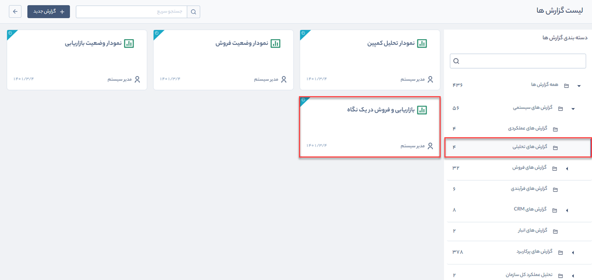

# گزارش بازاریابی و فروش در یک نگاه  
 گزارش بازاریابی و فروش در یک نگاه، از مسیر **گزارش‌های سیستمی** > **گزارش‌های تحلیلی** قابل‌دسترسی است.

> **نکته:**  کاربر برای دریافت گزارش نمودار تحلیل کمپین بایستی مجوز **مدیر فروش** یا **مدیر تبلیغات** و همچنین مجوز **مشاهده گزارش** را داشته باشد.

در این نمودارها تعداد کمپین‌ها، برنامه‌های تبلیغاتی مربوطه، تعداد جامعه هدف، مخاطب مرتبط شده، فرصت، پیش فاکتور، فاکتور و قراردادهای مرتبط به ترتیب و در بازه زمانی قابل انتخاب، نمایش داده می‌شود. همچنین تعداد فعالیت‌های انجام‌شده در نرم افزار، تعداد تماس‌های ورودی، خروجی و ازدست‌رفته را در بازه زمانی تعیین‌شده می‌توان مشاهده کرد.

برای دریافت گزارش بازاریابی و فروش در یک نگاه، به‌صورت زیر عمل کنید:

1.  .نوع بازه زمانی گزارش موردنظر را تعیین کنید.
2. .سال موردنظر برای گزارش‌گیری را در این فیلد انتخاب کنید  
3. ماه گزارش‌گیری را در این فیلد انتخاب کنید.
4. گزارش دریافتی خود را می‌توانید بر اساس روز یا ماه تفکیک کنید.
5. با انتخاب گزینه **تحلیل ساختاریافته** نرم‌افزار تنها آمار مربوط به مخاطبان، فرصت‌ها، پیش‌فاکتور و فاکتورهایی را در گزارش نمایش می‌دهد که مرتبط با یکی از کمپین‌های تبلیغاتی باشند. از این طریق می‌توان هزینه‌ها و منافع کلی یک کمپین تبلیغاتی را به‌خوبی ارزیابی کرد.
6. با استفاده از دکمه **اعمال**، بازه زمانی انتخاب‌شده بر روی گزارش اعمال می‌شود.

7.  با استفاده از دکمه **دریافت گزارش**  فایل گزارش در قالب PDF 
  قابل‌دریافت است.

> **نکته:**   
> - با کلیک بر روی هرکدام از ردیف‌های قیف وضعیت بازاریابی و فروش می‌توانید جزئیات مربوط به آن را مشاهده نمایید.
> - با کلیک بر روی لینک موجود در هریک از ردیف‌های این جدول، می‌توانید جزئیات برنامه تبلیغاتی یا آیتم مربوطه (فرصت، پیش‌فاکتور، فاکتور و...) را مشاهده کنید.

