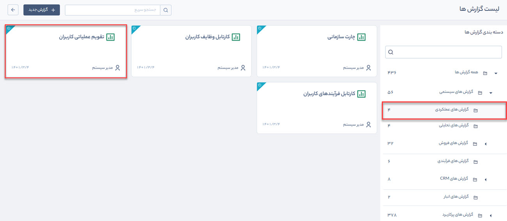
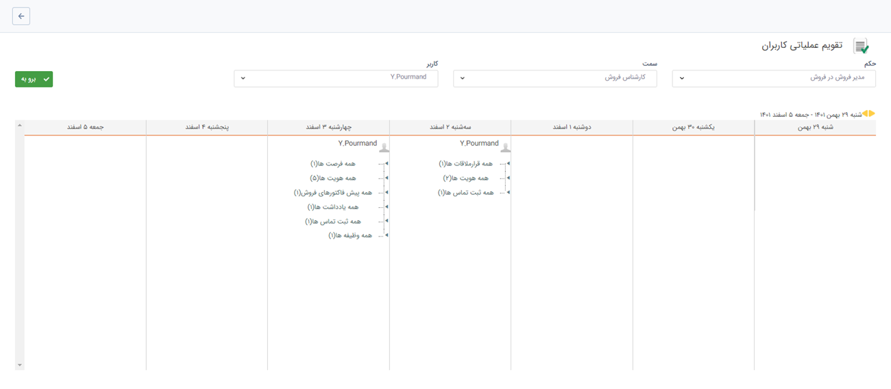

# گزارش تقویم عملیاتی کاربران
گزارش تقویم عملیاتی کاربران از مسیر گزارش‌های سیستمی > گزارش‌های عملکردی قابل‌دسترسی است.

> **نکته:**   تنظیمات واحدها، سمت‌ها و حکم‌های پرسنلی از قبل باید در  مدیریت شعب، دپارتمان و سمت و مدیریت حکم‌های پرسنلی انجام شود.

در این قسمت، مدیر هر واحد با توجه به سمت و حکمی که به او داده شده است، امکان مشاهده عملیات اجرا شده از سوی کاربران واحد خود را دارد. به این منظور ابتدا حکم خود و سپس سمت و کاربری که قصد دریافت گزارش از او را دارید انتخاب کنید. در انتها  روی دکمه **برو به** کلیک کنید تا تقویم عملیاتی کاربر مربوطه را در بازه زمانی موردنظرتان مشاهده کنید.

> **نکته:**   تمام سوابقی که کاربران ایجاد و یا ویرایش می‌کنند در این قسمت نمایش داده می‌شود. در واقع لیست عملیاتی که کاربر بر روی آیتم‌های CRM اجرا کرده قابل مشاهده است.
