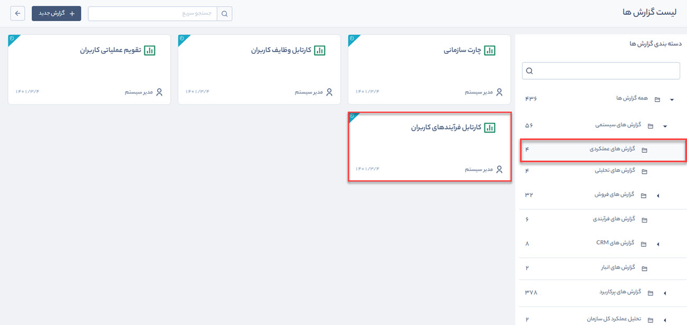
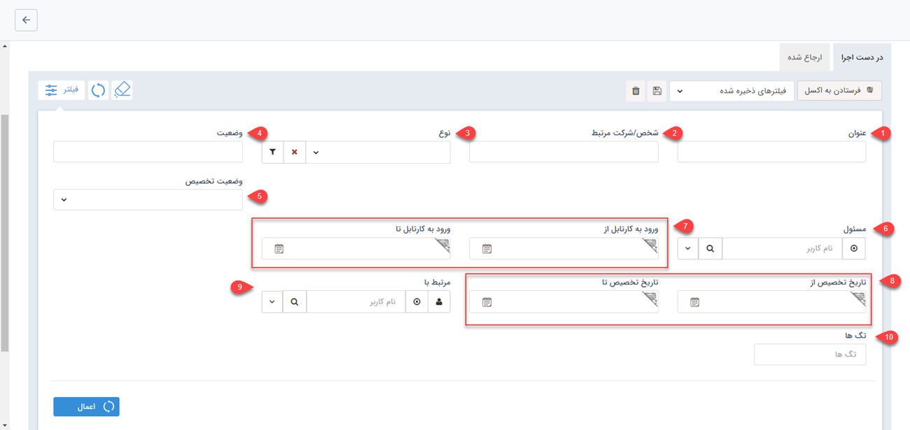
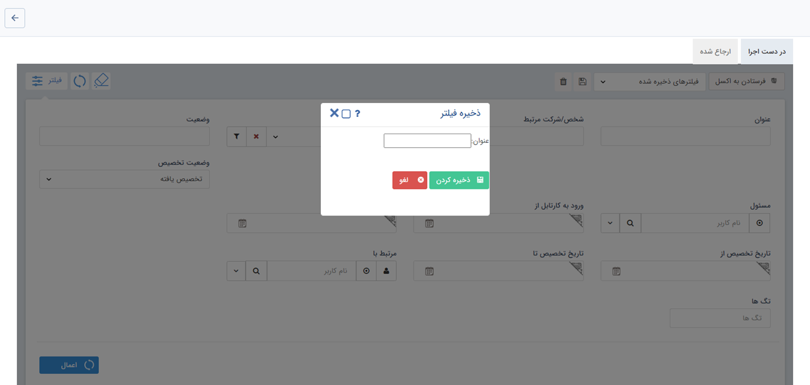

# گزارش کارتابل فرایندهای کاربران
گزارش کارتابل فرایندهای کاربران از مسیر گزارش‌های سیستمی > گزارش‌های عملکردی قابل‌دسترسی است.

در این قسمت مدیر هر واحد می تواند، کارتابل فرآیندهای کاربران زیرمجموعه خود را مشاهده کند. پس از انتخاب حکم خود، سمت و نام کاربر مورد نظر، فرآیندهای در حال اجرای آن کاربر را می توانید مشاهده نمایید. 

با استفاده از فیلتر می‌توان جستجوی دقیق‌تری از فرآیندهای کاربر مورد نظر داشت و آنها را بر اساس پارامترهایی که در ادامه به آنها اشاره می‌شود فهرست کرد.

1. نامی که به آیتم تحت چرخه اختصاص داده‌اید در **عنوان** جستجو کنید.
2. شرکت یا شخص مرتبط با آیتم تحت چرخه را در **شرکت/شخص مرتبط** وارد کنید.
3. آیتمی که فرایند بر روی آن پیاده سازی شده است در **نوع** انتخاب کنید.
4. نام کارتابل موردنظر را در **وضعیت** وارد کنید.
5. وضعیت تخصیص یک کاربر به‌عنوان مسئول آیتم در **وضعیت تخصیص** مشخص می‌شود.
6. کاربر مسئول کارتابل در **مسئول** انتخاب می‌شود.
7. بازه زمانی که فرایند وارد کارتابل کاربر موردنظر می‌شود در دو فیلد **ورود به کارتابل از** و **ورود به کارتابل تا** جستجو می‌شود.
8. بازه زمانی که فرایند به کاربر تخصیص یافته است در **تاریخ تخصیص از** و **تاریخ تخصیص تا** انتخاب می‌شود.
>**نکته:** 
اگر مسئول کارتابل یک نفر باشد تاریخ ورود به کارتابل و تاریخ تخصیص یکی است. در صورتی که مسئول کارتابل بیش از یک نفر باشد تاریخ ورود زمانی است که فرایند وارد کارتابل گروه کاربران می‌شود و تاریخ تخصیص زمانی است که فرایند به یک کاربر تخصیص داده می‌شود.

9. مرتبط با
10. تگ‌های اضافه شده به هر آیتم در **تگ‌ها** وارد می‌شود.

   در صورتی که قصد ذخیره فیلتر مورد نظر خود را دارید، کافی است پس از انتخاب فیلدهای جستجو بر روی دکمه ذخیره کلیک کنید و در پنجره باز شده یک نام برای جستجوی خود انتخاب کنید. از این پس با استفاده از منوی فیلترهای ذخیره‌شده می‌توان همان تنظیمات جستجو را فراخوانی کرد.

> **نکته:**  تنظیمات واحدها، سمت ها و حکم های پرسنلی از قبل باید در  [مدیریت شعب، دپارتمان و سمت](https://github.com/1stco/PayamGostarDocs/blob/master/Help/Basic-Information/branches-department/2.6.0/branches-department.md) و[  مدیریت حکم های پرسنلی ](https://github.com/1stco/PayamGostarDocs/blob/master/Help/Settings/Personnel-command-management/2.6.0/Personnel-command-management.md)انجام شود.
