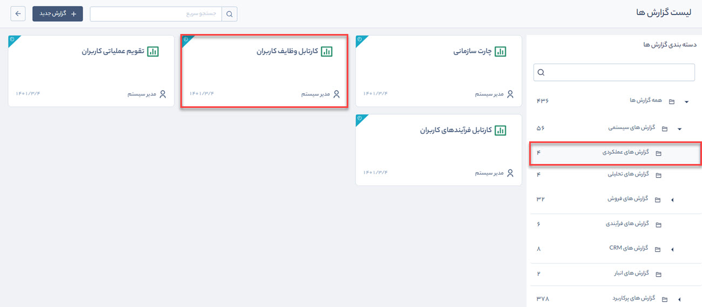
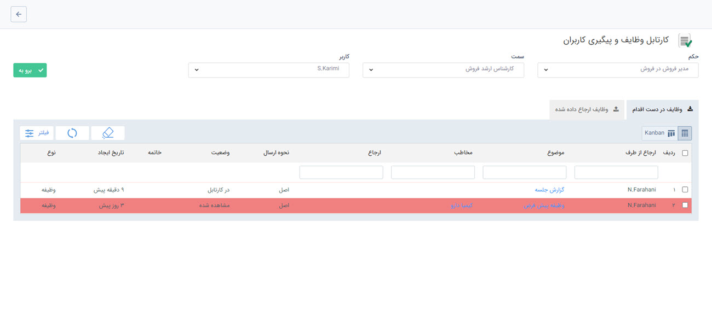
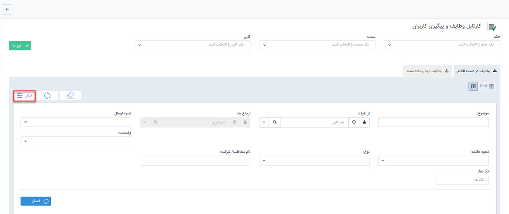

# گزارش کارتابل وظایف کاربران
 گزارش کارتابل وظایف کاربران از مسیر گزارش‌های سیستمی > گزارش‌های عملکردی قابل‌دسترسی است. 

در این قسمت هر کاربر بر اساس حکم خود و سمت و نام کاربران زیرمجموعه‌اش می‌تواند کارتابل وظایف آنها را مشاهده کند.

> **نکته:**    برای مشاهده گزارش  کارتابل وظایف کاربران، رعایت **سلسله مراتب** بر اساس چارت سازمانی و داشتن مجوز **مشاهده گزارش** ضرروی است.

 در این نوع گزارش، به‌صورت پیش‌فرض کارتابل وظایف شخصی که در حال گزارش‌گیری است نمایش داده می‌شود.
 برای مشاهده گزارش کارتابل کاربران، ابتدا حکم خود و سپس سمت و نام کاربری را که می‌خواهید از کارتابل او گزارش‌گیری کنید انتخاب  و بر روی دکمه **برو به** کلیک کنید.

 
 
 دکمه **فیلتر** شما را در جستجوی بهتر یاری می‌کند. با کلیک بر روی آن می‌توانید وظایف و پیگیری‌ها را بر اساس فیلدهای موضوع، کاربر، نحوه ارسال، وضعیت، نحوه خاتمه، نوع، نام مخاطب یا شرکت و تگ‌ها جستجو کنید. فیلد نوع با توجه به نوع آیتم (پیگیری و یا وظیفه) جستجو را محدود می‌کند.

> **نکته:**   تنظیمات واحدها، سمت ها و حکم های پرسنلی از قبل باید در  [مدیریت شعب،دپارتمان و سمت  ](https://github.com/1stco/PayamGostarDocs/blob/master/Help/Basic-Information/branches-department/2.6.0/branches-department.md)و  [مدیریت حکم های پرسنلی ](https://github.com/1stco/PayamGostarDocs/blob/master/Help/Settings/Personnel-command-management/2.6.0/Personnel-command-management.md)انجام شود.

