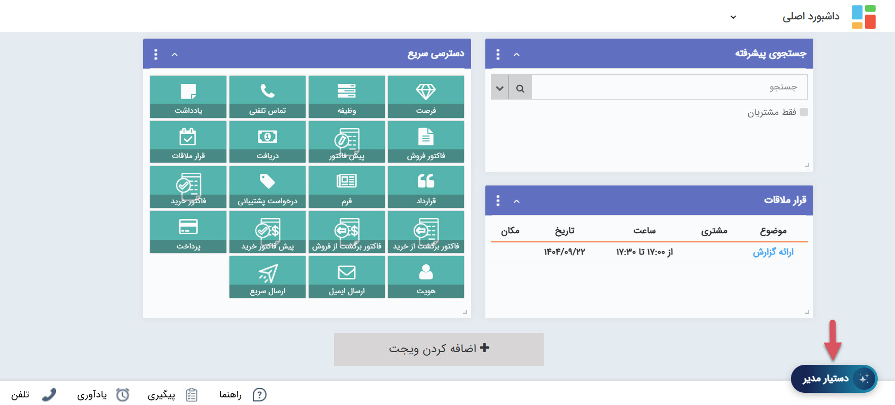

# رایان؛ دستیار هوشمند مدیران
رایان، یک ابزار مبتنی بر هوش مصنوعی می‌باشد که جهت سهولت تهیه گزارش‌‌های مورد نیاز برای مدیران در پیام‌گستر طراحی شده‌است. با استفاده از این ابزار می‌توانید در هر لحظه، گزارش مورد نظر خود را ایجاد و دریافت نمایید. تنها کافیست که بگویید به چه گزارشی نیاز دارید، تا رایان آن را برایتان بسازد.  
برای دسترسی به دستیار مدیر، از بخش منو، وارد تب **رایان** شوید و **دستیار مدیر** را انتخاب کنید.  
## دریافت گزارش
برای دریافت گزارش، درخواست خود را در یک جمله، در کادر پایین صفحه بنویسید و بر روی «پرسیدن» کلیک کنید. سعی کنید در درخواست خود، شاخص‌ها، بازه‌ی زمانی و همچنین فرمت مورد نظر برای ارائه‌ی گزارش را دقیق و واضح بیان کنید. 

پس از چند ثانیه، سیستم گزارش مورد نظر شما را تهیه کرده و در قالب متن یا جدول (بنا به نوع گزارش) به شما ارائه می‌دهد. در صورت نیاز می‌توانید با انتخاب تب «مشاهده SQL» به کدی که برای ایجاد این گزارش استفاده شده دسترسی داشته‌باشید. در صورت تسلط بر SQL و شناخت جداول داده پیام‌گستر، می‌توانید از این بخش اقدام به بهبود دستور نمایید. چنانچه گزارشی که درخواست آن را داده‌اید، قابل ارائه به صورت نمودار باشد، نمودار آن نیز در تب «نمودار» به شما نمایش داده می‌شود.  
در صورت نیاز به گزارش جدید، از کلید «گفتگو جدید» در داشبورد خود (در سمت راست تصویر) استفاده کنید. 

## گفتگوها
در لیست کناری می‌توانید تمامی گزارش‌هایی که پیش‌تر درخواست‌ آن‌ها را داده‌اید را مشاهده نمایید. با کلیک بر روی هر یک از آن‌ها، درخواست شما، دستور SQL اجرا شده جهت تهیه آن و همچنین خروجی حاصل از آن قابل مشاهده است. در صورت بروز هر گونه خطا، از همین قسمت می‌توانید مشکل درخواست را شناسایی کرده و اقدام به رفع آن نمایید. 
با استفاده از سه نقطه‌ی کنار هر گفتگو می‌توانید عنوان آن را تغییر دهید و یا در صورت تمایل، آن را حذف نمایید.  

## دسترسی سریع به دستیار مدیر
علاوه بر منو رایان، ویجتی جهت دسترسی آسان به دستیار در اختیار شما قرار داده شده که با کلیک بر روی آن، کادری جهت دریافت درخواست برایتان باز می‌شود. مراحل انجام کار در این بخش بسیار ساده است. سوال خود را بنویسید، بر روی «پرسیدن» کلیک کنید و گزارشتان را تحویل بگیرید. 

> **نکته** 
> استفاده از دستیار مدیر نیازمند تهیه اشتراک برای کاربر یا کاربران مورد نظر می‌باشد. در حال حاضر می‌توانید به مدت ۱ ماه، از این قابلیت به صورت رایگان استفاده نمایید.  