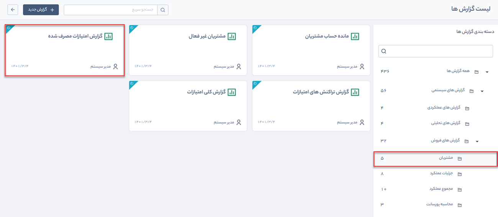

# گزارش امتیازات مصرف‌شده 
 گزارش امتیازات مصرف‌شده از مسیر گزارش‌های سیستمی > گزارش‌های فروش > مشتریان قابل‌دسترسی است.

> **نکته:**   برای دریافت گزارش امتیازات مصرف‌شده باید مجوز  مشاهده‌ امتیازات مشتریان را داشته باشید.

با استفاده از این گزارش می‌توان لیست امتیازات مصرف‌شده، تراکنش‌های آنها و آیتم مرتبط را مشاهده کرد. 

با کلیک بر روی دکمه فیلتر، امتیازات مصرف‌شده بر اساس فیلدهای زیر قابل جستجو هستند:  
1. تراکنش‌های امتیازات مصرف‌شده را بر اساس بازه تاریخ مصرف، در فیلدهای **تاریخ مصرف از/ تا** جستجو کنید.

2. تراکنش‌های امتیازات مصرف‌شده را بر اساس توضیحات آنها در فیلد **توضیحات** جستجو کنید.

3.   برای استفاده از فیلترهای مختلف مرتبط با پروفایل مخاطبان مانند نام، آدرس و ... از فیلد **فیلتر پیشرفته مخاطبان** استفاده کنید.
