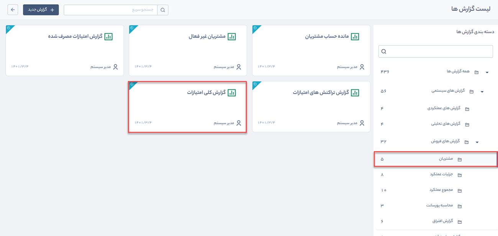

# گزارش کلی امتیازات
 گزارش کلی امتیازات از مسیر **گزارش‌های سیستمی** > **گزارش‌های فروش** > **مشتریان** قابل‌دسترسی است.

 

> **نکته:**   برای دریافت گزارش کلی امتیازات باید مجوز  **مشاهده‌ امتیازات مشتریان**   و همچنین مجوز [**مشاهده این گزارش**](https://github.com/1stco/PayamGostarDocs/blob/master/Help/Management-and-reports/SystemReports_2.7.0.md#SystemReportAccess) را داشته باشید.

 با استفاده از این گزارش شما می‌توانید  مجموع امتیازات کسب‌شده توسط مشتریان را به تفکیک پایه امتیازهای مختلف مشاهده کنید. امکان تهیه خروجی اکسل از این اطلاعات نیز وجود دارد.

 می‌توانید بر اساس پارامترهای زیر گزارش کلی امتیازات را فیلتر کنید:

1. نوع پروفایل را از بین مشتری، رقیب، نماینده و ... در **نوع پروفایل** انتخاب کنید.

2.	بازه امتیاز مشتریان را در فیلدهای **امتیاز از** و **امتیاز تا** درج کنید.

3.	برای استفاده از فیلتر های مختلف مرتبط با پروفایل مخاطبان (مانند نام، آدرس و ...) از **فیلتر پیشرفته مخاطبان** استفاده کنید.

4.	 با کلیک بر روی کلید **فرستادن به اکسل** می‌توانید فایل اکسل حاوی مقادیر این لیست را دریافت کنید.
