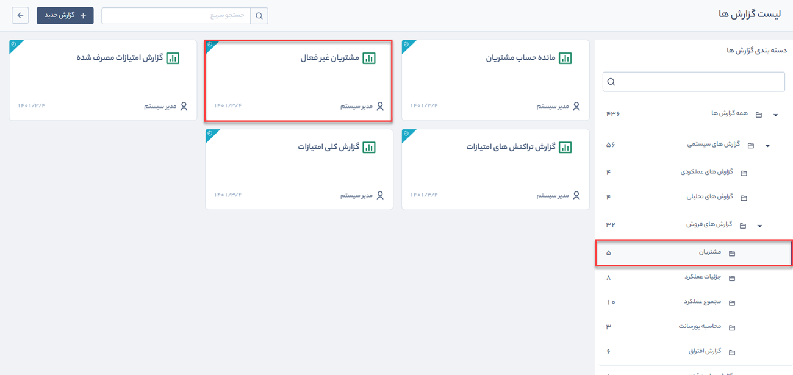
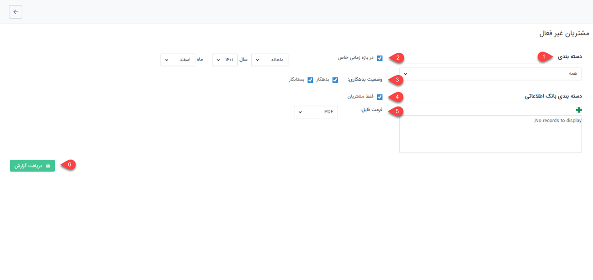
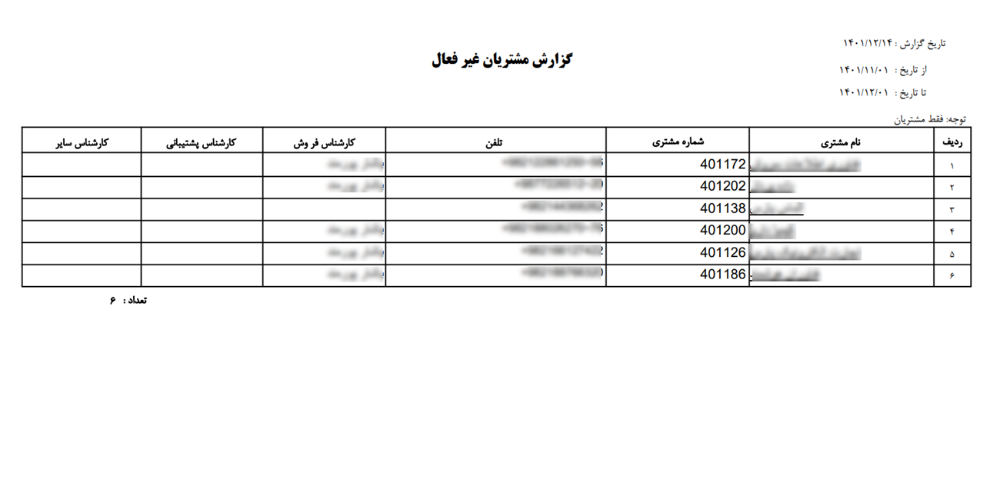

# گزارش مشتریان غیرفعال
 گزارش مشتریان غیرفعال از مسیر گزارش‌های سیستمی > گزارش‌های فروش > مشتریان قابل‌دسترسی است.

**نکته:**    برای دریافت گزارش مشتریان غیرفعال باید مجوز مدیر فروش یا مدیر مالی را داشته باشید.

خروجی این گزارش، مخاطبانی است که اطلاعات آنها در نرم‌افزار ذخیره شده اما تاکنون تراکنش مالی (فاکتور فروش و قرارداد مالی) نداشته‌اند یا در یک بازه زمانی خاص هیچ‌گونه تراکنش مالی برای آنها ثبت نشده است. شما می‌توانید گزارش مشتریان غیرفعال را با استفاده از پارامترهای مشخص به‌صورت زیر دریافت کنید.

1. منبع مورد نظر (دسته بندی بانک اطلاعاتی یا گروه‌های هدف) برای گزارش‌گیری را در **دسته‌بندی** انتخاب کرده و از میان دسته‌بندی‌های زیرمجموعه آن، موارد دلخواه را با استفاده از علامت پلاس اضافه کنید.

2. در صورتی که می‌خواهید گزارش مشتریان غیرفعال را برای بازه زمانی خاصی دریافت کنید، این گزینه را فعال و سپس بازه زمانی مورد نظر خود را تعیین کنید.

3. وضعیت تراز مالی (بدهکار، بستانکار) مخاطبانی را که مایل به گزارش‌گیری از آنها هستید، در  **وضعیت بدهکاری** انتخاب کنید.

4. با فعال کردن گزینه **فقط مشتریان**،  نرم‌افزار تنها از مخاطبانی گزارش‌گیری می‌کند که شماره مشتری به آنها اختصاص  یافته است.

5.  فرمت فایل خروجی گزارش (PDF، Excel یا Html) را در **فرمت فایل** انتخاب کنید.

6. پس از اعمال فیلترهای موردنظر خود، با کلیک بر روی این دکمه، گزارش مشتریان غیرفعال را دریافت کنید.

