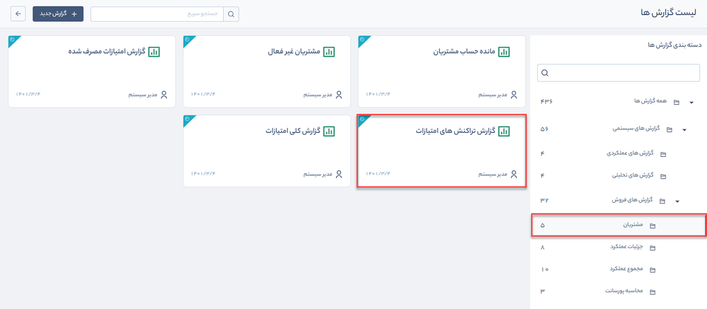

# گزارش تراکنش‌های امتیازات
 گزارش تراکنش‌های امتیازات از مسیر گزارش‌های سیستمی > گزارش‌های فروش > مشتریان قابل‌دسترسی است.

> **نکته:**     برای دریافت گزارش تراکنش‌های امتیازات باید مجوز مشاهده‌ امتیازات مشتریان را داشته باشید.

 با استفاده از این گزارش می‌توانید لیست تراکنش‌های امتیازات مخاطبان (عملیاتی که با استفاده از آن مخاطب امتیازی را کسب یا مصرف کرده است)، به همراه میزان امتیاز کسب‌شده، مصرف‌شده، منقضی‌شده، تاریخ ایجاد و انقضا، جزئیات و آیتم مرتبط با این امتیاز را که از قبل در تنظیمات امتیازدهی مشخص شده است مشاهده کنید.

گزارش تراکنش‌های امتیازات را می‌توانید بر اساس پارامترهای زیر فیلتر کنید:

1. نوع فعالیتی که بر اساس آن امتیاز کسب می‌شود انتخاب کنید.

2. تاریخ ایجاد تراکنش امتیاز را در فیلدهای **تاریخ ایجاد از/تا** مشخص کنید.

3. تاریخ انقضای پایه امتیازها را در فیلد **تاریخ انقضا از/تا** مشخص کنید.

4. برای استفاده از فیلترهای مختلف مرتبط با پروفایل مخاطبان (مانند نام، آدرس و ...) از **فیلتر پیشرفته مخاطبان** استفاده کنید.

5. با کلیک بر روی کلید **فرستادن به اکسل** می‌توانید فایل اکسل حاوی مقادیر این لیست را دریافت کنید.
