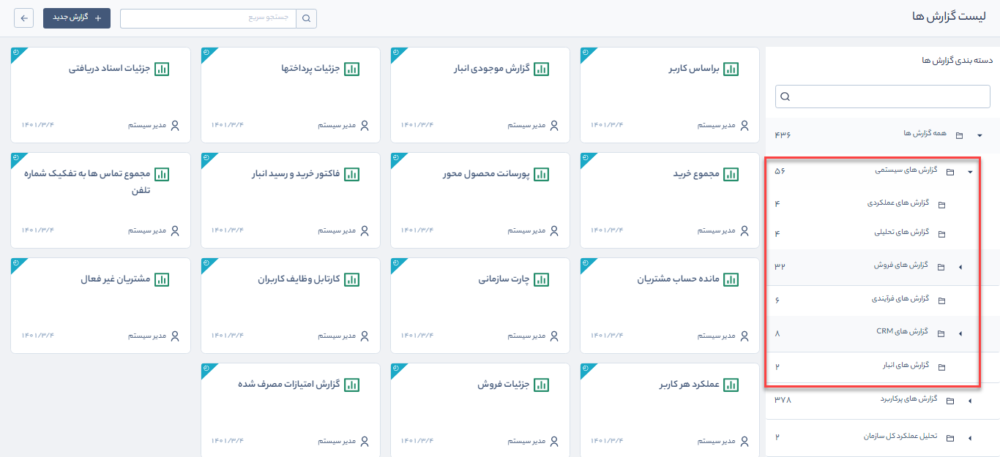
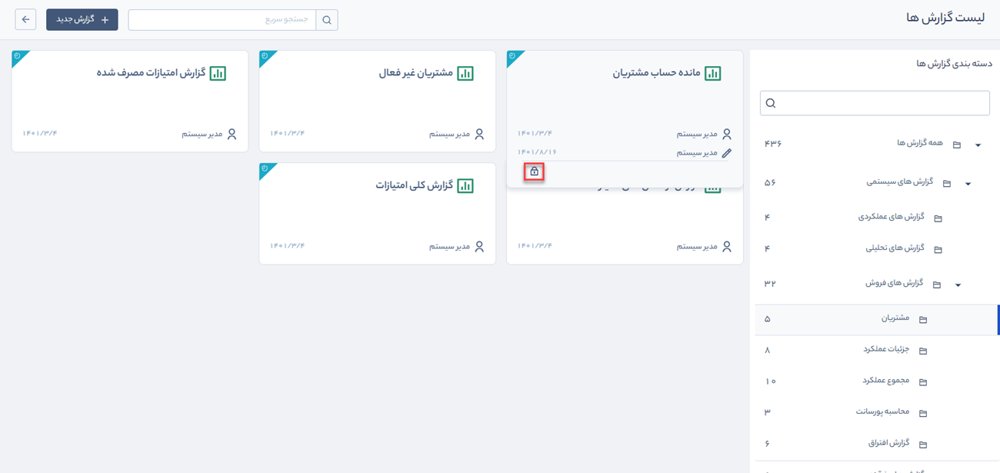

# معرفی گزارش‌های سیستمی
گزارش های سیستمی  به‌صورت پیش فرض در پیام گستر وجود دارد. شما می‌توانید اطلاعات موردنظر خود را فیلتر کرده و در فرمت‌های Excel، pdf و html دریافت کنید. 
برای دسترسی به گزارش‌های سیستمی می‌توانید از مسیر **گزارش‌ها** > **لیست گزارش‌ها** > **گزارش‌های سیستمی** اقدام نمایید. 

## دسترسی به گزارش‌های سیستمی {#SystemReportAccess}
برای دسترسی به گزارش‌های سیستمی کاربر باید **دسترسی عمومی** لازم و **دسترسی مشاهده** روی همان گزارش را داشته باشد. به‌عنوان مثال برای مشاهده گزارش «مانده حساب مشتریان»، کاربر باید علاوه بر داشتن مجوز **مدیر مالی** یا **مدیر فروش**، دسترسی **مشاهده بر روی این گزارش** را نیز داشته باشد.
برای تخصیص دسترسی به گزارش‌ها به‌صورت زیر اقدام کنید: 
1. گزارش موردنظر خود را انتخاب کنید و
 موس را روی کارت آن نگه دارید تا آیکون **قفل** ظاهر شود، سپس بر روی آن کلیک کنید تا وارد محیط تخصیص دسترسی شوید.

2.  در این بخش می‌توانید **کاربر**، **گروه**، **سمت** یا  **دپارتمان** موردنظر خود را انتخاب کنید. با کلیک بر روی دکمه  **اضافه کردن**، کاربر (کاربران) به جدول پایین صفحه اضافه و به آنها مجوز مشاهده، تخصیص داده می‌شود.

