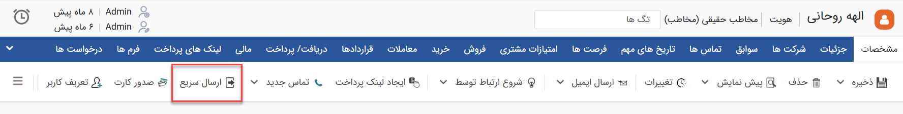
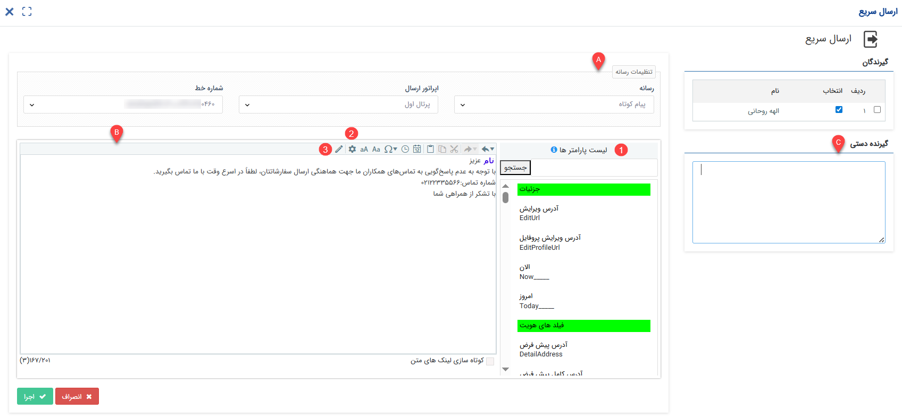

# ارسال سریع 

ارسال سریع ابزاری برای ارسال پیام از رسانه‌ی انتخابی به یک یا چند هویت می‌باشد. با استفاده از این ابزار می‌توانید برای هویت مورد نظر: 
- پیامک ارسال کنید.
- ایمیل ارسال کنید.
- فکس ارسال کنید.
- در شبکه پیام‌رسان تلگرام پیام ارسال کنید. 

شما می‌توانید از صفحه هویت و ویجت دسترسی سریع، به ارسال سریع دسترسی داشته‌باشید.  

## ارسال پیام از طریق ارسال سریع
در صفحه هویت مورد نظر (که قصد ارسال پیام برای وی را دارید)، کلید «ارسال سریع» را یافته و بر روی آن کلیک کنید.  

در صفحه ارسال سریع، کافیست: 
- رسانه (پیامک/ایمیل/فکس/شبکه اجتماعی) و خط مورد نظر برای ارسال پیام را انتخاب کنید.
- متن پیام را تنظیم کنید.
- بر روی اجرا کلیک کنید.

## A. تنظیمات رسانه
رسانه‌ی مورد نظر برای ارسال پیام را انتخاب نمایید. اگر قصد ارسال پیام یا ایمیل را دارید، پس از انتخاب رسانه، اپراتور ارسال و بر اساس اپراتور انتخابی خط‌هایی که به آن‌ها دسترسی دارید به شما نمایش داده‌می‌شود. از بین آن‌ها خط مورد نظر برای ارسال پیامک/ایمیل را مشخص کنید. اگر فکس یا پیام کوتاه شبکه‌های اجتماعی را برای ارسال پیام انتخاب کرده‌باشید نیز به صورت مشابه خطوطی که به آن‌ها دسترسی دارید به شما نمایش داده شده و می‌توانید خط مورد نظر برای ارسال پیام را انتخاب کنید. پس از انتخاب رسانه و خط، پیام مورد نظر را تنظیم نمایید. 

## B. تنظیمات پیام
در قسمت پایین، متن پیام را مشخص نمایید. بر اساس رسانه‌ی انتخابی جهت ارسال پیام، ابزارهایی که در اختیار شما قرار داده می‌شود، کمی متفاوت است. ابتدا قابلیت‌های مشترک رسانه‌ها برای ارسال پیام را بررسی می‌کنیم و سپس به نکات هر یک از رسانه‌ها می‌پردازیم. 

### 1. پارامتر هوشمند
برای تنظیم متن پیام شخصی‌سازی شده می‌توانید از پارامترهای هوشمند استفاده کنید. با استفاده از این پارامترها، اطلاعاتی از مشخصات هویت در متن پیام فراخوانی و با پارامتر جایگزین می‌شود. به عنوان مثال در صورت نیاز به درج مانده حساب یا کد ملی/اقتصادی هویت که در پروفایل وی موجود می‌باشد، به جای مراجعه به پروفایل و درج دستی این اطلاعات در متن پیام می‌توانید از پارامتر هوشمند برای فراخوانی آن‌ها استفاده کنید. برای درج پارامترهای هوشمند کافیست که در هر بخش از متن که به آن‌ها نیاز دارید، پارامتر را از لیست سمت راست پیدا کنید و با دو بار کلیک کردن آن را به پیام خود اضافه کنید. در صورت نیاز به کسب اطلاعات بیشتر می‌توانید از [راهنمای پارامتر هوشمند](https://github.com/1stco/PayamGostarDocs/blob/master/Help/Marketing/Parameters/MessageParameters.md) استفاده نمایید. 

### 2. استفاده از پیام‌های الگو
برای درج متن پیام می‌توانید از پیام‌های الگویی که پیش‌تر در نرم‌افزار ذخیره شده‌اند نیز استفاده نمایید. در بخش مدیریت پیام‌های الگو، قالب‌های مختلفی برای انواع رسانه‌ها نگهداری می‌شود (در صورت نیاز می‌توانید به [راهنمای مدیریت پیام‌های الگو](https://github.com/1stco/PayamGostarDocs/blob/master/Help/Marketing/moshtarak-abzar/gam%20do/ghaleb-payam/ghaleb-payam.md) مراجعه کنید). 
در قسمت نوار ابزار فضای تنظیم محتوای پیام، آیکون چرخ‌دنده را بیابید (در محتوای ایمیلی این آیکون به شکل فایل در سط پایین قرار دارد). اگر نمایشگر خود را بر روی آن نگه دارید راهنمای آن با عنوان File/Template به شما نمایش داده‌می‌شود. بر روی آیکون مذکور کلیک کنید تا پیام‌های الگوی موجود از رسانه‌ی انتخاب به شما نمایش داده‌شود. از بین الگو‌های تعریف شده، کافیست بر روی الگوی مورد نظر دو بار کلیک نمایید تا متن قالب در بخش محتوای پیام اضافه شود. با توجه به اینکه پیام‌های الگو اغلب با استفاده از پارامترهای هوشمند تنظیم شده‌اند، در صورت نیاز به درج اطلاعات هویت در متن پیام این اطلاعات به صورت خودکار از مشخصات هویت فراخوانی می‌شود. 

### 3. درج امضا
نرم‌افزار به هر کاربر این امکان را می‌دهد که امضای خود را (و فقط امضای خود را) در پایان پیام‌هایش درج کند. این امضا می‌تواند متن کوتاهی از نام، سمت شغلی و حتی شماره داخلی او باشد. 
برای درج امضا، آیکون قلم را در نوار ابزار بالای بخش محتوا بیابید. اگر نمایشگر خود را بر روی آن نگه دارید راهنمای آن با عنوان Sign به شما نمایش داده‌می‌شود. با کلیک بر روی این آیکون وارد صفحه لیست امضاهای خود می‌شوید. اگر پیش‌تر برای خود امضایی در نرم‌افزار تعریف نکرده‌اید، از [راهنمای اضافه کردن امضا](https://github.com/1stco/PayamGostarDocs/blob/master/Help/Marketing/moshtarak-abzar/gam-do/add-a-signature/add-a-sign.md) استفاده نمایید و امضا(ها)ی خود را به لیست اضافه نمایید. کافیست بر روی امضای مورد نظر دو بار کلیک کنید تا به انتهای محتوای پیام شما اضافه شود. 

## C. گیرنده دستی
اگر از صفحه هویت، اقدام به استفاده از ارسال سریع کرده باشید، هویت مذکور به صورت خودکار به عنوان گیرنده انتخاب شده‌است. اگر لازم است که پیام علاوه بر او برای شخص دیگری نیز ارسال شود، شماره یا آدرس ایمیل (بنا بر رسانه‌ی انتخابی) وی را در قسمت گیرنده دستی درج نمایید. 
اگر از ویجت دسترسی سریع وارد صفحه ارسال سریع شوید، هیچ گیرنده‌ای برای آن انتخاب نشده و شما باید به صورت دستی شماره یا آدرس ایمیل مد نظر را در این بخش وارد نمایید. 

## نکاتی درباره‌ی هر رسانه
چنانچه پیش‌تر به آن اشاره شد، رسانه‌های مختلف ممکن است دارای تنظیمات مختص به خود باشند که با سایرین مشترک نیست. در ادامه‌ی مطلب، به نکاتی که در مورد استفاده از هر رسانه باید به آن توجه داشته‌باشید مطرح شده‌است. 
- در صورت استفاده از رسانه‌ی پیام کوتاه و شبکه‌های اجتماعی، اگر در متن پیام خود، از لینک استفاده کرده‌اید، گزینه «کوتاه سازی لینک های متن» را فعال نمایید تا لینک به صورت کوتاه‌‌شده برای مخاطب ارسال شود.
- در صورت استفاده از رسانه‌ی ایمیل، عنوان آن را نیز می‌‌توانید درج کنید تا در بخش Subject ایمیل نمایش داده‌شود.
- در صورت استفاده از رسانه‌ی ایمیل در ارسال سریع به خاطر داشته‌باشید که امکان پیوست فایل فراهم نمی‌باشد. در صورت نیاز به پیوست فایل، از «ارسال ایمیل» به جای ارسال سریع استفاده کنید.
- در صورت استفاده از رسانه‌ی فکس، پیام را باید با استفاده از ابزار Web client tool، مشابه قالب پیش‌نمایش، تنظیم نمایید. بدین منظور می‌توانید از [راهنمای تنظیم قالب پیش‌نمایش](https://github.com/1stco/PayamGostarDocs/blob/master/Help/Settings/Personalization-crm/CustomizationCommonSettings/PrintTemplateSetting.md) استفاده کنید.
- در صورت استفاده از پیام شبکه‌های اجتماعی، می‌توانید محتوایی از نوع تصویر، فایل Excel، فایل Word یا فایل PDF به پیام خود اضافه نمایید و یا از قالب‌های از پیش تعریف شده در بخش [مدیریت پیام‌های الگو](https://github.com/1stco/PayamGostarDocs/blob/master/Help/Basic-Information/Model-message-management/Model-message-management.md) استفاده کنید. در صورت انتخاب فایل Word از همین بخش هم می‌توانید با استفاده از ابزار web client tool اقدام به تنظیم قالب نمایید (روش انجام این کار مشابه [تنظیم قالب پیش‌نمایش](https://github.com/1stco/PayamGostarDocs/blob/master/Help/Settings/Personalization-crm/CustomizationCommonSettings/PrintTemplateSetting.md) می‌باشد). لازم به ذکر است که در صورت انتخاب گزینه‌ی Plain Text صرفاً متن پیام مندرج برای مخاطب/مخاطبان ارسال می‌شود لکن با انتخاب هر یک از قالب‌های دیگر می‌توانید متن را در کنار فایل ارسال نمایید.  

> **نکته** 
> با توجه به اینکه نحوه تنظیم پیام‌های شبکه‌های اجتماعی کمی با سایر رسانه‌ها متفاوت می‌باشد، پیشنهاد می‌شود برای آشنایی با نحوه‌ی تنظیم پیام از این نوع به راهنمای [محتوای پیام شبکه‌های پیام‌رسان](https://github.com/1stco/PayamGostarDocs/blob/master/Help/Marketing/SocialNetworkMessage/GroupMessage/MessageContent.md) مراجعه نمایید.
