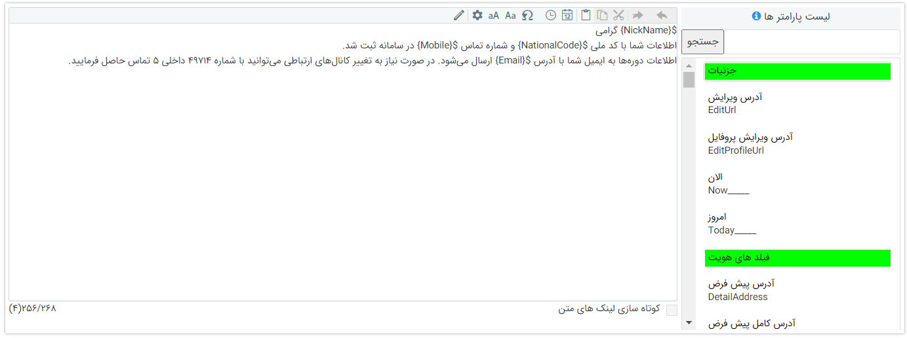

# استفاده از پارامترهای هوشمند

درج مشخصات مخاطب در پیام‌های ارسالی می‌تواند در شخصی‌سازی پیام‌ها و کیفیت تجربه‌ی مخاطبان تاثیر به‌سزایی داشته‌باشد. پارامترهای هوشمند به شما این امکان را می‌دهند که برای مخاطبان خود پیام‌های شخصی‌سازی‌ شده‌ای ارسال کنید که اطلاعات وی را شامل شود. با استفاده از این پارامترها دیگر نیاز نیست که کاربرانتان در هر بار ارسال پیام، اطلاعات و مشخصات هویت یا آیتم را در پیام ارسالی ویرایش کنند. این اطلاعات به صورت خودکار با مشخصات هویت و یا آیتم مورد نظر شما جایگذاری می‌شود. 
از این پارامترهای هوشمند می‌توانید برای درج اطلاعات هویت و یا آیتمی که پیام برای آن تنظیم می‌شود،‌ استفاده نمایید. چنانچه پیامی که در حال تنظیم متن آن هستید به آیتم (موجودیت) خاصی مرتبط باشد، علاوه بر اطلاعات هویت مرتبط با آن، کلیدهای اطلاعات آیتم را نیز می‌توانید در این بخش مشاهده کنید. به عنوان مثال، چنانچه از بخش یادآوری‌های انبوه اقدام به تنظیم پیام برای قراردادها نمایید، علاوه بر اطلاعات هویت، از اطلاعات قرارداد نیز می‌توانید در متن پیام خود استفاده کنید. در نظر داشته‌باشید که منظور از اطلاعات هویت و آیتم، صرفاً فیلدهای اطلاعاتی قابل ویرایش در آن نبوده و اطلاعاتی نظیر زمان ایجاد، مرحله‌ی آیتم، کاربر ویرایش‌کننده و موارد مشابه را نیز در برمی‌گیرد. به صورت کلی، شما در هر بخش از نرم‌افزار که امکان تنظیم قالب پیام در آن فراهم باشد، می‌توانید از پارامترهای هوشمند استفاده نمایید. در نتیجه پارامترهای هوشمند را می‌توانید در بخش‌هایی مثل «مدیریت یادآوری‌های انبوه»، «تنظیمات یادآوری تماس‌ها»، «مدیریت پیام‌های سیستم»، «پاسخ خودکار درخواست‌های ایمیلی» و «ارسال سریع» مشاهده نمایید. 
برای درج پارامترهای هوشمند در متن پیام‌ها، از سه روش می‌توانید استفاده کنید. در ادامه، به بررسی هر یک از این روش‌ها نمی‌پردازیم. 

## استفاده از دکمه پارامترهای هوشمند
در کنار صفحه تنظیم پیام، دکمه‌های پارامترهای هوشمند به شما نمایش داده‌می‌شوند. نوارهای سبز رنگی که در بین دکمه‌ها مشاهده می‌کنید، به منظور جداسازی دکمه‌های اطلاعات هر بخش تعبیه شده تا یافتن دکمه مورد نیاز را برای شما آسان‌تر سازد. به ترتیب می‌توانید پارامترهای هوشمند مرتبط با هر گروه فیلد از موجودیت را در ابتدای لیست و به دنبال آن، اطلاعات هویت مرتبط را در انتهای لیست مشاهده نمایید و یا از بخش جستجو برای یافتن پارامتر مورد نظر استفاده کنید. 

 
برای استفاده از پارامترها کافیست که بخش‌های ثابت پیام خود را نوشته و برای درج اطلاعات مخاطب یا آیتم مورد نظر، دکمه پارامتر فیلد اطلاعاتی مورد نیاز را یافته و با دو بار کلیک کردن بر روی آن، پارامتر هوشمند را به متن پیام خود اضافه نمایید. بر این اساس هنگام ارسال پیام، پارامترهای هوشمند با مقادیر مرتبط جایگذاری شده و سپس پیام شما ارسال می‌شود. 

## استفاده از پیشوند prop
در مواردی نظیر تنظیم پیام‌های HTML برای امکان استفاده از دکمه‌ها برای درج پارامترهای هوشمند فراهم نمی‌باشد. در این شرایط می‌توانید از روش prop برای درج پارامترهای هوشمند در متن پیام خود استفاده نمایید. 
در این روش کافیست که از الگوی زیر برای فراخوانی پارامتر مورد نظر استفاده کنید و به جای X، کلید پارامتر مورد نظر را قرار دهید. منظور از کلید، نام اصلی پارامترها در پایگاه داده می‌باشد که با یک عنوان انگلیسی در زیر دکمه‌های پارامترها قابل مشاهده است. در نتیجه برای یافتن این کلیدها می‌توانید از دکمه‌های کنار صفحه تنظیم پیام، به عنوان راهنما استفاده کنید. 

 
به عنوان مثال، پیامکی که در بخش قبل مشاهده نمودید، بر  اساس روش prop به شکل زیر قابل تنظیم می‌باشد. 

## استفاده از نشان $
مشابه روش  prop از نشان $ نیز می‌توانید برای فراخوانی پارامترهای هوشمند استفاده کنید. بدین منظور کافیست که از الگوی زیر برای درج پارامترها استفاده نمایید. 

 
به همین ترتیب، مثال فوق را به شکل زیر نیز می‌توان تنظیم کرد. 

 

> **نکته** 
> در استفاده از روش prop و $ به چیدمان عبارات توجه داشته‌باشید. تغییر چیدمان در این الگوها باعث عدم عملکرد صحیح آن در فراخوانی داده‌ها می‌شود. در این راستا، در صورت کپی کردن این عبارات در بخش‌های دیگر پیام، صحت چیدمان (راست‌چین/چپ‌چین بودن) آن را کنترل کنید. با توجه به حساسیت‌های موجود در این زمینه پیشنهاد می‌شود که نتیجه‌ی پیام‌های‌ تنظیم شده‌ی خود را در چند نمونه‌ی تستی بررسی نمایید. 

## راهنمایی
با توجه به اینکه اطلاعات مندرج در هر آیتم می‌تواند نسبت به دیگری متفاوت باشد، امکان بررسی تمامی پارامترهای هوشمند به صورت یک‌به‌یک فراهم نمی‌باشد. عطف به اینکه نام این کلیدها در اکثر موارد به وضوح محتوای آن را معرفی می‌کنند، با نگاهی بر لیست کلیدها می‌توانید به راحتی کلیدهای قابل استفاده در پیام‌هایتان را بیابید. در این راستا می‌توانید از راهنمای زیر برای آشنایی با کلیدهایی که ممکن است عملکردشان برایتان شفاف نباشد، کمک بگیرید.
- کلیدهای «الان» و «امروز» که در ابتدای لیست تمامی پارامترهای هوشمند مشاهده می‌کنید، به ترتیب ساعت و تاریخ لحظه‌ی ارسال پیام را در متن درج می‌کند.
- با درج کلید «شهرت رسمی»، نام و نام خانوادگی هویت به صورت برعکس (مثلا صادقی، مهرناز) در متن پیام درج می‌شود.
- با درج کلید «دسته‌بندی‌ها»، عنوان دسته‌بندی بانک اطلاعاتی که هویت در آن ثبت شده‌است در پیام درج می‌شود. چنانچه هویت در چند دسته‌بندی ذخیره شده‌باشد، عنوان تمامی دسته‌بندی‌ها در پیام ذکر می‌شود.
- در صورت استفاده از کلید «خلاصه» تمامی اطلاعاتی که در خلاصه‌ی آن آیتم مشاهده می‌شود، در متن پیام قرار می‌گیرد. برای بررسی اطلاعات مندرج در خلاصه‌ی آیتم کافیست در لیست آیتم، نشان‌گر خود را بر روی یک رکورد نگه دارید تا خلاصه‌ی آن به شما نمایش داده‌شود. اطلاعات نمایش داده‌شده در بخش خلاصه را می‌توان از بخش [شخصی‌سازی](https://github.com/1stco/PayamGostarDocs/blob/master/Help/Settings/Personalization-crm/CustomizationCommonSettings/ItemsCustomizationMainPage_2.5.0.md#SummarySetting) ویرایش نمود.
> **نکته** 
> در صفحه تنظیم پیامک‌ها، گزینه‌ای تحت عنوان «کوتاه‌سازی لینک‌های متن» قابل مشاهده است. با فعال‌سازی این گزینه تمامی لینک‌های مندرج در متن پیام به صورت کوتاه شده برای مخاطب ارسال می‌شود. 