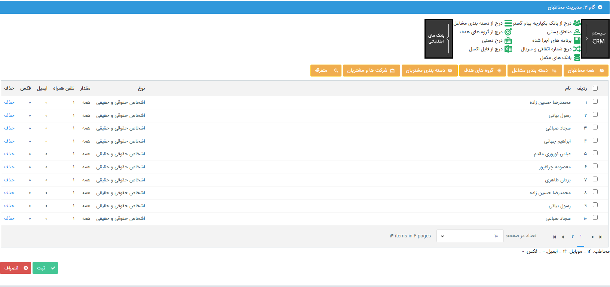

# مخاطبان پیام گروهی شبکه‌های پیام‌رسان
در گام سوم لازم است که مخاطبانی که قصد ارسال پیام برای آن‌ها را دارید را مشخص نمایید. می‌توانید مخاطبان خود را از بانک اطلاعاتی، فایل اکسل و یا روش‌های دیگر انتخاب کنید. برای کسب اطلاعات بیشتر در مورد نحوه‌ی افزودن مخاطب از هر یک از این بخش‌ها به [راهنمای مدیریت مخاطبان](https://github.com/1stco/PayamGostarDocs/blob/master/Help/Marketing/moshtarak-abzar/gam-se/bank-ykparche/bank-ykparche.md) مراجعه نمایید. در این بخش می‌توانید به راهنمای هر یک از این روش‌ها دسترسی داشته‌باشید.  

شما می‌توانید در یک برنامه‌ی تبلیغاتی از چند روش و بانک مختلف برای تعیین مخاطبان خود استفاده نمایید. در نهایت پس از افزودن مخاطبان می‌توانید با بررسی تعداد شماره موبایل‌ها، ایمیل‌ها و فکس‌های هر هویت، صحیح بودن رسانه‌ی ارسالی خود را بررسی نمایید. در پایین جدول نیز مجموع این خطوط به شما نمایش داده می‌شود.  
