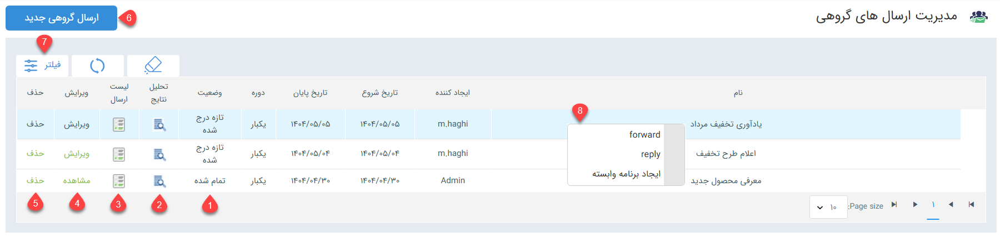

#  مدیریت ارسال پیام گروهی در پیام‌رسان 

در این صفحه می‌توانید لیست تمامی برنامه‌های ارسال گروهی تنظیم شده برای پیام‌رسان‌ها را مشاهده نمایید، به جزئیات آن‌ها دسترسی داشته‌باشید و یا برنامه‌ی ارسال گروهی جدید تنظیم کنید. 

> **نکته** 
> به صورت پیش‌فرض، هر کاربر با ورود به این صفحه، صرفاً برنامه‌هایی که خودش تنظیم کرده‌است را مشاهده می‌کند. حتی مدیر سیستم (ادمین)، به صورت پیش‌فرض صرفاً قادر به مشاهده برنامه‌های خود می‌باشد. برای مشاهده تمامی برنامه‌ها، در قسمت فیلتر، اپراتور را حذف کرده و بر روی اعمال کلیک کنید تا لیست تمامی برنامه‌های ارسال گروهی شبکه‌های پیام‌رسان به شما نمایش داده‌شود. 

**1. وضعیت** 
در این ستون می‌توانید وضعیت ارسال پیام‌ها را مشاهده نمایید. حالت «تمام شده» به معنای تشکیل لیست ارسال برای تمام مخاطبان انتخابی در برنامه است. چنانچه لیست هنوز به صورت کامل تشکیل نشده‌باشد و یا برنامه به صورت قطعه‌بندی شده تنظیم شده‌باشد، وضعیت آن در حالت «در حال اجرا» قرار می‌گیرد. برنامه‌ای که تازه ثبت شده و هنوز در انتظار رسیدن زمان اجرا می‌باشد، در وضعیت «تازه درج شده» نمایش داده می‌شود. 
**2. تحلیل نتایج** 
با استفاده از نتایج ارائه شده در این بخش می‌توانید تحلیلی بر عملکرد برنامه‌ی اجرایی خود داشته‌باشید. برای آشنایی با هر یک از نتایج ارائه شده در این بخش به راهنمای [نمودارهای تحلیلی نتایج برنامه تبلیغاتی](https://github.com/1stco/PayamGostarDocs/blob/master/Help/Marketing/Advertising-analysis-chart/Advertising-analysis-chart.md) مراجعه نمایید. 
**3. لیست ارسال** 
لیست ارسال بر اساس مخاطبانی که در بخش مدیریت ارسال برنامه (گام سوم) مشخص شده‌اند تشکیل می‌شود. با کلیک بر روی این بخش می‌توانید لیست ارسالی از برنامه مشاهده کنید که تمامی مخاطبان، وضعیت ارسال به آن‌ها، وضعیت تحویل و سایر جزئیاتی که در صفحه لیست ارسال کلی نیز قابل دسترس است را به شما ارائه می‌دهد. با توجه به اینکه این صفحه در واقع همان صفحه لیست ارسال لکن مختص به یک برنامه خاص می باشد، می‌توانید از راهنمای [لیست پیام‌های ارسالی در شبکه‌های پیام‌رسان](https://github.com/1stco/PayamGostarDocs/blob/master/Help/Marketing/SocialNetWorkMessage/List/SendList.md) برای درک آن استفاده نمایید. 
**4. ویرایش** 
اگر هنوز زمان اجرای برنامه نرسیده‌است (وضعیت آن در حالت تازه درج شده قرار دارد)، می‌توانید با کلیک بر روی این گزینه اقدام به ویرایش اطلاعات، محتوا و یا مخاطبان برنامه نمایید. توجه داشته‌باشید که چنانچه برنامه در حالت اجرا شده قرار بگیرد، دیگر امکان ویرایش هیچ یک از اطلاعات، حتی عنوان برنامه فراهم نمی‌باشد. 
**5. حذف** 
با استفاده از این گزینه می‌توانید یک برنامه‌ی ارسال را لغو یا حذف نمایید. اگر برنامه هنوز اجرا نشده‌باشد (وضعیت آن در حالت تازه درج شده قرار داشته‌باشد)، با حذف آن برنامه لغو می‌شود. لکن در مورد برنامه‌های اجرا شده، حذف برنامه صرفاً آن را از لیست حذف می‌کند. توجه داشته‌باشید که با حذف برنامه از این بخش، رکوردهای امربوط به لیست ارسال آن برنامه نیز از لیست پیام‌های ارسالی حذف می‌شود. 
**6. ارسال گروهی جدید** 
با استفاده از این کلید می‌توانید برنامه‌ جدیدی برای ارسال گروهی پیام از طریق شبکه‌های پیام‌رسان تنظیم کنید. برای تنظیم برنامه ارسال گروهی لازم است که در ۳ گام اقدام به تعیین مشخصات نمایید:  
- **گام اول- اطلاعات پیام:** در این بخش زمان و نحوه‌ی ارسال پیام مشخص می‌شود.
- **گام دوم- محتوای پیام:** در این بخش محتوای پیام تنظیم می‌شود.
- **گام سوم- مدیریت مخاطبان:** در این بخش لیست مخاطبانی که پیام باید برایشان ارسال شود، تعیین می‌شود. 
پس از تنظیم برنامه بر اساس گام‌های فوق، برنامه‌ی شما در لیست مدیریت ارسال‌های گروهی قابل مشاهده خواهدبود. 
**7. فیلتر** 
با استفاده از فیلترهای موجود می‌توانید می‌توانید برنامه‌های مورد نظر خود را بر اساس معیارهای مختلف نظیر بازه‌ی زمانی اجرا، جدا نمایید.
**8. راست کلیک** 
با راست کلیک بر روی هر یک از برنامه‌های ارسال گروهی می‌توانید: 
**A. با انتخاب گزینه‌ی Forward، پیام را برای مخاطب یا مخاطبان دیگری ارسال کنید.** 
با انتخاب این گزینه صفحه تنظیم برنامه‌ی جدیدی برای شما باز می‌شود که محتوای پیام مشابه پیام اولیه (که قصد Forward آن را دارید)، در آن درج شده و شما می‌توانید مخاطبان جدید خود و همچنین زمان ارسال آن را مشخص کنید. عنوان این برنامه‌ی جدید مشخص می‌کند که این برنامه از روی کدام برنامه بازارسال شده‌است. 
**B. با انتخاب گزینه‌ی Reply می‌توانید برای همه یا تعدادی از مخاطب برنامه‌ی اجرا شده، پیام دیگری ارسال کنید.** 
با کلیک بر روی این گزینه، صفحه‌ای برای انتخاب مخاطبان برنامه‌ی جدید به شما نمایش داده‌می‌شود. می‌توانید مشخص کنید که پیام جدید برای تمام مخاطبان برنامه‌ی پیشین ارسال شود و یا اینکه بر اساس نتایج برنامه‌ی قبلی، تعدادی از مخاطبان آن برنامه را برای ارسال پیام جدید انتخاب نمایید.  

اگر گزینه‌ی «انتخاب بر اساس نتایج» را انتخاب کردید، فیلترهای مورد نظر برای جداسازی مخاطبان از لیست مخاطبان برنامه‌ی قبلی را مشخص کنید (مثلاً فقط مخاطبانی که پیام قبلی را تحویل گرفته‌اند). سپس بر روی کلید «به‌روزرسانی تعداد» کلیک کنید تا تعداد مخاطبان جداسازی شده به شما نمایش داده‌شود.  پس از انتخاب تمام یا بخشی از مخاطبان برنامه‌ی قبلی، بر روی «انتخاب مخاطبین» کلیک کنید تا مخاطبان برنامه جدید شما مشخص شود. حال در برنامه‌ی جدید کافیست که زمان ارسال و محتوای پیام جدیدتان را تنظیم کنید. 
**C. با انتخاب گزینه‌ی ایجاد برنامه وابسته می‌توانید برنامه‌ی جدیدی را وابسته به یکی از برنامه‌های قبلی خود ایجاد کنید.** 
اگر برنامه‌ی ارسال گروهی جدید که قصد ایجاد و اجرای آن را دارید، به یکی از برنامه‌های اجرای شده‌ی قبلی مرتبط است، می‌توانید از این طریق اقدام به ایجاد آن نمایید. برنامه‌ی جدیدی که از این طریق ایجاد می‌شود در بخش اطلاعات وابسته به برنامه‌ی قبلی نمایش داده می‌شود هیچ یک از مشخصات برنامه‌ی قبلی (اطلاعات، محتوا و مخاطبان) به آن انتقال پیدا نمی‌کند.  

