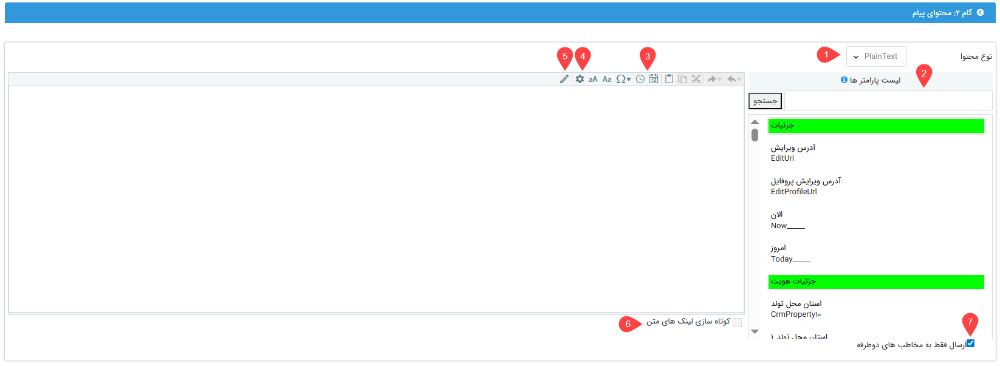

# محتوای پیام گروهی شبکه‌های پیام‌رسان
در گام دوم از تنظیم ارسال گروهی پیام در شبکه‌های پیام‌رسان، لازم است که محتوای پیام را مشخص نمایید. در تنظیم محتوای پیام می‌توانید: 
- از پارامترهای هوشمند برای شخصی‌سازی پیام‌هایتان استفاده کنید.
- از قالب‌های آماده استفاده کنید.
- به پیام خود تصویر اضافه کنید.
- امضای خود را در پیام درج کنید. 
در ادامه با قابلیت‌های مختلف بخش محتوای پیام آشنا می‌شویم. 

## ابزارهایی برای تنظیم محتوای پیام
در صفحه تنظیم محتوای پیام، قابلیت‌های مختلفی در اختیار شما قرار داده‌است که می‌توانید برای تنظیم محتوای مورد نظرتان از آن‌ها استفاده کنید. استفاده از این ابزارها علاوه بر سهولت کار، در تنظیم محتوای حرفه‌ای‌تر به شما کمک می‌کنند. 

### 1. پارامتر هوشمند
برای تنظیم متن پیام شخصی‌سازی شده می‌توانید از پارامترهای هوشمند استفاده کنید. با استفاده از این پارامترها، اطلاعاتی از مشخصات هر هویت در متن پیام فراخوانی و با پارامتر جایگزین می‌شود. به عنوان مثال می‌توانید مشخص کنید که نام هر هویت در ابتدای پیام قرار گیرد تا پیام به صورت خاص، شخص را مخاطب قرار دهد. با توجه به اینکه پیام به صورت گروهی برای چندین مخاطب مختلف تنظیم می‌شود، برای این کار باید از پارامتر هوشمند استفاده کنید. برای درج پارامترهای هوشمند کافیست که در هر بخش از متن که به آن‌ها نیاز دارید، پارامتر را از لیست سمت راست پیدا کنید و با دو بار کلیک کردن آن را به پیام خود اضافه کنید. در صورت نیاز به کسب اطلاعات بیشتر می‌توانید از [راهنمای پارامتر هوشمند](https://github.com/1stco/PayamGostarDocs/blob/master/Help/Marketing/Parameters/MessageParameters.md) استفاده نمایید. 

### 2. تاریخ و ساعت
با کلیک بر روی آیکون تقویم (Insert Date) و ساعت (Insert Time) می‌توانید تاریخ لحطه‌ی تنظیم پیام و همچنین ساعت تنظیم پیام را در متن پیام خود درج نمایید. 

> **نکته** 
> با استفاده از تاریخ و ساعتی که در نوار ابزار بالای صفحه وجود دارد، تاریخ و ساعت لحظه تنظیم پیام در متن پیام درج می‌شود که متنی ثابت است. لکن در صورت درج تاریخ با استفاده از پارامترهای هوشمند «امروز» و «الان»، تاریخ و ساعت ارسال پیام در متن پیام درج می‌شود. بنابراین ثابت نیست و بنا بر زمان ارسال می‌تواند متفاوت باشد. 

### 3. استفاده از پیام‌های الگو
برای درج متن پیام می‌توانید از پیام‌های الگویی که پیش‌تر در نرم‌افزار ذخیره شده‌اند نیز استفاده نمایید. در بخش مدیریت پیام‌های الگو، قالب‌های مختلفی برای انواع رسانه‌ها نگهداری می‌شود (در صورت نیاز می‌توانید به [راهنمای مدیریت پیام‌های الگو](https://github.com/1stco/PayamGostarDocs/blob/master/Help/Marketing/moshtarak-abzar/gam%20do/ghaleb-payam/ghaleb-payam.md) مراجعه کنید). 
در قسمت نوار ابزار فضای تنظیم محتوای پیام، بر روی آیکون چرخ‌دنده (File/Template) کلیک کنید تا پیام‌های الگویی که پیش‌تر برای پیام‌رسان‌ها ذخیره شده‌است، به شما نمایش داده‌شود. از بین الگو‌های تعریف شده، کافیست بر روی الگوی مورد نظر دو بار کلیک نمایید تا متن قالب در بخش محتوای پیام اضافه شود. 

### 4. درج امضا
نرم‌افزار به هر کاربر این امکان را می‌دهد که امضای خود را (و فقط امضای خود را) در پایان پیام‌هایش درج کند. این امضا می‌تواند متن کوتاهی از نام، سمت شغلی و حتی شماره داخلی او باشد. برای درج امضا، آیکون قلم (Sign) را در نوار ابزار بالای بخش محتوا بیابید. با کلیک بر روی این آیکون وارد صفحه لیست امضاهای خود می‌شوید. اگر پیش‌تر برای خود امضایی در نرم‌افزار تعریف نکرده‌اید، از [راهنمای اضافه کردن امضا](https://github.com/1stco/PayamGostarDocs/blob/master/Help/Marketing/moshtarak-abzar/gam-do/add-a-signature/add-a-sign.md) استفاده نمایید و امضا(ها)ی خود را به لیست اضافه نمایید. کافیست بر روی امضای مورد نظر دو بار کلیک کنید تا به انتهای محتوای پیام شما اضافه شود. 

### 5. کوتاه‌سازی لینک
اگر در متن پیامتان از لینک استفاده کرده‌اید با فعال‌سازی گزینه «کوتاه‌سازی لینک‌های متن»، لینک به صورت کوتاه‌شده برای مخاطب ارسال می‌شود. 

### 6. افزودن تصویر
برای درج تصویر در پیام خود، با کلیک بر روی کلید «Select»، ابتدا تصویر مورد نظر را انتخاب نمایید. سپس با کلیک بر روی کلید «بارگذاری» آن را در محتوای پیام خود بارگذاری کنید. اگر بارگذاری به درستی انجام شود، پیش‌نمایشی از تصویر را می‌توانید در صفحه مشاهده نمایید. در صورت نیاز به حذف تصویر بارگذاری شده می توانید از کلید حذف بدین منظور استفاده نمایید. 

### 7. ارسال فقط به مخاطب‌های دوطرفه
در صورت فعال بودن این گزینه، پیام تنها برای مخاطبانی ارسال می‌شود که هم علاوه بر ذخیره بودن شماره آن‌ها در نرم‌افزار، شماره تلگرام شما در دستگاه (موبایل)‌ آن‌ها ذخیره باشد. 