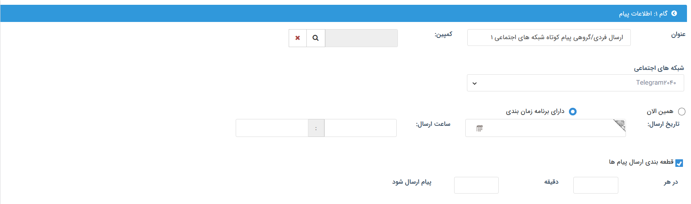

# اطلاعات پیام گروهی شبکه‌های پیام‌رسان
در گام اول برای تنظیم یک پیام گروهی، باید اطلاعات مربوط به برنامه مورد نظر، شامل خط مورد استفاده، زمان و نحوه اجرای برنامه را تعیین کنید. 

## تعیین اطلاعات
برای تکمیل فیلدهای اطلاعات پیام می‌توانید از راهنمای زیر استفاده کنید. 

- **عنوان:** برای برنامه‌ی خود یک عنوان مشخص کنید. این عنوان برای دریافت‌کنندگان پیام (مخاطبان) قابل مشاهده نبوده و صرفاً برای شناسایی آسان‌تر برنامه‌های اجرا شده برای کاربران نرم‌افزار کاربرد دارد.
- **کمپین:** اگر برنامه ارسال گروهی شما به کمپین تبلیغاتی خاصی مرتبط است، از بین کمپین‌های تعریف شده در نرم‌افزار کمپین مورد نظر را انتخاب کنید. برای نشاهده لیست کمپین‌ها بر روی آیکون ذره‌بین کلیک نمایید و سپس کمپین مورد نظر را انتخاب کنید. بدین ترتیب اطلاعات این برنامه در گزارش‌های کمپین مورد نظر اعمال می‌شود.
- **شبکه‌های اجتماعی:** خط شبکه پیام‌رسان مورد نظر برای ارسال پیام را انتخاب نمایید. در این لیست تنها خطوطی که اجازه‌ی ارسال از آن‌ها را داشته‌باشید به شما نمایش داده می‌شود.
- **زمان ارسال:** زمان ارسال را از بین گزینه‌های «همین الان» و «دارای برنامه زمان‌بندی» انتخاب نمایید. در صورت انتخاب گزینه‌ی «همین الان»، برنامه به محض ثبت، اجرا می‌شود. در صورت انتخاب گزینه «دارای برنامه زمان‌بندی»، تاریخ و ساعت مورد نظر برای ارسال پیام را مشخص نمایید تا پیام در زمان مقرر برای مخاطبان ارسال شود.
- **قطعه‌بندی ارسال پیام‌ها:** با فعال کردن این گزینه می‌توانید تعداد پیام‌های ارسالی در هر بازه زمانی را مشخص کنید. به عنوان مثال مشخص کنید که در هر ۱۰ دقیقه ۱۰۰ پیام ارسال شود. 

پس از تکمیل اطلاعات پیام، به منظور تنظیم محتوای پیام به گام دوم بروید. 