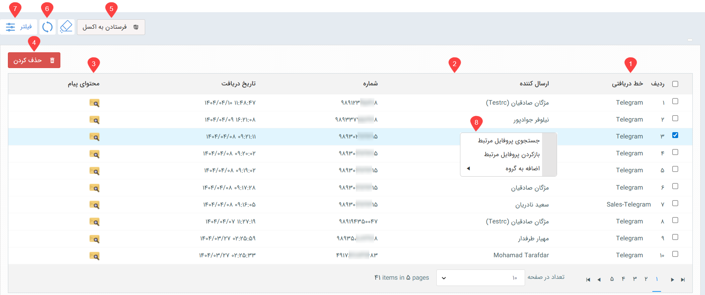
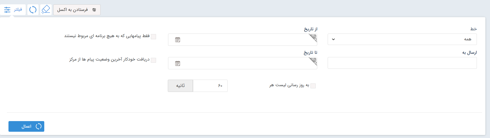

# لیست پیام‌های دریافتی از شبکه‌های پیام‌رسان
تمامی پیام‌هایی که مخاطبان در شبکه‌های پیام‌رسان به شما ارسال کرده‌اند، در لیست پیام‌های دریافتی قابل مشاهده و بررسی می‌باشد. در این لیست می‌توانید تمامی پیام‌هایی که در شبکه‌های پیام‌رسان از مخاطب دریافت کرده‌اید را همراه با اطلاعاتی نظیر مشخصات ارسال‌کننده و محتوای هر پیام را مشاهده نمایید. 

**1. خط دریافتی**  
با توجه به اینکه تمامی پیام‌های دریافتی در شبکه‌های پیام‌رسان (بر روی تمامی خطوط) در این بخش نمایش داده می‌شود، در هر رکورد، خطی که پیام از طریق آن دریافت شده‌است، درج می‌شود. 

**2. نام و شماره ارسال‌کننده** 
نام، نام خانوادگی و همچنین شماره هویت ارسال‌کننده در این قسمت درج می‌شود. چنانچه هویت در گروه به شما پیام داده‌باشد، نام گروه نیز در کنار نام ارسال‌کننده درج می‌شود. 

**3. محتوای پیام** 
با کلیک بر روی آیکون پیام مقابل هر ردیف می‌توانید محتوای پیام دریافتی از مخاطب را مشاهده نمایید. چنانچه پیام دارای تصویر باشد، تصویر دریافت شده نیز به همراه متن پیام در این قسمت قابل مشاهده است. 

**4. حذف کردن** 
برای حذف سابقه پیام دریافتی در شبکه‌های پیام‌رسان کافیست پیام‌های مورد نظر را با تیک انتخاب و سپس بر دکمه حذف را کلیک کنید. 

**5. فرستادن به اکسل** 
در صورت نیاز می‌توانید ردیف‌های مورد نظر یا تمامی ردیف‌ها را انتخاب و از آن خروجی اکسل دریافت کنید.  

**6. به‌روزرسانی** 
پیام‌های دریافتی، خودکار به صورت دوره‌ای به‌روزرسانی می‌شود. چنانچه در صفحه حضور داشتید و در لحظه، به به‌روزرسانی دستی نیاز داشتید می‌توانید با کلیک بر روی آیکون به‌روزرسانی،‌ لیست را به‌روز کنید.  

**7. فیلتر** 
همان طور که بالاتر نیز به آن اشاره شد، در این لیست تمامی پیام‌های دریافتی از طریق تمامی خطوط شبکه‌های پیام‌رسان نمایش داده‌می‌شود. در صورت نیاز به جداسازی پیام‌های دریافتی بر اساس معیارهای مختلف می‌توانید از فیلتر بالای صفحه استفاده کنید.  

- **خط:** برای مشاهده پیام‌هایی که از یک خط مشخص دریافت شده‌اند، خط مورد نظر را انتخاب و فیلتر را اعمال کنید.
- **از تاریخ/تا تاریخ:** برای دسترسی به پیام‌های دریافت شده در یک بازه‌ی زمانی مشخص می‌توانید از این دو فیلد تاریخی برای فیلتر استفاده کنید. توجه داشته‌باشید که برای فیلتر پیام‌های دریافتی از یه تاریخی به قبل/بعد می‌توانید تنها حد بالا/پایین بازه تاریخی را مشخص نمایید.
- **دریافت از:** اگر به پیام‌های دریافت شده از یک شماره مشخص نیاز دارید، شماره مورد نظر را در این قسمت وارد و فیلتر را اعمال نمایید.
- **به‌روزرسانی لیست هر چند ثانیه:** با فعال‌سازی و مشخص کردن زمان مورد نظر می‌توانید تعیین کنید که لیست فیلتر شده‌ی شما، هر چند ثانیه یکبار به‌روزرسانی شود تا آخرین پیام‌های دریافتی نیز در فیلتر شما اعمال شود. 
- **فقط پیام‌هایی که به هیچ برنامه‌ای مربوط نیستند:** پیام‌هایی نمایش داده می‌شود که مخاطب به شماره شما ارسال کرده‌است، اما مربوط به برنامه‌های تبلیغاتی  نیستند. با توجه به اینکه برنامه‌‌ی تبلیغاتی تعاملی‌ای برای این پیام‌رسان ارائه نشده‌است، این گزینه برای این رسانه کاربردی ندارد. 

**8. راست کلیک** 
با انتخاب یک یا چند ردیف از پیام‌های دریافتی و راست کلیک بر روی آن می‌توانید به قابلیت‌های بیشتری دسترسی داشته‌باشید. 
- **جستجوی پروفایل مرتبط:** با استفاده از این گزینه می‌توانید جستجو کنید و تمامی هویت‌هایی که این شماره (که پیام را برای شما ارسال کرده‌است) در پروفایلشان ثبت شده‌است را بیابید.
- **باز کردن پروفایل مرتبط:** پروفایل هویتی که پیام را برایتان فرستاده‌است را باز می‌کند.
- **اضافه به گروه:** با استفاده از این گزینه می‌توانید پروفایل هویتی که پیام را برایتان ارسال کرده را به گروه‌های هدف اضافه کنید. این امر می‌تواند به دلایل مختلفی مانند اجرای کمپین‌‌های آینده و یا انجام پیگیری انجام شود. 

> **نکته** 
> ردیف‌هایی که به صورت پررنگ (Bold) نمایش داده می‌شوند، پیام‌های دریافت شده‌ای هستند که هنوز باز و مشاهده نشده‌اند. 