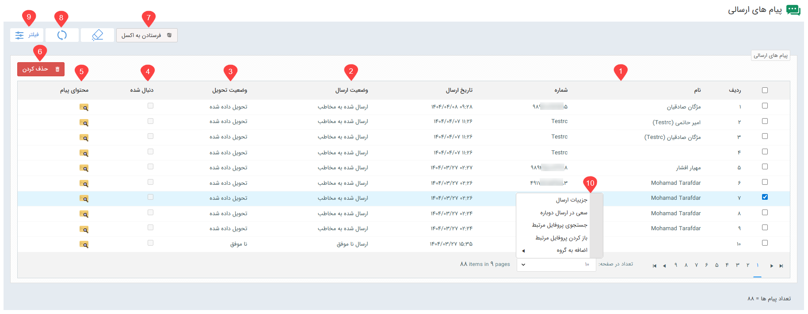
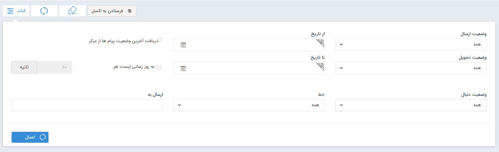
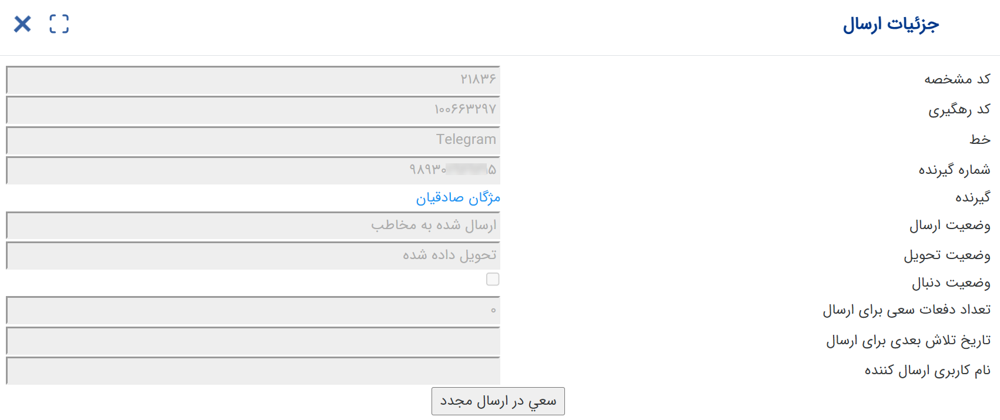

# لیست پیام‌های ارسالی در شبکه‌های پیام‌رسان
تمامی پیام‌های ارسالی در شبکه‌های پیام‌رسان، از تمامی خطوط، در لیست پیام‌های ارسالی قابل مشاهده و بررسی می‌باشد. در این لیست می‌توانید تمامی پیام‌هایی که در شبکه‌های پیام‌رسان برای مخاطب یا در گروه ارسال کرده‌اید را همراه با اطلاعاتی نظیر وضعیت ارسال، تحویل و محتوای هر پیام را مشاهده نمایید. 

**1. نام و شماره**  
نام و شماره هویتی که پیام برای او ارسال شده‌است، در دو ستون اول به شما نمایش داده می‌شود. لازم به ذکر است که چنانچه پیامی در گروه ارسال شده‌باشد، نام گروه به جای شماره درج می‌شود (نظیر ردیف شماره ۴ در تصویر فوق). هنگام ارسال پیام در گروه، علاوه بر رکورد پیام ارسالی در آن، برای هر یک از اعضای گروه نیز یک رکورد ارسالی ثبت می‌شود. نام این افراد به عنوان گیرنده همراه با نام گروه در ستون نام درج می‌شود تا مشخص شود که پیام در گروه به این مخاطب ارسال شده‌است نه در چت شخصی (نظیر ردیف ۳ و ۲ در تصویر فوق). 

**2. وضعیت ارسال** 
در این قسمت می‌توانید از وضعیت ارسال پیام مطلع شوید. وضعیت ارسال پیام، یکی از حالات زیر می‌باشد: 
- **در صف ارسال:** پیام به‌ درستی در صف ارسال قرار گرفته و در حال ارسال است.
- **ارسال‌ شده به مرکز:** پیام به‌درستی به پنل مرکز ارسال شده‌است.
- **ارسال‌ شده به مخاطب:** پیام به درستی به مخاطب ارسال شده‌است. این به معنای تحویل گرفتن پیام از طرف مخاطب می‌باشد.
- **ارسال ناموفق:** پیام به درستی ارسال نشده‌است.
- **ارسال دوباره:** پیام در حال تلاش مجدد برای ارسال است.

**3. وضعیت تحویل** 
وضعیت تحویل می‌تواند به شما کمک کند تا مطمئن شوید که مخاطبتان پیام را دریافت کرده‌است. وضعیت تحویل پیام، یکی از حالات زیر می‌باشد: 
- **نامشخص:** هنوط مشخص نیست که مخاطب پیام را دریافت کرده‌است یا خیر. چنانچه وضعیت ارسال، «ارسال شده به مخاطب» و وضعیت تحویل «نامشخص» باشد، بدین معناست که پیام به مخاطب تحویل داده شده اما هنوز پیام را باز و مشاهده نکرده‌است.
- **تحویل داده شده:** مخاطب پیام را دریافت و مشاهده کرده‌است.
- **ناموفق:** مخاطب پیام را دریافت نکرده‌است. 

**4. دنبال شده** 
این بخش مرتبط با برنامه‌های تبلیغاتی تعاملی می‌باشد و در این زمینه کاربردی ندارد. 

**5. محتوای پیام** 
با کلیک بر روی آیکون پیام مقابل هر ردیف می‌توانید محتوای پیام ارسالی به مخاطب را مشاهده نمایید. چنانچه پیام دارای تصویر باشد، تصویر ارسال شده نیز به همراه متن پیام در این قسمت قابل مشاهده است. 

**6. حذف کردن** 
برای حذف سابقه پیام ارسال‌ شده در شبکه‌های پیام‌رسان کافیست پیام‌های مورد نظر را با تیک انتخاب و سپس بر دکمه حذف را کلیک کنید. توجه داشته‌باشید که با حذف پیام از لیست ارسالی‌ها، پیام از لیست کلی و همچنین سابقه هویت در پیام‌گستر حذف می‌شود لکن در پیام در پیام‌رسان بدون تغییر باقی می‌ماند. 

**7. فرستادن به اکسل** 
در صورت نیاز می‌توانید ردیف‌های مورد نظر یا تمامی ردیف‌ها را انتخاب و از آن خروجی اکسل دریافت کنید.  

**8. به‌روزرسانی** 
پیام‌های ارسالی از نرم‌افزار، خودکار به صورت دوره‌ای به‌روزرسانی می‌شود. چنانچه در صفحه حضور داشتید و در لحظه، به به‌روزرسانی دستی نیاز داشتید می‌توانید با کلیک بر روی آیکون به‌روزرسانی،‌ لیست را به‌روز کنید.  

**9. فیلتر** 
همان طور که بالاتر نیز به آن اشاره شد، در این لیست تمامی پیام‌های ارسالی از تمامی خطوط شبکه‌های پیام‌رسان نمایش داده‌می‌شود. در صورت نیاز به جداسازی پیام‌های ارسالی بر اساس معیارهای مختلف می‌توانید از فیلتر بالای صفحه استفاده کنید.  

- **وضعیت ارسال/تحویل/دنبال شده:** بر اساس آنچه در مورد هر یک از حالات وضعیت ارسال/تحویل پیام توضیح داده شد، می‌توانید پیام‌های ارسالی را بر اساس وضعیت ارسال/تحویل فیلتر نمایید.
- **از تاریخ/تا تاریخ:** برای دسترسی به پیام‌های ارسال شده در یک بازه‌ی زمانی مشخص می‌توانید از این دو فیلد تاریخی برای فیلتر استفاده کنید. توجه داشته‌باشید که برای فیلتر پیام‌های از یه تاریخی به قبل/بعد می‌توانید تنها حد بالا/پایین بازه تاریخی را مشخص نمایید.
- **خط:** برای مشاهده پیام‌هایی که از یک خط مشخص ارسال شده‌اند، خط مورد نظر را انتخاب و فیلتر را اعمال کنید.
- **ارسال به:** اگر به پیام‌های ارسال شده به یک شماره مشخص نیاز دارید، شماره مورد نظر را در این قسمت وارد و فیلتر را اعمال نمایید.
- **به‌روزرسانی لیست هر چند ثانیه:** با فعال‌سازی و مشخص کردن زمان مورد نظر می‌توانید تعیین کنید که لیست فیلتر شده‌ی شما، هر چند ثانیه یکبار به‌روزرسانی شود تا آخرین پیام‌های ارسالی نیز در فیلتر شما اعمال شود. 

**10. راست کلیک** 
با انتخاب یک یا چند ردیف از پیام‌های ارسالی و راست کلیک بر روی آن می‌توانید به قابلیت‌های بیشتری دسترسی داشته‌باشید. 
- **جزئیات ارسال:** در این قسمت جزئیات مرتبط با ارسال هر پیام مانند کد رهگیری، وضعیت تحویل و ارسال را می‌توانید مشاهده کنید.

- **سعی در ارسال دوباره:** با استفاده از این گزینه می‌توانید پیام را مجدد برای مخاطب ارسال کنید.
- **جستجوی پروفایل مرتبط:** با استفاده از این گزینه می‌توانید جستجو کنید و تمامی هویت‌هایی که این شماره (که پیام برایش ارسال شده‌است) در پروفایلشان ثبت شده‌است را بیابید.
- **باز کردن پروفایل مرتبط:** پروفایل هویتی که پیام برای او ارسال شده‌است را باز می‌کند.
- **اضافه به گروه:** با استفاده از این گزینه می‌توانید پروفایل هویتی که پیام برایش ارسال شده‌است را به گروه‌های هدف اضافه کنید. این امر می‌تواند به دلایل مختلفی مانند اجرای کمپین‌‌های آینده و یا انجام پیگیری انجام شود. 

