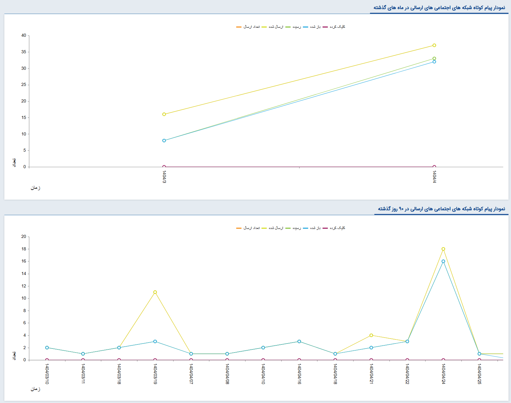

# نمودار پیام ارسالی شبکه‌های پیام‌رسان
در این بخش می‌توانید نموداری از پیام‌های ارسالی در شبکه‌های پیام‌رسان در ۳۰ و ۹۰ روز گذشته مشاهده کنید. بر همین اساس، دو نمودار در صفحه به شما نمایش داده‌می‌شود:  
**نمودار پیام‌های ارسالی در ماه گذشته**  
این نمودار پیام‌های ارسالی در شبکه‌های پیام‌رسان در یک ماه گذشته را به شما نمایش می‌دهد. در این نمودار می‌توانید تعداد پیام‌های ارسالی در یک ماه گذشته، تعدادی که به مخاطب رسیده و تعداد پیام‌هایی که مخاطب آن را باز و مشاهده کرده‌است را مشاهده نمایید. 
**نمودار پیام‌های ارسالی در ۹۰ روز گذشته**  
این نمودار پیام‌های ارسالی در شبکه‌های پیام‌رسان در ۹۰ روز گذشته را به شما نمایش می‌دهد. در این نمودار می‌توانید تعداد پیام‌های ارسالی در ۹۰ روز گذشته، تعدادی که به مخاطب رسیده و تعداد پیام‌هایی که مخاطب آن را باز و مشاهده کرده‌است را مشاهده نمایید. 

با کلیک بر روی هر یک از گزینه‌های تعداد ارسال، ارسال شده، رسیده و باز شده می‌توانید آن را فعال و غیرفعال کنید. به عنوان مثال اگر قصد دارید فقط تعداد پیام‌های ارسال شده بر روی نمودار به شما نمایش داده شود، سایر موارد را غیرفعال کرده تا تنها نمودار پیام‌های رسیده (نمودار سبز) به شما نمایش داده شود. در صورت نیاز به مقایسه تعداد پیام‌های رسیده با پیام‌های مشاهده شده، نمودار باز شده (نمودار آبی) را نیز فعال نمایید. 