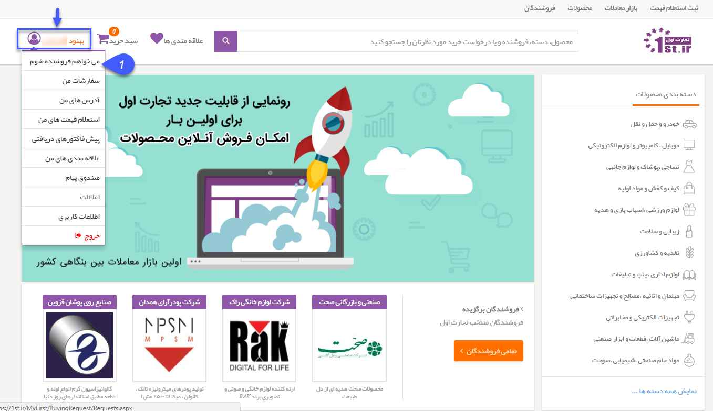
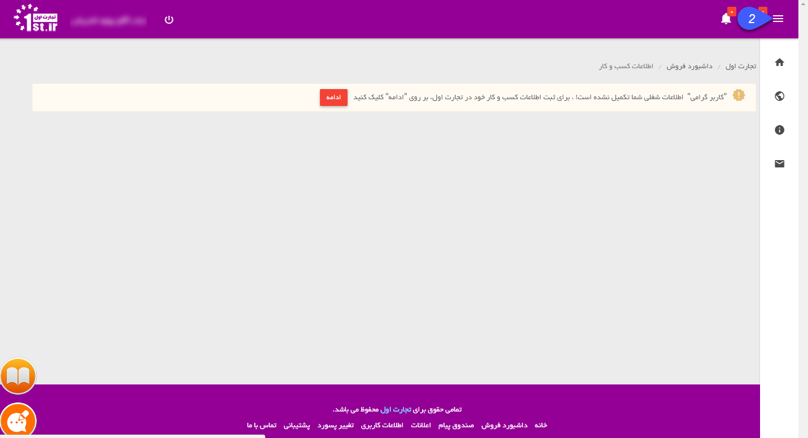
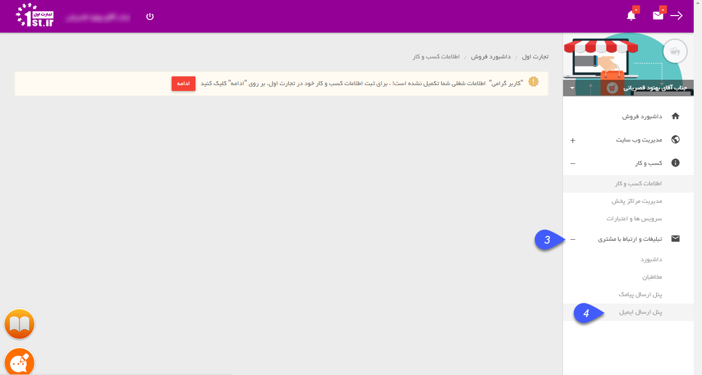
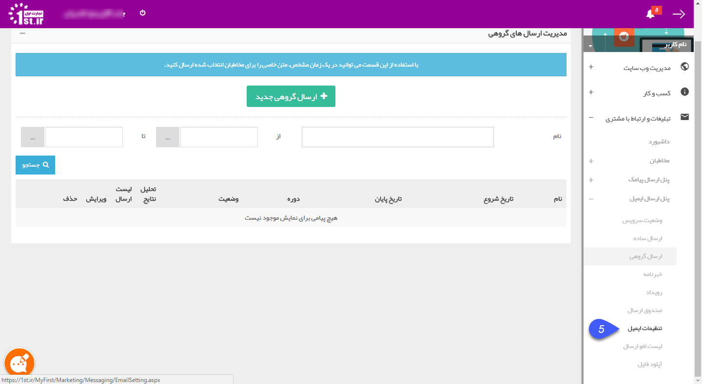
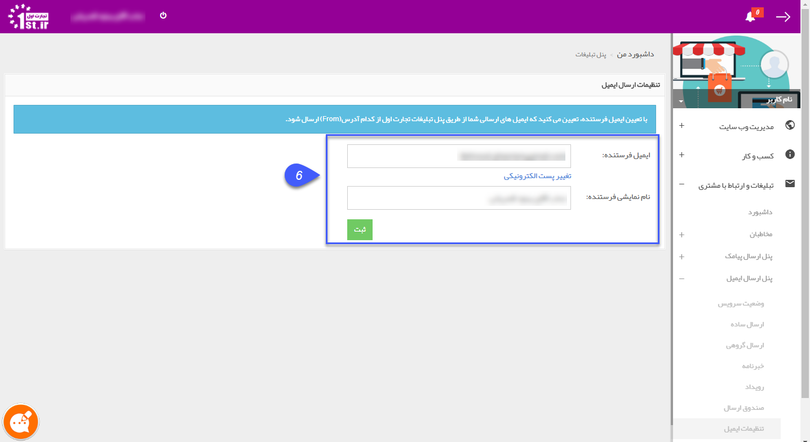

# اپراتور ارسال ایمیل پرتال اول
اپراتور ارسال ایمیل می تواند پرتال اول و یا SMTP باشد. برای ارسال ایمیل از طریق پرتال اول باید در پرتال اول دارای حساب کاربری باشید و در منوی 1st، مشخصات کاربری، نام کاربری و رمز عبور خود را وارد کرده باشید.
آدرس ایمیلی که ایمیل‌های ویژه شما از آن ارسال می‌شود از طریق این صفحه قابل تغییر می‌باشد. 
ابتدا از طریق نام کاربری خود در سایت www.1st.ir  وارد شوید و سپس مانند شکل زیر عمل کنید:

**1**. در بالای صفحه روی نام خود و سپس روی دکمه **" میخواهم فروشنده شوم"** کلیک کنید.

**2**. سپس در صفحه پیش رو، روی دکمه سه خط، مانند شکل کلیک کنید تا تب منو برای شما باز شود.

**4و3**. در منوی باز شده، در قسمت **"تبلیغات و ارتباط با مشتری"** کلیک کرده و سپس **"پنل ارسال ایمیل"** را کلیک کنید.

**5**. در پنل ارسال ایمیل وارد تنظیمات ایمیل می‌شوید. مانند شکل زیر

**6**.در این کادر ایمیل پیش‌فرض جهت ارسال و نام فرستنده بصورت پیش‌فرض نوشته شده است که در صورت نیاز می‌توان تغییر داد.

