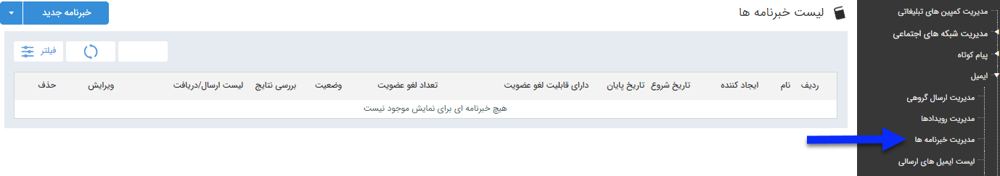

# خبرنامه 

با استفاده از این قابلیت این امکان فراهم می شود تا در تاریخ های مورد نظر پیام های  هوشمند مختلفی را برای مخاطبان خود ارسال کنید .

در صفحه اول، می توان با تعیین تاریخ اجرا، کاربر ایجاد کننده برنامه،نام برنامه تعریف شده و براساس قابلیت عضویت و لغو عضویت و زدن دکمه فیلتر، لیست برنامه های اجرا شده در گذشته را مشاهده کرد. اما برای اجرای یک برنامه جدید باید بر روی دکمه "خبرنامه جدید" در سمت راست و بالای صفحه کلیک کرده و بالای صفحه کلیک کرده و با گذراندن چند گام ساده، برنامه را به راحتی اجرا نمایید.

لطفا ابتدا  [اطلاعات مشترک بین ابزارها](https://github.com/1stco/PayamGostarDocs/blob/master/Help/Marketing/moshtarak-abzar/moshtarak-abzar.md) را مطالعه فرمایید و طبق گام های زیر برای ارسال گروهی جدید اقدام فرمایید

 گام 1- [اطلاعات خبرنامه](https://github.com/1stco/PayamGostarDocs/blob/master/Help/Marketing/email/Newsletters-email/1-avalie-khabarname-email/1-avalie-khabarname-email.md)

گام 2-  [تنظیم متن]( https://github.com/1stco/PayamGostarDocs/blob/master/Help/Marketing/email/send-group-email/2-tanzim-matn-email/2-tanzim-matn-email.md)

گام 3-  [انتخاب مخاطبان]( https://github.com/1stco/PayamGostarDocs/blob/master/Help/Marketing/email/Newsletters-email/3-mokhatab-khabarname-email/3-mokhatab-khabarname-email.md)

