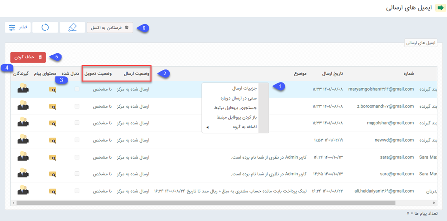
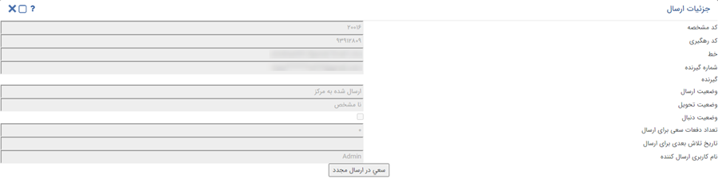
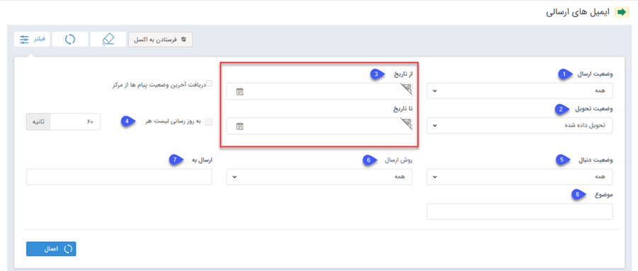

# لیست ایمیل‌‌های ارسالی
در یک برنامه تبلیغاتی برای مشاهده لیست ایمیل‌های ارسالی از مسير **ابزار تبليغات** > **ایمیل** > **ليست ایمیل‌هاي ارسالی** اقدام کنيد.
 در این صفحه ایمیل‌های ارسالی، آدرس گیرنده، تاریخ ارسال، وضعیت ارسال، وضعیت تحویل، وضعیت دنبال، محتوای پیام و گیرندگان قابل مشاهده است.

>**نکته** 
>برای اطلاعات بیشتر در خصوص لیست ارسال ها به قسمت  [اطلاعات مشترک لیست ارسال](https://github.com/1stco/PayamGostarDocs/blob/master/Help/Marketing/sms/Send-ist/moshtarake-liste-ersal.md) مراجعه کنید.

**1**. با کليک راست بر روي يک ایمیل گزينه‌هاي زير مشاهده مي‌شود:

- **جزئیات ارسال**: در این قسمت جزئیات مرتبط با ارسال ایمیل مانند کد رهگیری، وضعیت تحویل و ارسال را می‌توانید مشاهده کنید.

 
- **سعی در ارسال دوباره**: در این گزينه، ایمیل دوباره ارسال خواهد شد. 
- **جستجوی پروفایل مرتبط**: پروفایل‌هایی را که در نرم‌افزار شامل این ایمیل هستند نمایش می‌دهد. 
- **باز کردن پروفایل مرتبط**: در صورتی که بسته به رسانه تبلیغاتی، اطلاعات ایمیل موردنظر، در پیام گستر ثبت شده باشد، با 
انتخاب این گزینه پروفایل مربوط به این ایمیل  باز خواهد شد. 
- **اضافه به گروه**: در صورتی که ایمیل مربوط به یک پروفایل در پیام گستر باشد، می‌توان از همین بخش آن را به گروه هدف خاصی برای پیگیری‌های آینده اضافه نمود. 
**2. وضعیت ارسال و وضعیت تحویل**: این دو ستون می‌توانند به آگاهی شما از نتیجه ایمیل‌های ارسالی کمک کنند. 
**3.محتوای پیام**: در ستون محتوای پیام، می توانید، متن ایمیل ارسالی خودر را ببینید . 
**4. گیرندگان**: در ستون گیرندگان، آدرس ایمیل گیرندگان قابل مشاهده است. 
**5. حذف کردن**: برای حذف سابقه ایمیل ارسال‌شده کافی است ایمیل‌های مورد نظر را با تیک انتخاب و سپس دکمه حذف را کلیک کنید. 
**6.فرستادن به اکسل**: با استفاده از اين گزينه می‌توانید لیست ارسال‌های انتخاب شده را در قالب فایل اکسل دریافت کنید.

درقسمت فیلترها، با توجه فیلدهای مشخص‌شده می‌توانید دامنه نمایش ایمیل‌ها را محدود کنید.

**1. وضعیت ارسال**: انواع وضعیت ارسال به شرح زیر است

- **در صف ارسال**: ایمیل به‌درستی در صف ارسال قرار گرفته و در حال ارسال است. 
- **ارسال‌شده به مرکز**: ایمیل به‌درستی به پنل مرکز ارسال شده است. 
- **ارسال‌شده به مخاطب**: مخاطب ایمیل را به‌درستی دریافت کرده است. 
- **ارسال ناموفق**: مخاطب ایمیل را دریافت نکرده است. 
- **ارسال دوباره**: نشان‌دهنده تلاش مجدد برای ارسال است.

**2. وضعیت تحویل**: انواع وضعیت تحویل به شرح زیر است

- **نامشحص**: هنوز مرکز پاسخی برای وضعیت تحویل ایمیل به مخاطب برای نرم افزار ارسال نکرده است. 
- **تحویل داده شده**: ایمیل به مخاطب تحویل داده شده است. 
- **ناموفق**: ایمیل به مخاطب تحویل داده نشده است.

**3 .از تاریخ/تا تاریخ**: ابتدا و انتهای بازه زمانی ارسال را در این قسمت مشخص کنید.

**4. به روز رسانی لیست**: با استفاده از این گزینه می‌توانید تعیین کنید که این لیست ارسال، هر چند ثانیه یکبار به‌روزرسانی شود.

**5. وضعیت دنبال**: اگر در ایمیل ارسال‌شده لینکی وجود داشته باشد و مخاطب آن را باز کرده باشد، وضعیت به دنبال‌شده تغییر می‌کند و در غیر این صورت دنبال‌نشده است. 

**6. روش ارسال**: خط ارسال‌کننده ایمیل را در این قسمت مشخص کنید.

**7. ارسال به**: در این قسمت ایمیل مقصد را مشخص کنید.

**8. موضوع**: در این قسمت می‌توانید جستجو را بر اساس موضوع انجام دهید.