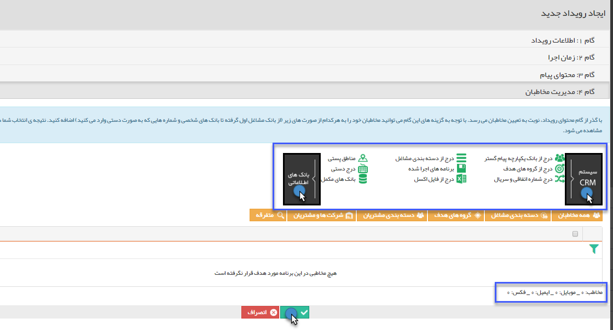

# گام 4 -  مدیریت مخاطبان رویداد تبلیغاتی پیامک 

برای استفاده از این بخش به لینک ([ انتخاب مخاطبان](https://github.com/1stco/PayamGostarDocs/blob/master/Help/Marketing/moshtarak-abzar/gam%20se/select-Audience.md) ) مراجعه نمایید.

این مخاطبان باید شامل پروفایل هایی باشند که شماره تلفن همراه در آن ها وجود داشته باشد .

