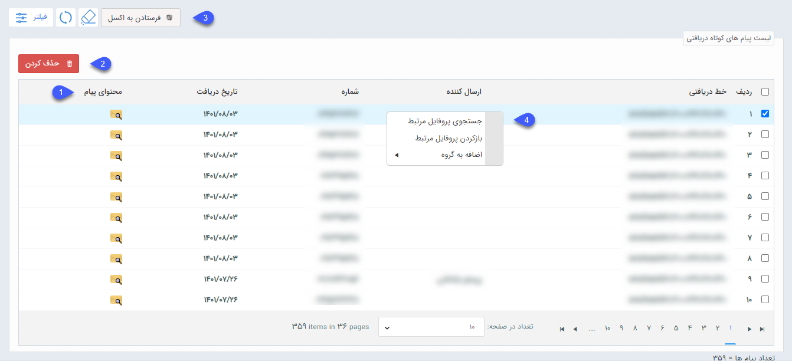
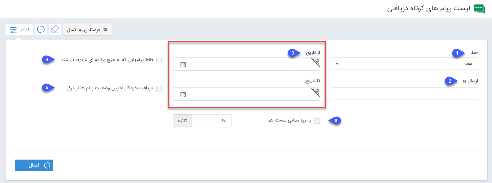

#  لیست پیامک‌های دریافتی 
در یک برنامه تبلیغاتی برای مشاهده لیست پیام‌هاي دریافتی از مسير **ابزار تبليغات** > **پيام کوتاه** > **ليست پيام‌هاي دریافتی** اقدام کنيد. 
برای مشاهده لیست پیام‌های دریافتی، کاربر نیاز به مجوز مشاهده ليست پيام‌های دريافتي دارد.  
در این پنجره تمام پیام کوتاه‌هایی که به شماره شما ارسال شده است، شماره خط دریافتی، ارسال کننده، شماره آن و همچنین تاریخ دریافت نمایش داده می شود. 

**1.محتوای پیام**: با استفاده از این گزینه محتوای پیام‌های دریافتی قابل مشاهده است. 
**2. حذف**: برای حذف سابقه پیام دریافت‌شده کافی است پیام‌های مورد نظر را با تیک انتخاب و سپس دکمه حذف را کلیک کنید. 
**3. فرستادن به اکسل**: با استفاده از اين گزينه می‌توانید لیست در‌یافت‌های انتخاب‌شده را در قالب فایل اکسل دریافت کنید. 
4. با کليک راست بر روي يک پيام گزينه‌هاي زير مشاهده مي‌شود:

**جستجوی پروفایل مرتبط**: پروفایل‌هایی را که در نرم‌افزار شامل این شماره هستند نمایش می‌دهد. 
**بازکردن پروفایل مرتبط**: در صورتی که بسته به رسانه تبلیغاتی، اطلاعات شماره موردنظر، در پیام گستر ثبت شده باشد، با انتخاب این گزینه پروفایل مربوط به این شماره باز خواهد شد. 
**اضافه به گروه**: در صورتی که شماره مربوط به یک پروفایل در پیام گستر باشد، می‌توان از همین بخش آن را به گروه هدف خاصی برای پیگیری‌های آینده اضافه نمود. 
 می‌توان لیست پیام‌ها را با فاکتورهایی مانند تاریخ دریافت، یا بازه‌ای بین دو تاریخ، شماره خط ارسال‌کننده، خط دریافتی فیلتر کرد.

**1.خط**: خط دریافت‌کننده پیامک را در این قسمت مشخص کنید. 
**2.ارسال‌کننده**: شماره خط ارسال‌کننده را در این قسمت وارد کنید. 
**3. از تاریخ/تا تاریخ**: ابتدا و انتهای بازه زمانی دریافت را در این قسمت مشخص کنید. 
**4. فقط پیام‌هایی که به هیچ برنامه‌ای مربوط نیستند**: پیام‌هایی نمایش داده می‌شود که مخاطب به شماره شما ارسال کرده است، اما مربوط به برنامه‌های تبلیغاتی مثل مسابقه نیست. 
**5. دریافت آخرین وضعیت پیام‌ها از مرکز**: با فعال‌کردن این گزینه، کلید فیلتر علاوه بر اعمال فیلترهای تعیین‌شده، آخرین وضعیت ارسال و تحویل پیام‌ها را از سرور دریافت خواهد کرد. 
**6. به‌روزرسانی لیست**: با استفاده از این گزینه می‌توانید تعیین کنید که این لیست دریافت، هر چند ثانیه یکبار به‌روزرسانی شود. 
 

