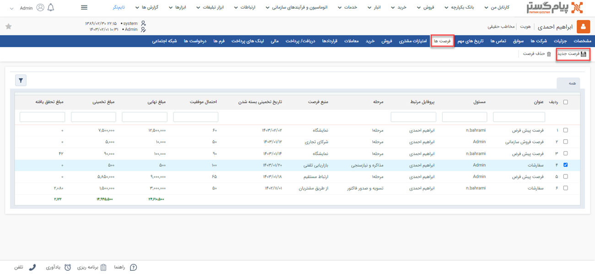
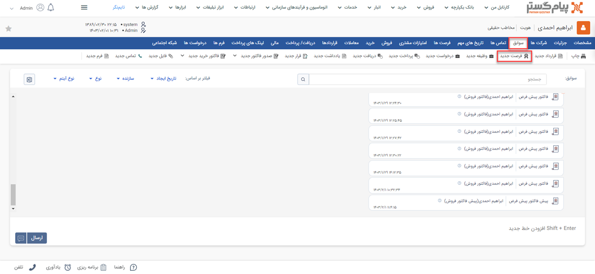
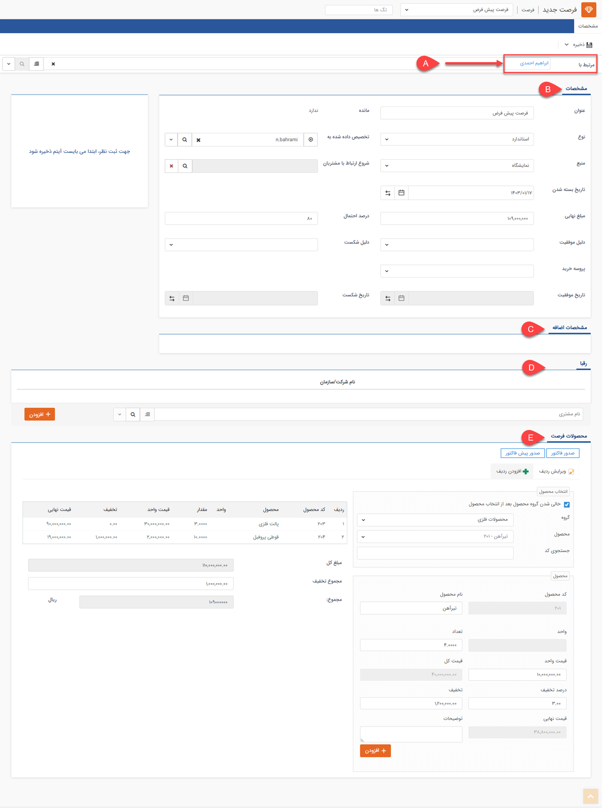

# ثبت فرصت
 چنانچه نیاز به ثبت درخواست مشتری خود دارید می‌توانید از آیتم فرصت برای منظم کردن فرآیند فروش استفاده نمایید. از این طریق می‌توانید با ثبت دلایل شکست یا موفقیت فرصت‌های فروش خود را ارزیابی کنید. 

> **نکته** 
>پس از ثبت فرصت می‌توانید از روی فرصت برای مشتری خود پیش‌فاکتور و فاکتور ثبت کنید.

## مسیر‌های ثبت فرصت
شما از طریق مسیرهای زیر میتوانید برای مشتری خود فرصت جدید ثبت کنید. 
- **ویجت دسترسی سریع** > **فرصت**

- **تب فروش** > **فرصت‌ها** >**زیرنوع فرصت‌ها** >**فرصت**

- **صفحه اصلی پروفایل مخاطب** > **فرصت‌ها** > **فرصت جدید** 

- **صفحه اصلی پروفایل مخاطب** > **تب سوابق** > **فرصت جدید**

 **صفحه اصلی پروفایل مخاطب** > **آیتم‌ها** > **فرصت جدید** 
برای مشاهده لیست «آیتم‌های جدید» بر روی فلش کنار «تماس جدید» (قابل مشاهده در نوار سفید بالای صفحه) مراجعه نمایید.

## شیوه‌ی ثبت فرصت
در صورت داشتن چند زیرنوع فرصت، به انتخاب صحیح آن توجه داشته باشید. زیرنوع آیتم در قسمت بالای صفحه قابل مشاهده و قابل تغییر می‌باشد. در تصویر زیر، «فرصت پیش‌فرض» و «فرصت سفارشات» را داریم که یکی از آنها برای ثبت نمونه انتخاب شده است. 
برای ثبت فرصت لازم است فیلدهای مورد نیاز آیتم را با اطلاعات موجود تکمیل و سپس ذخیره نمایید. مشخصات فرصت در پیام‌گستر به شرح زیر می‌باشد: 

### A. مرتبط با
نام هویتی که این فرصت برای او ثبت شده را در این قسمت درج کنید. بدین منظور کافیست بخشی از نام هویت مورد نظر را تایپ نمایید تا لیست هویت‌های مشابه آن برای انتخاب به شما نمایش داده شود.

### B. مشخصات 
- **عنوان**  عنوان مناسبی برای فرصت انتخاب کنید. (این عنوان نشان دهنده عنوان پروژه فروش است.)
- **مانده**  مانده حساب مرتبط با این فرصت را نمایش می‌دهد، در واقع اگر در سوابق این فرصت آیتم‌هایی ایجاد کنید که مشتری را بدهکار یا بستانکار می‌کند (آیتم‌های فاکتور، دریافت/پرداخت و قرارداد) میزان بدهکاری یا بستانکاری مشتری که مرتبط با این فروش است را می‌توانید در این قسمت مشاهده کنید. 
> **نکته**  توجه داشته باشید که این مانده حساب ممکن است با مانده حساب اصلی مشتری که در صفحه مشخصات پروفایل نمایش داده می‌شود، متفاوت باشد. در واقع یکی از **فواید** آیتم **فرصت فروش**، در اختیار داشتن تمامی‌ فعالیت‌های انجام شده در پروسه فروش به صورت یکپارچه است.   
>> زمانی که فرصت به نتیجه رسید، آیتم‌های فاکتور، قرارداد، دریافت و فاکتور برگشت از فروش را در سوابق فرصت ایجاد کنید، در هر مرحله از فروش می‌توانید وضعیت بدهکاری یا بستانکاری مشتری که مرتبط با این فروش است را در این قسمت مشاهده کنید.

- **نوع**  نوع این فرصت را مشخص کنید. این انواع اگر به مجموعه شما مرتبط نیست می‌توانید با توجه به زمینه فعالیت شرکت آیتم‌هایی را در این قسمت اضافه نمایید. ( به قسمت [مدیریت آیتم‌های سیستم ](https://github.com/1stco/PayamGostarDocs/blob/master/Help/Basic-Information/Management-of-system-items/Management-of-system-items.md)مراجعه کنید.)
- **تخصیص داده‌شده به**  کاربر مرتبط با این فرصت فروش را مشخص نمایید. (این کاربر مسئولیت به ثمر رساندن این فرصت را بر عهده دارد.)
- **منبع**  نشان‌دهنده روش جذب مشتری است و می‌توان آیتم‌های مختلفی را به آن اضافه نمود. [(مدیریت آیتم‌های سیستم ) ](https://github.com/1stco/PayamGostarDocs/blob/master/Help/Basic-Information/Management-of-system-items/Management-of-system-items.md)به طور مثال: تماس تلفنی، تبلیغات، نمایشگاه، معرفی همکار یا دوست و ... .
- **شروع ارتباط با مشتریان**   با استفاده از این فیلد می‌توانید این فرصت فروش را به یکی از کمپین‌های تبلیغاتی تعریف شده در نرم افزار متصل کنید (مدیریت کمپین‌های تبلیغاتی ). با تعریف ارتباط فرصت‌ها و کمپین‌های تبلیغاتی، گزارشات دقیق تری از تعداد فرصت‌های بوجود آمده از کمپین‌های تبلیغاتی و میزان فروش مرتبط با کمپین‌ها در گزارشات تحلیلی ساختاریافته خواهید داشت.
- **تاریخ بسته‌شده**  هر فرصت فروش برای به نتیجه رسیدن نیاز به پیگیری از طرف کارشناسان فروش دارد. با استفاده از این فیلد می‌توانید تاریخ بسته شدن این فرصت و در واقع بیشینه زمان ممکن برای پیگیری این فرصت را تعیین کنید. توجه داشته باشید که پس از گذشتن این تاریخ، نرم افزار ممانعتی از پیگیری دوباره و ویرایش این فرصت به عمل نمی‌آورد و وارد کردن این تاریخ صرفا جهت اطلاع رسانی زمان موعد پروسه فروش می‌باشد.
- **مبلغ نهایی** مبلغ نهایی خود را می‌توانید تعیین کنید تا میزان اهمیت یک فرصت را از لحاظ میزان احتمالی سود دریابید. توجه داشته باشید که اگر محصولات مرتبط با این فرصت را وارد کنید، مبلغ نهایی به صورت خودکار و بر اساس قیمت‌های تعریف شده در مدیریت محصولات درج خواهد شد.
- **درصد احتمال**  احتمال خرید از جانب مشتری و در واقع احتمال موفق شدن این فرصت فروش را نشان می‌دهد.
- **دلیل موفقیت/شکست**  از به نتیجه رسیدن فرصت که ممکن است موفق یا ناموفق باشد، می‌توانید دلیل موفقیت یا شکست را وارد کنید تا بتوانید تحلیل دقیق تری از نقاط قوت و ضعف سازمان خود در بخش فروش داشته باشید. با توجه به شناخت خود از دلایل موفقیت و شکست فرصت‌های فروش،گزینه‌های مرتبط با این لیست‌ها را در قسمت مدیریت آیتم‌های سیستم تعریف کنید. (این لیست‌ها را می‌توانید با عناوین "علت به دست آوردن فرصت" و "علت از دست دادن فرصت" در مدیریت آیتم‌های سیستم بیابید)
- **پروسه خرید**  نوع تصمیم‌گیری مشتری برای خرید را تعیین می‌کند. (اینکه مشتری به صورت فردی برای خرید تصمیم می‌گیرد یا خرید او از ما نیاز به تصمیم گیری یک گروه دارد)
- **تاریخ موفقیت**  س از به نتیجه رسیدن فرصت (موفق یا ناموفق شدن مرحله فروش) فیلد تاریخ موفقیت یا تاریخ شکست به صورت خودکار درج خواهد شد و امکان تغییر آن به صورت دستی وجود ندارد. با در اختیار داشتن این تاریخ و مقایسه آن با تاریخ ایجاد فرصت، می‌توانید بازه زمانی پیگیری این فرصت را تحلیل کنید.
- **تاریخ شکست** س از به نتیجه رسیدن فرصت (موفق یا ناموفق شدن مرحله فروش) فیلد تاریخ موفقیت یا تاریخ شکست به صورت خودکار درج خواهد شد و امکان تغییر آن به صورت دستی وجود ندارد. با در اختیار داشتن این تاریخ و مقایسه آن با تاریخ ایجاد فرصت، می‌توانید بازه زمانی پیگیری این فرصت را تحلیل کنید.
### C. مشخصات اضافه   
 می‌توانید در قسمت [شخصی سازی،](https://github.com/1stco/PayamGostarDocs/blob/master/Help/Settings/Personalization-crm/Overview/General-information/Add-features/Add-features.md) فیلدهای مورد نیاز خود را به آیتم فرصت اضافه کنید تا بتوانید اطلاعات کامل تری از پروسه فروش خود داشته باشید (به طور مثال نحوه ارسال بار برای مشتری یا مذاکرات مرتبط با شرایط پرداخت). فیلدهای اضافه شده در این قسمت نمایش داده خواهند شد.
### D. رقبا 
 نام رقبایی که در این فرصت ممکن است به دلیل وجود آنها فرصت به حالت ناموفق و شکست خورده در آید را وارد کنید تا بتوانید آنالیز دقیق تری از رقبای خود داشته باشید.
### E. محصولات فرصت 

**انتخاب محصول:** خدمات و یا محصولاتی که قصد فروش آن‌ها را در این فرصت دارید، وارد کنید. مزیت وارد کردن محصولات در فرصت این است که مبلغ برآوردی به صورت خودکار درج خواهد شد و همچنین می‌توانید به راحتی و با کلیک بر روی یک دکمه از این محصولات پیش فاکتور یا فاکتور صادر کنید. 
 **چک باکس مربوط به انتخاب محصول:** در صورت غیر فعال کردن این گزینه، پس از انتخاب یک محصول، دسته بندی محصول انتخاب شده باز می‌ماند تا بتوانید از همان دسته بندی یک یا چند محصول دیگر را انتخاب کنید. 
**صدور پیش فاکتور:** می‌توانید از روی این فرصت یک پیش فاکتور ایجاد نمایید که در محتوای آن محصولات تعریف شده در این فرصت به عنوان کالا درج شده اند. 
**صدور فاکتور:** می‌توانید از روی این فرصت یک فاکتور ایجاد نمایید که در محتوای این فاکتور محصولات تعریف شده در این فرصت به عنوان کالا درج شده اند. 
 **مرحله فروش:** نشان دهنده مراحل فروش به مشتری است و می‌تواند یکی از گزینه‌های برقراری ارتباط، مذاکره و ... باشد. (البته شما می‌توانید در شخصی سازی فرصت مراحل مورد نظر خود را تعریف کنید، برای مطالعه بیشتر به بخش[ مرحله بندی ](https://github.com/1stco/PayamGostarDocs/blob/master/Help/Settings/Personalization-crm/Overview/General-information/leveling/leveling.md)مراجعه نمایید.) با تعیین دقیق مرحله فروش مرتبط با هر فرصت می‌توانید پراکندگی کل فرصت‌ها در هریک از مراحل فروش را در گزارشات تحلیلی نرم افزار، نمودار وضعیت فروش مشاهده کنید.

- **لیست قیمت:**
 با استفاده از این قسمت می‌توانید لیست قیمت مورد نظر خود را انتخاب نمایید، تا قیمت خدمات/کالاهای این فرصت بر اساس آن درج شود. با اتنخاب لیست قیمت در این قسمت، تمامی قیمت‌‌های درج شده در جدول مشخصات ردیف فرصت  بر اساس آن لحاظ می‌شود.  
در صورتی که ماژول[ کلاس بندی مشتریان ](https://github.com/1stco/PayamGostarDocs/blob/master/Help/Settings/Customer-classification-management/Customer-classification-management.md)فعال باشد، و مشتری در یکی از سطوح کلاس بندی‌ قرار گرفته باشد، به صورت خودکار تعیین می‌گردد.

> **نکته**  
> برای استفاده از لیست قیمت لازم است: **۱**) ماژول لیست قیمت برای شما فعال باشد؛ **۲**) لیست قیمت‌های مختلف (مثل لیست قیمت خرده‌فروشی و عمده‌فروشی) تعریف شده باشد؛ **۳**) شما مجوز استفاده از لیست قیمت را داشته باشید. در صورت عدم امکان استفاده از این قابلیت علت یکی از سه مورد فوق است. 

- **فروشنده:** می‌توانید کارشناس فروش مرتبط با این پیش‌فاکتور را تعیین کنید. کاربران نرم‌افزار در لیست نمایش داده می‌شود و می‌توانید از لیست نام شخص فروشنده را انتخاب نمایید. به صورت پیش‌فرض نام کاربر ایجادکننده در این فیلد قرار می‌گیرد. 
- **تاریخ صدور:** تاریخ صدور فاکتور را تعیین نمایید. این تاریخ می‌تواند با تاریخ ایجاد متفاوت باشد. به عنوان مثال درر شرایطی که پیش‌فاکتوری که دیروز صادر شده است را امروز در سیستم ثبت می‌کنید، تاریخ ایجاد به صورت خودکار امروز ثبت می‌شود اما شما می‌توانید تاریخ صدور را روز قبل انتخاب کنید. 
- **تاریخ انقضا:** تاریخ انقضا در واقع گویای تاریخ اعتبار قیمت‌ها و تعهدات مندرج در آن می‌باشد. 
- **شماره:** در صورتی که مجوز شماره‌گذاری این نوع پیش‌فاکتور فروش را داشته باشید، می‌توانید به صورت دستی این پیش‌فاکتور را شماره‌گذاری کنید. در غیر این صورت پس از ذخیره پیش‌فاکتور، کاربرانی که مجوز شماره‌گذاری داشته باشند آن را در کارتابل پیش‌فاکتورهای خود مشاهده خواهند نمود و می‌توانند آن را شماره‌گذاری کنند. در صورت نیاز، کاربر دارای مجوز شماره‌گذاری پیش‌فاکتور فروش، ویرایش شماره پس از شماره‌گذاری یا مدیر فروش می‌تواند این شماره را به دلخواه تغییر دهد.
- **توضیحات:** می‌توانید توضیحات  بیشتر در خصوص این فرصت را در این قسمت درج نمایید. 

3. **انتخاب محصول** 
برای افزودن محصول/خدمت به فرصت کافیست حروف اول عنوان آن را در فیلد «محصول» درج نمایید تا راحت‌تر بتوانید آن را از بین لیست محصولات انتخاب کنید.  
در صورت انتخاب دسته‌بندی محصول مورد نظر در فیلد «گروه» تنها محصولات همان دسته‌بندی در بخش «محصول» به شما نمایش داده می‌شود.  به عنوان مثال اگر محصولات شما در دو دسته‌ی ابزارآلات و قطعات در سیستم تعریف شده باشد، شما برای انتخاب محصول سنسور در فیلد «محصول» می‌توانید در فیلد «گروه»، قطعات را انتخاب نمایید تا فقط محصولات این گروه به شما نمایش داده شود. با توجه به قابلیت جستجو در فیلد محصول، انتخاب این بخش الزامی نیست و شما می‌توانید مستقیم در فیلد بعدی محصول مورد نظر را بیابید. 
در صورت آگاهی از کد محصول،‌ می‌توانید در فیلد «کد محصول» را جستجو کرده و آن را برای افزودن به فاکتور انتخاب نمایید.

> **نکته**  
> شما تنها محصولاتی که از پیش در لیست محصولات تعریف شده باشند را می‌توانید در پیش‌فاکتور و فاکتورهای خود استفاده کنید. در صورت نیاز به اضافه کردن محصول/خدمت جدید به منظور استفاده در پیش‌فاکتور/فاکتور،‌ می‌توانید از بخش «مدیریت محصولات» (قابل مشاهده در بالای صفحه) استفاده کنید. این بخش در واقع میانبری به بخش [مدیریت محصولات](https://github.com/1stco/PayamGostarDocs/blob/master/Help/Basic-Information/Product-management/Product-management.md) در اطلاعات پایه است. برای این کار باید مجوز مدیریت فروش یا مدیریت محصولات را داشته باشید. 
>> در صورت نیاز به درج محصول در فاکتور که نام آن را در لیست مشاهده نمی‌کنید و قصد افزودن آن به لیست محصولات را ندارید، می‌توانید از محصول «سایر» که به صورت پیش‌فرض در مدیریت محصولات موجوداست استفاده کرد و اطلاعات محصول سایر را با توجه به نیاز ویرایش کرد. چنانچه از انبارداری سریالی استفاده می‌کنید و یا مجوز ویرایش نام کالا را ندارید، این امکان برای شما فراهم نمی‌باشد. 

4. **موجودی انبار:**
با انتخاب هر محصول، موجودی آن در این جدول به شما نمایش داده می‌شود. در صورتی که از انبارداری پیشرفته(سریالی) استفاده می‌کنید، موجودی محصول به تفکیک انبارهای مختلف، در این قسمت نمایش داده خواهد شد. 
منظور از موجودی فریز شده در این جدول، محصولاتی است که در پیش‌فاکتورهای تایید شده ثبت شده‌اند. 

> **نکته** 
> در انبارداری تعدادی تنها در صورتی که برای محصول گزینه انبارداری فعال شده باشد این جدول در پیش‌فاکتور و فاکتور به شما نمایش داده می‌شود. در انبارداری سریالی نیز تنها کاربر دارنده مجوز صدور حواله در مدیریت انبارها، امکان مشاهده موجودی انبار را در هنگام صدور پیش‌فاکتور و یا فاکتور را دارد. 

5. **مشخصات ردیف فرصت** 
در این قسمت می‌توانید مشخصات بیشتری از هر محصول برای درج در ردیف‌های پیش‌فاکتور را وارد کنید. بدین منظور می‌توانید از راهنمایی‌های زیر استفاده نمایید: 
- با انتخاب محصول (قسمت ۳)، اطلاعاتی نظیر «نام محصول»، «کد محصول» و «واحد» آن به صورت خودکار در فیلدها ثبت می‌شود. 
- «قیمت واحد» بر اساس قیمت تعیین شده برای محصول در این قسمت درج می‌شود. چنانچه در قسمت مشخصات پیش‌فاکتور، لیست قیمت مورد نظر را برای فاکتور انتخاب کرده باشید، قیمت بر اساس مبلغ لیست قیمت انتخابی در این قسمت درج می‌شود. در صورت داشتن مجوز ویرایش قیمت می‌توانید قیمت را از این قسمت ویرایش کنید. 
- در قسمت «مقدار» میزان مورد نظر را با توجه به واحد کالا درج نمایید.

> **نکته** 
 در صورتی که برای مقدار کالا در قسمت [شخصی‌سازی](https://github.com/1stco/PayamGostarDocs/blob/master/Help/Settings/Personalization-crm/Factor-management/Factor-management.md)، فرمول محاسبه تعیین کرده باشید، فیلد مقدار براساس فرمول تعریف شده محاسبه گردیده و به صورت غیرفعال نمایش داده می‌شود. 

- در صورت استفاده از انبارداری سریالی،‌از قسمت «انبار» انتخاب نمایید که کالای مندرج از کدام موجودی کدام انبار تامین شود و همچنین سریال کالا را در فیلد «سریال» وارد نمایید.
- در صورت نیاز به درج تخفیف، درصد مورد نظر را در بخش «درصد تخفیف» وارد نمایید. مقدار تخفیف اعمال شده (بر اساس درصد تخفیف، تعداد و قیمت واحد) در فیلد «تخفیف» به صورت خودکار محاسبه و نمایش داده می‌شود. البته شما می‌توانید مبلغ تخفیف مورد نظر خود را به صورت مستقیم در فیلد «تخفیف» نیز وارد نمایید.
- فیلدهای «مالیات» و «عوارض» نیز برای درج این مبالغ تعبیه شده است. در صورتی که فیلدها روی حالت خودکار تنظیم شده باشند، مجوز درج آن به صورت دستی را نخواهید داشت.
- فیلد «قیمت کل» بر اساس حاصل ضرب مقدار انتخابی در قیمت واحد به شما نمایش داده می‌شود «قیمت نهایی» مبلغ مذکور را پس از اعما تخفیف، مالیات و عوارض نشان می‌دهد.
- در صورت نیاز به درج توضیحات اضافه در مورد محصولی که در حال افزودن آن به پیش‌فاکتور هستید آن را در فیلد «توضیحات» درج نمایید. توجه داشته باشید توضیح درج شده در این قسمت صرفا مربوط به همین محصولی است که در حال افزودن آن به فاکتور یا پیش‌فاکتور هستید.
> **نکته** 
> ممکن است از طریق شخصی‌سازی پیش‌فاکتور فروش، فیلدهایی از نوع متن (مانند رنگ محصول، توضیحات تکمیلی و...) یا عدد (مانند هزینه نصب، هزینه حمل و ...) به فیلدهای ردیف‌های پیش‌فاکتور اضافه شده باشد. در این صورت این فیلدها نیز در این برای شما نمایش داده می‌شود تا به هنگام افزودن محصول، اطلاعات مورد نیاز را در آن وارد کنید. فلیدهای عددی می‌توانند در فرمول محاسبه تعداد و فرمول محاسبه قیمت کل استفاده شده باشند. 

پس از تکمیل اطلاعات محصول مورد نظر، با کلیک بر روی دکمه «افزودن» آن را به پیش‌فاکتور اضافه کنید. برای انتخاب محصول بعدی، همین مسیر را از انتخاب محصول مجدد طی نمایید. چنانچه گزینه «خالی شدن گروه محصول بعد از انتخاب محصول» (قسمت انتخاب محصول) فعال باشد، فیلد محصول برای انتخاب محصول بعدی خالی و آماده می‌باشد. 

6. **محصولات پیش‌فاکتور** 
تمامی محصولات اضافه شده به پیش‌فاکتور در این جدول قابل مشاهده می‌باشند. در صورت نیاز به ویرایش یک ردیف بر روی آن کلیک کرده و در کادر سمت راست اطلاعات آن را تغییر داده و بر روی کلید «ویرایش» کلیک نمایید.  
- **مبلغ کل:** مجموع مبلغ کل‌های ردیف‌‌های پیش‌فاکتور می‌باشد. این مبلغ شامل هزینه محصولات/خدمات مندرج در فاکتور بدون اعمال تخفیف،‌ مالیات و عوارض است.
- **مجموع تخفیف:** در ایت قسمت مجموع تخفیف اعمال شده نمایش داده می‌شود.
- **درصد کل تخفیف:** در این قسمت درصد کل تخفیف در پیش‌فاکتور ((مبلغ کل پیش‌فاکتور)/( ۱۰۰ × مجموع کل مبالغ تخفیف ردیف‌ها) ) نمایش داده می‌شود. چنانچه مجوز ویرایش آن را داشته باشید می‌توانید تخفیف کل اعمال شده را از همین قسمت تغییر دهید. بدین منظور کافیست درصد تخفیف مورد نظر را در قسمت سمت چپ همین کادر وارد نمایید تا مبلغ آن برای شما محاسبه و نمایش داده شود.   
- **مجموع عوارض:** مجموع عوارض اعمال شده در ردیف‌ها در این قسمت نمایش داده می‌شود. چنانچه مجوز ویرایش آن را داشته باشید می‌توانید عوارض کل اعمال شده را از همین قسمت تغییر دهید. بدین منظور کافیست مبلغ مورد نظر برای عوارض را در قسمت سمت راست کادر وارد نمایید. در صورت تمایل می‌توانید درصد عوارض مورد نظر را در قسمت سمت چپ همین کادر  وارد نمایید تا مبلغ آن برای شما محاسبه و نمایش داده شود.     
- **مجموع مالیات:** مجموع مالیات اعمال شده در ردیف‌ها در این قسمت نمایش داده می‌شود. چنانچه مجوز ویرایش آن را داشته باشید می‌توانید مالیات کل اعمال شده را از همین قسمت تغییر دهید. بدین منظور کافیست مبلغ مورد نظر برای مالیات را در قسمت سمت راست کادر وارد نمایید. در صورت تمایل می‌توانید درصد مالیات مورد نظر را در قسمت سمت چپ همین کادر وارد نمایید تا مبلغ آن برای شما محاسبه و نمایش داده شود. 

> **نکته**  
> اگر از طریق شخصی‌سازی،‌ مبلغ اضافات به پیش‌فاکتور فروش شما اضافه شده باشد،‌ فیلد این مبلغ را در نیز در این بخش مشاهده می‌کنید. به عنوان مثال به مبلغ نهایی پیش‌فاکتور، مبلغ بسته‌بندی و ارسال اضافه شود. 

در نهایت کافیست بر روی دکمه «ذخیره» در سمت راست بالای صفحه کلیک نمایید. 
پس از ذخیره پیش‌فاکتور فروش، سایر اطلاعات و قابلیت‌های موجود در مورد آن به شما نمایش داده می‌شود. برای کسب اطلاعات بیشتر در این خصوص به راهنمای [ اطلاعات مشترک سوابق](https://github.com/1stco/PayamGostarDocs/blob/master/Help/Integrated-bank/Database/Records/Joint-record-information/Joint-record-information.md) مراجعه نمایید.

