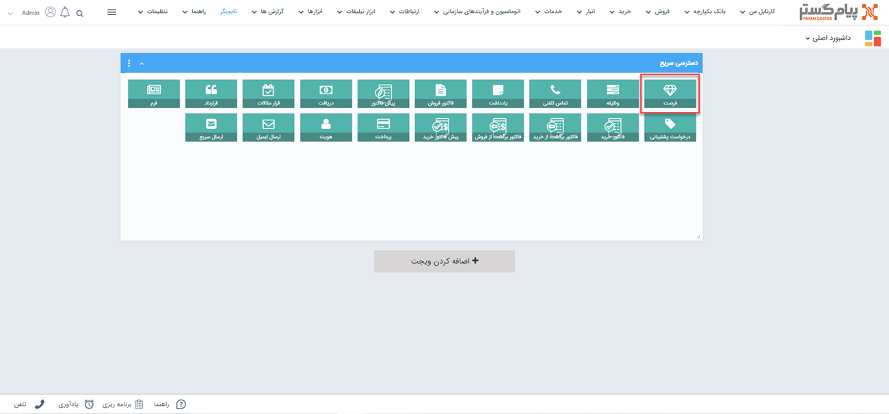
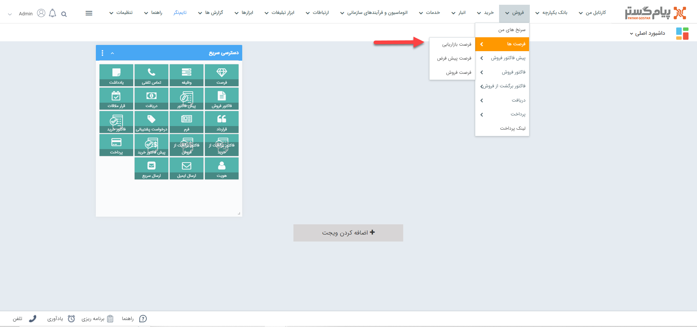

# ثبت فرصت
 چنانچه قصد ثبت درخواست مشتری و یا ثبت پیشنهادی برای او دارید، می‌توانید از آیتم فرصت برای منظم کردن فرآیند فروش استفاده نمایید. از این طریق می‌توانید آن‌ها را اولویت‌بندی، پیگیری و با ثبت دلایل شکست یا موفقیت آن‌ها را ارزیابی کنید. 

> **نکته** 
> پس از ثبت فرصت می‌توانید از روی فرصت برای مشتری خود پیش‌فاکتور و فاکتور ثبت کنید که این در سهولت فرآیند فروش نقش چشم‌گیری دارد.

## مسیر‌های ثبت فرصت
برای ثبت فرصت در پیام‌گستر، مسیرهای مختلفی وجود دارد. بنا بر نیاز خود می‌توانید از مسیرهای زیر اقدام به ثبت فرصت جدید برای مشتری خود نمایید. 
- **ویجت دسترسی سریع** > **فرصت**

- **تب فروش** > **فرصت‌ها** >**انتخاب زیرنوع فرصت‌ها** >**+فرصت**

- **صفحه اصلی پروفایل مخاطب** > **فرصت‌ها** > **فرصت جدید** 

- **صفحه اصلی پروفایل مخاطب** > **تب سوابق** > **فرصت جدید**

 **صفحه اصلی پروفایل مخاطب** > **آیتم‌ها** > **فرصت جدید** 
برای مشاهده لیست «آیتم‌های جدید» بر روی فلش کنار «تماس جدید» (قابل مشاهده در نوار سفید بالای صفحه) مراجعه نمایید.

> **نکته** 
> توجه داشته باشید که چنانچه از صفحه هویت مورد نظر اقدام به ثبت فرصت نمایید (مسیر سوم، چهارم و پنجم)، بخش «مرتبط با» به صورت خودکار با نام هویت پر می‌شود. به عبارت دیگر فرصت به نام هویت ثبت می‌شود. اما اگر از مسیرهای صفحه اصلی (مسیر اول و دوم) اقدام به ثبت فرصت نمایید، باید نام هویت را در قسمت «مرتبط با» جستجو و انتخاب نمایید. 

## شیوه‌ی ثبت فرصت
در صورت داشتن چند زیرنوع فرصت، به انتخاب صحیح آن توجه داشته‌باشید. زیرنوع آیتم در قسمت بالای صفحه قابل مشاهده و قابل تغییر می‌باشد. در تصویر زیر، «فرصت پیش‌فرض» برای ثبت نمونه انتخاب شده‌است. 
برای ثبت فرصت لازم است فیلدهای مورد نیاز آیتم را با اطلاعات موجود تکمیل و سپس ذخیره نمایید. مشخصات فرصت در پیام‌گستر به شرح زیر می‌باشد: 

### A. مرتبط با
نام هویتی که این فرصت برای او ثبت شده را در این قسمت درج کنید. بدین منظور کافیست بخشی از نام هویت مورد نظر را تایپ نمایید تا لیست هویت‌های مشابه آن برای انتخاب به شما نمایش داده‌شود. چنانچه پیش‌تر به آن اشاره شد، اگر از صفحه هویت اقدام به ثبت فرصت کرده‌باشید، نام هویت به صورت خودکار در این بخش ثبت شده‌است. 

### B. مشخصات
- **عنوان:** عنوان مناسبی برای فرصت انتخاب کنید. (این عنوان نشان‌دهنده عنوان پروژه فروش است.)
- **مانده:** مانده حساب مرتبط با این فرصت را نمایش می‌دهد، در واقع اگر در سوابق این فرصت (متصل به این فرصت) آیتم‌هایی ثبت کنید که مشتری را بدهکار یا بستانکار کند (آیتم‌های فاکتور، دریافت، پرداخت و قرارداد مالی)، میزان بدهکاری یا بستانکاری مرتبط با آن در مانده‌ی فرصت نمایش داده می‌شود. به عنوان مثال، اگر فاکتوری به مبلغ ۲۰ میلیون ریال، متصل به این فرصت ثبت شود، مانده‌ی فرصت به مبلغ ۲۰ میلیون ریال بدهکاری تبدیل می‌شود. به همین ترتیب با ثبت دریافت به مبلغ ۵ میلیون ریال، بدهکاری آن به مبلغ ۱۵ میلیون ریال تغییر می‌کند. 

> **نکته** 
> توجه داشته باشید که این مانده حساب، با مانده حساب اصلی مشتری که در صفحه مشخصات پروفایل نمایش داده‌می‌شود، متفاوت است. چرا که مانده صفحه مشخصات، کل حساب مشتری را در نظر می‌گیرد (تمامی آیتم‌های مالی سوابق مشتری)، اما مانده فرصت فقط آیتم‌های مالی متصل به همان فرصت را در نظر می‌گیرد. 

در واقع یکی از **فواید** آیتم **فرصت فروش**، در اختیار داشتن تمامی‌ فعالیت‌های انجام شده در پروسه فروش به صورت یکپارچه است. زمانی که فرصت به نتیجه رسید، آیتم‌های فاکتور، قرارداد، دریافت و فاکتور برگشت از فروش را در سوابق فرصت ایجاد کنید، تا در هر مرحله از فروش بتوانید وضعیت بدهکاری یا بستانکاری مشتری را در این قسمت مشاهده کنید.

- **نوع:** نوع این فرصت را مشخص کنید. چهار نوع «استاندارد»، «سفارش انبوه»، «تحویل» و «سفارش مخصوص» به صورت پیش‌فرض در این لیست قابل مشاهده‌است. چنانچه به نوع دیگری در این لیست نیاز دارید،‌از مدیر سیستم (ادمین) مجموعه خود بخواهید که آن را به لیست نوع فرصت اضافه کند. 

> **راهنمای مدیر سیستم** 
> برای اطلاع از نحوه‌ی افزودن گزینه به لیست نوع فرصت، به قسمت [مدیریت آیتم‌های سیستم ](https://github.com/1stco/PayamGostarDocs/blob/master/Help/Basic-Information/Management-of-system-items/Management-of-system-items.md)مراجعه کنید. 

- **تخصیص داده‌شده به:** کاربر مرتبط با این فرصت فروش را مشخص نمایید. این کاربر مسئولیت به ثمر رساندن این فرصت را بر عهده دارد. 
- **منبع:** نشان‌دهنده روش جذب مشتری است. از این طریق می‌توانید منابع ایجاد این فرصت فروش را مشخص نمایید. چنانچه نیاز به تغییر گزینه‌های لیست منبع دارید، از مدیر سیستم خود بخواهید گزینه مورد نیاز را به لیست افزوده یا آن‌ها را ویرایش کند. 

> **راهنمای مدیر سیستم** 
> برای اطلاع از نحوه‌ی افزودن گزینه به لیست منبع فرصت، به قسمت [مدیریت آیتم‌های سیستم ](https://github.com/1stco/PayamGostarDocs/blob/master/Help/Basic-Information/Management-of-system-items/Management-of-system-items.md)مراجعه کنید. توجه داشته باشید که گزینه‌های «منبع فرصت» در آیتم فرصت با گزینه‌های «نحوه آشنایی» در صفحه هویت مشترک است. یعنی با ویرایش لیست منبع فرصت، گزینه‌های لیست نحوه آشنایی نیز تغییر می‌کند.  

- **شروع ارتباط با مشتریان:**  با استفاده از این فیلد می‌توانید این فرصت فروش را به یکی از کمپین‌های تبلیغاتی تعریف شده در نرم‌افزار متصل کنید. با تعریف ارتباط فرصت‌ها و کمپین‌های تبلیغاتی، گزارشات دقیق‌تری از تعداد فرصت‌های به وجود آمده از کمپین‌های تبلیغاتی و میزان فروش مرتبط با کمپین‌ها در گزارشات تحلیلی خواهید‌داشت.
- **تاریخ بسته‌شده:** هر فرصت فروش برای به نتیجه رسیدن نیاز به پیگیری از طرف کارشناسان فروش دارد. با استفاده از این فیلد می‌توانید تاریخ بسته شدن این فرصت و در واقع بیشینه زمان ممکن برای پیگیری این فرصت را تعیین کنید. توجه داشته باشید که پس از گذشتن این تاریخ، نرم‌افزار ممانعتی از پیگیری دوباره و ویرایش این فرصت به عمل نمی‌آورد و وارد کردن این تاریخ صرفاً جهت اطلاع‌رسانی زمان موعد برای پروسه فروش می‌باشد. از طریق اعمال فیلتر می‌توانید فرصت‌‌هایی که تاریخ موعدشان گذشته را جدا و تعیین تکلیف نمایید.
- **مبلغ نهایی:** مبلغ نهایی تخمینی خود را می‌توانید تعیین کنید تا میزان اهمیت یک فرصت را از لحاظ میزان  سود احتمالی دریابید. در واقع این مبلغ تخمین شما از فروش در این فرصت است. توجه داشته‌باشید که اگر محصولات مرتبط با این فرصت را وارد کنید، مبلغ مجموع به صورت خودکار و بر اساس قیمت نهایی حاصل‌شده در قسمت «محصولات فرصت»، در این فیلد درج خواهد‌شد.
- **درصد احتمال:** احتمال خرید از جانب مشتری و در واقع احتمال موفق شدن این فرصت فروش را نشان می‌دهد. به مشابه مبلغ نهایی، در اولویت‌بندی فرصت‌ها به کارشناسان کمک می‌کند.
- **دلیل موفقیت/شکست:** پس از به نتیجه رسیدن فرصت که ممکن است موفق یا ناموفق باشد، می‌توانید دلیل موفقیت یا شکست را مشخص کنید تا بتوانید تحلیل دقیق‌تری از نقاط قوت و ضعف سازمان خود در بخش فروش داشته‌باشید.

> **راهنمای مدیر سیستم** 
> برای اطلاع از نحوه‌ی افزودن گزینه به لیست دلایل شکست و موفقیت، به قسمت [مدیریت آیتم‌های سیستم ](https://github.com/1stco/PayamGostarDocs/blob/master/Help/Basic-Information/Management-of-system-items/Management-of-system-items.md)مراجعه کنید.  

- **پروسه خرید:** شیوه تصمیم‌گیری مشتری برای خرید را تعیین می‌کند. (اینکه مشتری به صورت فردی برای خرید تصمیم می‌گیرد یا خرید او از ما نیاز به تصمیم‌گیری یک گروه دارد)
- **تاریخ موفقیت/شکست:** پس از به نتیجه رسیدن فرصت (موفق یا ناموفق شدن مرحله فروش) فیلد تاریخ موفقیت یا تاریخ شکست (متناسب با نتیجه) به صورت خودکار درج خواهد شد و امکان تغییر آن به صورت دستی وجود ندارد. با در اختیار داشتن این تاریخ و مقایسه آن با تاریخ ایجاد فرصت، می‌توانید بازه زمانی پیگیری این فرصت را تحلیل کنید.

### C. مشخصات اضافه   
فیلدهای فوق فیلدهای پیش‌فرض آیتم فرصت هستند که در همه‌ی فرصت‌ها به صورت مشترک وجود دارند. چنانچه بنابر نیاز سازمان، طی شخصی‌سازی، فیلدهای دیگری به آیتم فرصت اضافه شده‌باشد، آن‌ها را در این قسمت مشاهده می‌کنید. به عنوان مثال چنانچه توافق بر سر شیوه‌ی پرداخت در مذاکرات شما مهم است، می‌توانید در این قسمت یک فیلد تحت عنوان «شیوه پرداخت» در این بخش داشته باشید.
> **راهنمای مدیر سیستم** 
> برای اطلاع از شیوه‌ی افزودن فیلد به آیتم، به راهنمای بخش [شخصی‌سازی]() مراجعه کنید. 

### D. رقبا 
 نام رقبایی که در این فرصت ممکن است به دلیل وجود آن‌ها فرصت به حالت ناموفق و شکست خورده در آید را وارد کنید تا بتوانید آنالیز دقیق‌تری از رقبای خود داشته‌باشید. 

### E. محصولات فرصت  
خدمات و یا محصولاتی که قصد فروش آن‌ها را در این فرصت دارید، وارد کنید. مزیت وارد کردن محصولات در فرصت این است که مبلغ برآوردی به صورت خودکار درج خواهد شد و همچنین می‌توانید به راحتی و با کلیک بر روی یک دکمه از این محصولات انتخابی، پیش‌فاکتور یا فاکتور صادر کنید. 

#### انتخاب محصول 
برای افزودن محصول/خدمت به لیست محصولات فرصت، کافیست حروف اول عنوان آن را در فیلد «محصول» درج نمایید تا راحت‌تر بتوانید آن را از بین لیست محصولات انتخاب کنید.  
در صورت انتخاب دسته‌بندی محصول مورد نظر در فیلد «گروه»، تنها محصولات همان دسته‌بندی در بخش «محصول» به شما نمایش داده‌می‌شود. به عنوان مثال اگر محصولات شما در دو دسته‌ی ابزارآلات و محصولات فلزی در سیستم تعریف شده‌باشد، شما برای انتخاب محصول سنسور در فیلد «محصول» می‌توانید در فیلد «گروه»، محصولات فلزی را انتخاب نمایید تا فقط محصولات این گروه به شما نمایش داده‌شود. با توجه به قابلیت جستجو در فیلد محصول، انتخاب این بخش الزامی نیست و شما می‌توانید مستقیم در فیلد «محصول»، محصول مورد نظر را بیابید. 
در صورت آگاهی از کد محصول،‌ می‌توانید در فیلد «کد محصول» را جستجو کرده و آن را برای افزودن به لیست انتخاب نمایید.

> **نکته**  
> شما تنها محصولاتی که از پیش در لیست محصولات تعریف شده باشند را می‌توانید در این قسمت استفاده کنید. در صورت نیاز به اضافه شدن محصول به این لیست، درخواست خود را به مدیر سیستم (ادمین) اعلام نمایید.  
>> در صورت نیاز به درج محصولی که نام آن را در لیست مشاهده نمی‌کنید و قصد افزودن آن به لیست محصولات را ندارید، می‌توانید از محصول «سایر» که به صورت پیش‌فرض موجوداست استفاده کرده و اطلاعات محصول سایر را با توجه به نیاز ویرایش کرد. چنانچه از انبارداری سریالی استفاده می‌کنید و یا مجوز ویرایش نام کالا را ندارید، این امکان برای شما فراهم نمی‌باشد. 

در صورت غیر‌فعال کردن گزینه «خالی شدن گروه محصول بعد از انتخاب محصول»، پس از انتخاب یک محصول، دسته‌بندی محصول انتخاب شده باز می‌ماند تا بتوانید از همان دسته‌بندی یک یا چند محصول دیگر را انتخاب کنید. در غیراین صورت، این بخش خالی‌ شده و در صورت نیاز شما باید مجدد گروه مورد نظر را انتخاب نمایید.  

#### موجودی انبار 
با انتخاب هر محصول، موجودی آن در این جدول به شما نمایش داده‌می‌شود. در صورتی که از انبارداری پیشرفته (سریالی) استفاده می‌کنید، موجودی محصول به تفکیک انبارهای مختلف، در این قسمت نمایش داده‌خواهد‌شد. 
منظور از موجودی فریز شده در این جدول، محصولاتی است که در پیش‌فاکتورهای تایید شده ثبت شده‌اند. 

> **نکته** 
> در انبارداری تعدادی، این جدول تنها برای محصول‌هایی که انبارداری برایشان فعال شده‌باشد، نمایش داده می‌شود.  

تنها در صورتی که برای محصول، گزینه انبارداری فعال شده باشد، این جدول به شما نمایش داده می‌شود. در انبارداری سریالی نیز تنها کاربر دارنده مجوز صدور حواله در مدیریت انبارها، امکان مشاهده موجودی انبار را در هنگام صدور پیش‌فاکتور و یا فاکتور را دارد. 

#### محصول 
نام و کد محصولی که در قسمت قبل انتخاب کرده‌اید در این بخش به شما نمایش داده‌می‌شود. چنانچه برای آن قیمت واحد تعیین شده‌باشد، آن را در فیلد مربوطه مشاهده می‌کنید. در غیراین صورت باید به صورت دستی آن را درج نمایید. با تعیین تعداد مورد نظر و کلیک بر روی افزودن، ردیف محصول به جدول کناری اضافه می‌شود. 

در نهایت کافیست بر روی دکمه «ذخیره» در سمت راست بالای صفحه کلیک نمایید. 
پس از ذخیره فرصت، سایر اطلاعات و قابلیت‌های موجود در مورد آن به شما نمایش داده‌می‌شود. برای کسب اطلاعات بیشتر در این خصوص به راهنمای [ اطلاعات مشترک سوابق](https://github.com/1stco/PayamGostarDocs/blob/master/Help/Integrated-bank/Database/Records/Joint-record-information/Joint-record-information.md) مراجعه نمایید. 
علاوه بر آن، با استفاده از دو کلید «صدور پیش‌فاکتور» و «صدور پیش‌فاکتور» می‌توانید اقدام به ثبت فاکتور/پیش‌فاکتور نمایید. در این حالت، محصولات انتخابی آن فرصت به صورت خودکار در پیش‌فاکتور/فاکتور صادر شده، وارد می‌شود. 