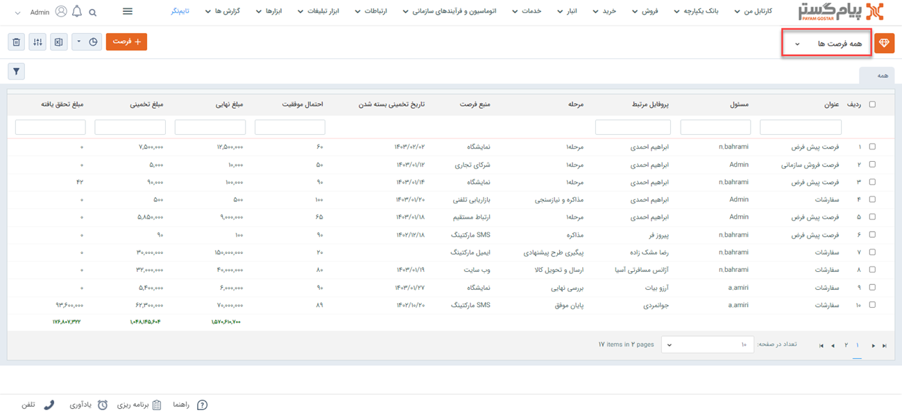

# مشاهده لیست فرصت‌های ثبت شده
دراین مقاله روش‌های مشاهده‌ی لیست فرصت‌ها در دو حالت بررسی می‌شود: 
- [مشاهده لیست تمامی فرصت‌‌های ثبت شده](#AllOpportunities)
- [مشاهده فرصت‌‌های ثبت شده برای یک هویت](#CustomerOpprtunities)

## مشاهده لیست همه فرصت‌های ثبت شده{#AllOpportunities}
برای مشاهده لیست همه فرصت‌های ثبت شده دو روش وجود دارد:
- از طریق **تب فروش** > **فرصت‌ها** 
، تمامی فرصت‌های ثبت شده از نوع زیرنوع انتخابی شما،‌ نمایش داده می‌شود.

از قسمت بالای صفحه می‌توانید سایر زیرنوع‌ها و یا همه را برای نمایش انتخاب نمایید. با انتخاب همه، تمامی فرصت‌ها(از همه زیرنوع‌ها) در لیست به شما نمایش داده می‌شود.

- از طریق **تب بانک یکپارچه** > **تاریخچه CRM**  می توانید با اعمال فیلتر "نوع" بر روی فرصت، و انتخاب زیرنوع مورد نظر/همه در فیلتر کناری، تمامی فرصت‌های ثبت شده را مشاهده نمایید.

> **نکته** 
> در صورت داشتن مجوز مشاهده لیست و مشاهده آیتم زیرنوع‌های فرصت‌، شما می‌توانید تمامی فرصت‌‌های ثبت شده را در این قسمت‌ها مشاهده نمایید. در این صورت تنها مجاز به مشاهده فرصت‌هایی که خودتان ثبت کرده‌اید خواهید بود. 

## مشاهده لیست فرصت‌های ثبت‌شده یک هویت{#CustomerOpprtunities}
برای مشاهده لیست فرصت‌های ثبت شده برای یک مخاطب می‌توانید از چهار روش زیر اقدام نمایید: 

- از طریق صفحه **پروفایل مخاطب** > **تب سوابق** می‌توانید به فرصت‌های ثبت شده برای مخاطب دسترسی داشته باشید. بدین منظور با استفاده از ویجت جستجوی سریع، صفحه پروفایل هویت مورد نظر را باز کنید. در صفحه اصلی پروفایل هویت از قسمت سوابق  با اعمال فیلتر روی "نوع آیتم" و انتخاب «فرصت» می‌توانید فرصت‌های ثبت شده در فرآیند فروش را برای هویت مورد نظر خود را مشاهده نمایید. 

- از طریق صفحه **پروفایل مخاطب** > **تب فرصت‌ها** می‌توانید به فرصت‌های مشتری دسترسی داشته باشید. بدین منظور با استفاده از ویجت جستجوی سریع صفحه پروفایل هویت مورد نظر را باز کنید. در صفحه اصلی پروفایل هویت از قسمت فروش می‌توانید تمامی فرصت‌های مخاطب را مشاهده نمایید. برای مشاهده فرصت‌ها به تنهایی، می‌توانید از فیلتر استفاده نمایید. بدین منظور کافیست در بخش فیلتر، نوع را بر روی فرصت تنظیم کرده و بر روی اعمال کلیک کنید.  

- از طریق **تب فروش** > **فرصت** > **انتخاب زیرنوع مناسب** به صفحه لیست فرصت‌ها رفته و در صورت نیاز زیرنوع فرصت‌ها را به «همه فرصت‌ها» تغییر دهید (از فلش کنار کادر قرمز بالا استفاده کنید). با استفاده از جستجوی «پروفایل مرتبط» فرصت ثبت شده برای هویت مورد نظر را جدا کنید. بدین منظور کافیست نام هویت را در  قسمت مربوطه نوشته و Enter کنید.
 

- از طریق **تب بانک یکپارچه** > **تاریخچه CRM** با اعمال فیلتر(کادر قرمز بالا)، فرصت‌ها را یافته و با استفاده از جستجوی «پروفایل مرتبط» (کادر قرمز پایین) فرصت هویت مورد نظر را جدا کنید. بدین منظور کافیست نام هویت را در قسمت مربوطه نوشته و Enter کنید.

> **نکته** 
> برای مشاهده فرصت‌های ثبت شده در سابقه یک هویت باید مجوز مشاهده سوابق را بر روی آن زیرنوع هویت و همچنین مشاهده آیتم را در زیرنوع‌های فرصت داشته باشید.  