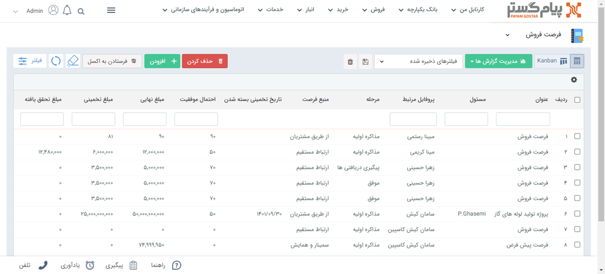

# لیست فرصت‌ها
از مسیرهای مختلفی می‌توانید لیست تمام فرصت‌هایی که توسط کاربران پیام گستر برای پروفایل‌های مختلف ثبت شده است را مشاهده نمایید:
- [مشاهده لیست فرصت های ثبت شده برای یک هویت](#customerOpprtunityList)
- [مشاهده لیست فرصت های ثبت شده برای تمامی هویت ها](#AllOpportunityList)

> **نکته** 
> هر کاربر می‌تواند تنها فرصت‌های مربوط به خود را مشاهده کند این در حالیست که شخص دارنده مجوز "مشاهده لیست فرصت‌ها" می‌تواند کلیه فرصت‌های کاربران موجود را مشاهده و بررسی نماید.

## مشاهده لیست فرصت های یک هویت{#customerOpprtunityList}
مشاهده لیست فرصت‌های ثبت شده برای یک هویت خاص از دو مسیر زیر میسر خواهد بود. 
- از طریق **صفحه اصلی هویت** > تب **فرصت ها** تمامی فرصت‌های ثبت شده برای هویت قابل مشاهده است.

- فرصت‌های ثبت شده برای مشتری از طریق **صفحه اصلی پروفایل مشتری**> **تب سوابق** فرصت‌ها را براساس **نوع آیتم** فیلتر کنید.

- با کلیک روی تب اصلی **فروش** > **فرصت**
 با انتخاب نام هویت در قست پروفایل مرتبط می توانید فرصت های مرتبط با هویت مورد نظر را مشاهده نمایید.

 برای دسترسی سریع‌تر لیست فرصت‌ها می‌توانید از قسمت فیلتر روی فرصت‌های موجود در نرم افزار فیلتر اعمال کنید. 

**نوع فیلتر:** می توانید فیلترهای اعمال شده را به عنوان یک فیلتر اختصاصی  برای خود ذخیره کرده و برای اخذ گزارشات بعدی از آن استفاده کنید. 
**عنوان:** می توانید فرصت‌ها را بر اساس عنوان آن‌ها جستجو کنید. 

> **نکته**  لطفا ابتدا قسمت[ فیلترهای پیشرفته](https://github.com/1stco/PayamGostarDocs/blob/master/Help/Customer-relationship-management/Advanced-filter/Advanced-filter.md) را مطالعه کنید.

**منبع:** می‌توانید منبع ایجاد فرصت را مشخص کنید. 
**شروع ارتباط با مشتری:** کمپین تبلیغاتی که فرصت از طریق آن ایجاد شده است را می‌توانید انتخاب کنید. 
**مرتبط با:** کاربر مرتبط با فرصت (کاربری که در فیلد "تخصیص داده شده به"  انتخاب شده است) را می‌توانید انتخاب کنید. 
**فیلدهای فرصت:** در این قسمت می‌توانید یکی از زیرنوع های فرصت تعریف شده در شخصی سازی را فیلتر کنید. همچنین می توانید با استفاده از دکمه فیلتر موجود در این فیلد، پس از انتخاب یکی از زیرنوع های فرصت، روی فیلدهای اضافه شده به آن نیز فیلتر مورد نظر خود را اعمال کنید. 
**محصول:** می‌توانید فرصت های حاوی یک محصول یا گروه محصول خاص را انتخاب کنید. 
**علت:** در صورت  به اتمام رسیدن فرصت فروش می‌توانید دلایل موفقیت و شکست را ثبت کنید.

>**نکته** 
> تنها در صورتی که گزینه موفق یا نا موفق را در مراحل فروش انتخاب نمایید  قادر به ثبت علت موفقیت یا شکست خواهید بود. حتی با انتخاب گزینه "همه" دسترسی به این قسمت برای شما امکان پذیر نخواهد بود.  

**نتایج برعکس:** با فعال کردن این گزینه، نتایج جستجو فرصت هایی را نمایش می دهد که مشخصه های انتخاب شده را نداشته باشند. 
**نوع:** می‌توانید براساس فیلد نوع در فرصت  فیلتر انجام دهید. 
**مقدار محقق شده:** در صورتی که در سوابق فرصت، فاکتور ثبت کنید و فاکتور ثبت شده تایید گردد ، مبلغ نهایی فاکتور به عنوان مبلغ محقق شده فرصت محسوب می شود. با استفاده از این فیلدها می‌توانید بازه ای برای مقدار محقق شده (میزان فروش فرصت) به عنوان پارامتر جستجو اعمال کنید. 
**تاریخ موفقیت و شکست و بسته شدن:** می‌توانید فرصت ها را بر اساس تاریخ موفقیت و شکست و بسته شدن آن‌ها جستجو کنید. 
**حذف کردن:** می توانید فرصت/فرصت های  انتخاب شده را حذف کنید. 
**اضافه کردن:** می توانید یک [فرصت فروش جدید](https://github.com/1stco/PayamGostarDocs/blob/master/Help/Opportunity/NewOpportunity.md) ایجاد نمایید. 
**فرستادن به اکسل:** می‌توانید فرصت های انتخاب شده را به صورت خروجی اکسل دریافت نمایید. 
**زیرنوع فرصت:** با استفاده از این فیلد کشویی می‌توانید زیرنوع فرصت را تغییر دهید. 

> **نکته**  
>با کلیک راست بر روی یک یا چند فرصت می توانید اقدام به ویرایش گروهی یا افزودن سابقه برای آن‌ها کنید.

**مدیریت گزارش‌ها:**  با استفاده از این بخش میتوان از لیست فرصت با توجه به فیلتر های اعمال شده، گزارش گیری کرد. برای توضیحات بیشتر میتوانید به بخش [گزارش ساز جدید ](https://github.com/1stco/PayamGostarDocs/blob/master/Help/Management-and-reports/Report-Builder/Report-Builder.md)مراجعه کنید. 

## نحوه نمایش تمامی فرصت‌های ثبت شده{#ListOfAllOpps}
برای مشاهده انواع فرصت‌هایی که تاکنون در CRM پیام‌گستر شما ثبت شده است باید از مسیر **سربرگ فروش** > **فرصت‌ها** اقدام کنید. 
لیست فرصت‌ها در پیام گستر به دو حالت Grid و Kanban نمایش داده می شوند. 
- حالت نمایشی **Kanban** براساس مراحل تعریف شده در شخصی سازی می‌باشد. توضیحات این بخش را میتوانید از بخش[ نمایش کانبان ](https://github.com/1stco/PayamGostarDocs/blob/master/Help/Settings/Personalization-crm/Overview/General-information/leveling/leveling.md)مراحل مطالعه کنید.

- حالت نمایشی **Grid** زمانی کاربرد دارد که شما بخواهید فرصت‌های فروش ثبت شده را به صورت ردیفی و به تفکیک آیتم هایی نظیر پروفایل مرتبط، منبع فرصت و ... مشاهده کنید.

## مشاهده لیست همه فرصت‌های ثبت شده{#AllOpportunityList}
برای مشاهده لیست همه فرصت‌های ثبت شده دو مسیر اصلی  وجود دارد.
- از طریق **تب فروش** > **فرصت**، تمامی فرصت‌های فروش قابل مشاهده هستند.

- از طریق **تب بانک یکپارچه** > **تاریخچه CRM** می‌توانید با اعمال فیلتر روی "نوع"،تمامی فرصت‌های فروش ثبت شده را مشاهده نمایید.

