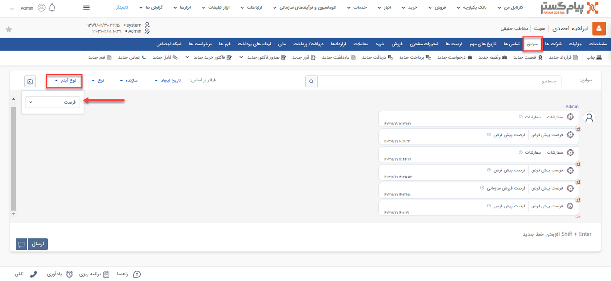

# مشاهده لیست فرصت‌های ثبت شده
دراین مقاله روش‌های مشاهده‌ی لیست فرصت‌ها در دو حالت بررسی می‌شود: 
- [مشاهده لیست تمامی فرصت‌‌های ثبت شده](#AllOpportunities)
- [مشاهده فرصت‌‌های ثبت شده برای یک هویت](#CustomerOpprtunities)

## مشاهده لیست همه فرصت‌های ثبت شده{#AllOpportunities}
برای مشاهده لیست همه فرصت‌های ثبت شده در سیستم، می‌توانید از دو مسیر اقدام نمایید: 
- از مسیر **تب فروش** > **فرصت‌ها** > **زیرنوع فرصت**
با انتخاب یکی از زیرنوع‌های فرصت، وارد صفحه فرصت می‌شوید. در این حالت، تمامی فرصت‌های ثبت‌شده از زیرنوع انتخابی به شما نمایش داده می‌شود. 

از قسمت بالای صفحه می‌توانید سایر زیرنوع‌ها و یا همه را برای نمایش انتخاب نمایید. با انتخاب «همه فرصت‌ها»، تمامی فرصت‌ها از همه زیرنوع‌ها در لیست به شما نمایش داده‌می‌شود. 

- از مسیر **تب بانک یکپارچه** > **تاریخچه CRM**  می توانید با اعمال فیلتر «نوع» بر روی فرصت و انتخاب زیرنوع مورد نظر/همه در فیلتر کناری، تمامی فرصت‌های ثبت شده را مشاهده نمایید.

> **نکته** 
> در صورت داشتن مجوز مشاهده لیست زیرنوع‌های فرصت‌، شما می‌توانید تمامی فرصت‌‌های ثبت شده را در این قسمت‌ها مشاهده نمایید. در غیراین صورت تنها مجاز به مشاهده فرصت‌هایی که خودتان ثبت کرده‌اید، خواهید بود. 

## مشاهده لیست فرصت‌های ثبت‌شده برای یک هویت{#CustomerOpprtunities}
برای مشاهده لیست فرصت‌های ثبت شده برای یک مخاطب می‌توانید یکی از چهار مسیر زیر را انتخاب نمایید: 

- از طریق صفحه **پروفایل مخاطب** > **تب فرصت‌ها** می‌توانید به فرصت‌های مشتری دسترسی داشته‌باشید. بدین منظور با استفاده از ویجت جستجوی سریع، وارد صفحه پروفایل هویت مورد نظر شوید. در صفحه اصلی پروفایل هویت از قسمت «فرصت‌ها» می‌توانید تمامی فرصت‌های مخاطب را مشاهده نمایید.  

- از طریق صفحه **پروفایل مخاطب** > **تب سوابق** نیز می‌توانید به فرصت‌های ثبت شده برای مخاطب دسترسی داشته‌باشید. بدین منظور با استفاده از ویجت جستجوی سریع، وارد صفحه پروفایل هویت مورد نظر شوید. در صفحه اصلی پروفایل هویت، در تب سوابق، گزینه «فرصت» را در لیست «نوع آیتم» انتخاب نمایید تا فرصت‌های ثبت‌شده در فرآیند فروش هویت مورد نظر را مشاهده کنید. 

- از طریق **تب فروش** > **فرصت** به صفحه لیست فرصت‌ها رفته و در صورت نیاز زیرنوع فرصت‌ها را به «همه فرصت‌ها» تغییر دهید (از فلش کنار کادر قرمز بالا استفاده کنید). با جستجوی «پروفایل مرتبط» فرصت‌های ثبت شده برای هویت مورد نظر را پیدا کنید. بدین منظور کافیست نام هویت را در  قسمت مربوطه نوشته و Enter کنید. 
 

- از طریق **تب بانک یکپارچه** > **تاریخچه CRM** با اعمال فیلتر (کادر قرمز بالا)، فرصت‌ها را یافته و با استفاده از جستجوی «پروفایل مرتبط» (کادر قرمز پایین) فرصت‌های هویت مورد نظر را جدا کنید. بدین منظور کافیست نام هویت را در قسمت مربوطه نوشته و Enter کنید. 

> **نکته** 
> برای مشاهده فرصت‌های ثبت شده در سابقه یک هویت باید مجوز مشاهده سوابق را بر روی آن زیرنوع هویت و همچنین مشاهده آیتم را در زیرنوع‌های فرصت داشته‌باشید.  