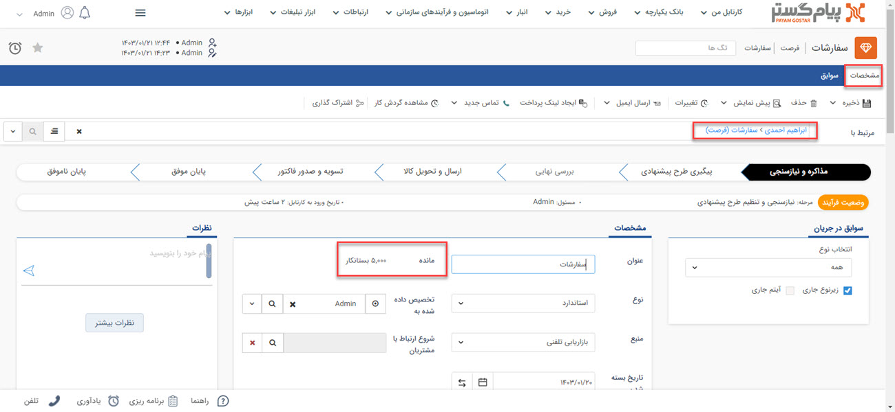

# سوابق فرصت
در این بخش با مزایای سوابق فرصت در پیام‌گستر آشنا خواهید شد: 
-امکان صدور پیش‌فاکتور و فاکتور از فرصت ثبت شده وجود دارد. 
این پیش فاکتور و فاکتور ثبت شده به عنوان سابقه‌ی فرصت درنظر گرفته می‌شود.  
در تب سوابق فرصت امکان ثبت تمامی آیتم‌ها مانند وظیفه، فرم و ... مرتبط با این فرصت ثب شده وجود دارد. 

در قسمت سوابق هنگامی که قرارداد مالی یا فاکتور را از روی فرصت ثبت می‌کنید میزان بدهی مرتبط با این فرصت برای مشتری افزایش می‌یابد و در بخش مشخصات **مانده** کاهش می‌یابد. همچنین می‌توانید با ثبت دریافت میزان بدهی مشتری را کاهش دهید و با ثبت پرداخت میزان بدهی مشتری را افزایش دهید.

