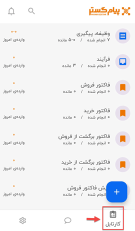
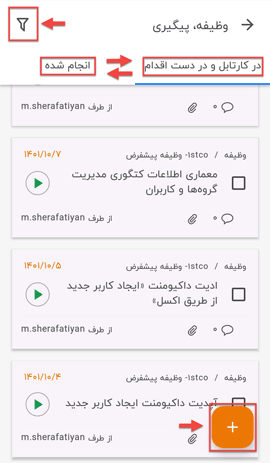
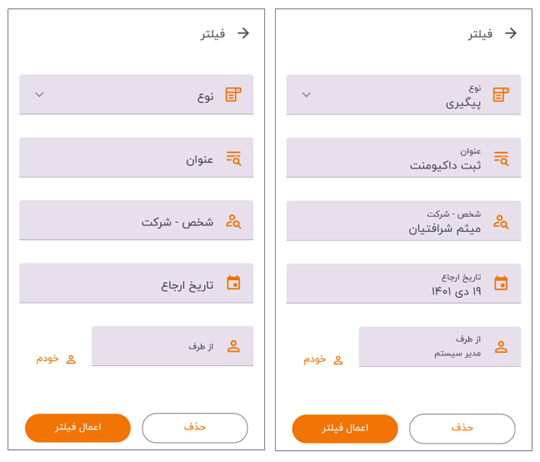
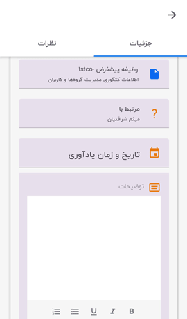

# مدیریت کارتابل

 می‌توانید با کلیک بر روی تب **کارتابل** در سمت راست منوی پایین صفحه، در اپلیکیشن پیام‌گستر، (همانند نسخه تحت وب) همه‌ی آیتم‌های نرم‌افزار را مشاهده کنید و برای مواردی که مجوز برایتان تعریف شده باشد سابقه جدید ایجاد و یا سوابق قبلی را ادیت نمایید. 

در این صفحه برای هر آیتم، تعداد  موارد انجام شده، تعداد موارد مانده و تعداد ثبت ورودی همان روزی که در آن قرار دارید (وارده‌ی امروز)، مشخص شده است. شما می‌توانید برای بررسی بیشتر با کلیک بر روی هر آیتم به صفحه‌ی مربوط به آن بروید.  
 در ادامه لیستی از آیتم‌هایی که کاربران می‌توانند با توجه به سطح دسترسی و مجوزهایی که برایشان تعیین شده، به آن‌ها دسترسی داشته باشند را بررسی خواهید کرد. 
**1) وظیفه و پیگیری:** با کلیک بر روی این آیتم، می‌توانید به لیست کامل وظایف و پیگیری‌های خود دست پیدا کنید و مدیریت وظایف و پیگیری‌های حساب کاربری خود را از این قسمت انجام دهید.  
در این بخش، وظایف و پیگیری‌های کاربر به دو قسمت تقسیم شده است: 
 a) *در کارتابل و در دست اقدام*: در این قسمت می‌توانید وظایف و پیگیری‌هایی که جدید برای کاربری شما تعیین شده و یا پروسه‌ی انجام آن باز بوده و هنوز به‌اتمام نرسیده را مشاهده نمایید. 
 b) *انجام شده*: از این قسمت تمامی وظایف و پیگیری‌هایی که پیش از این انجام داده‌اید و پروسه‌ی آن به‌اتمام رسیده را مشاهده می‌کنید. 
 

**ثبت وظیفه و پیگیری جدید**:
 با کلیک بر روی علامت پلاس (+) در پایین صفحه می‌توانید یک وظیفه یا پیگیری جدید ثبت نمایید. 
 **فیلتر**:
  این امکان برای شما فراهم شده که برای جستجوی سریع‌تر  بین وظایف و پیگیری‌هایتان، امکان استفاده از فیلتر را داشته باشید تا بتوانید راحت‌تر به تسک مدنظر خود برسید؛ برای این منظور روی علامت مخصوص فیلتر در بالای صفحه سمت چپ کلیک کنید؛  پس از کلیک بر روی آیکون فیلتر، پنجره‌ای برای شما باز می‌شود که می‌توانید براساس فیلدهای نوع، عنوان، شخص-شرکت، تاریخ ارجاع و از طرفِ، به وظیفه و یا پیگیری مدنظرتان با استفاده از فیلتر برسید. 

 پس از استفاده از فیلترها و پیدا کردن وظیفه و یا پیگیری مدنظرتان با کلیک بر روی آن، به صفحه‌ی مربوطه‌  می‌روید و می‌توانید تمامی جزییات و نظرات مخصوص به آن مورد مثل عنوان، مرتبط با، تاریخ و زمان یادآوری، توضیحات و فایل‌های اضافه شده را مشاهده و ادیت نمایید. 

>**نکته** 
در صورت فعال بودن لایسنس ماژول **تایم‌نگر**، امکان ثبت شروع و پایان وظایف در اپلیکیشن نیز فراهم خواهد بود. 

 **2) فرآیند:** آیتم دیگری که در اپلیکیشن آن را بررسی می‌کنید، فرآیندها است، می‌توانید هر فرآیند و چرخه کاری که در آن به‌گونه‌ای دخیل بوده‌اید و یا مسئولیتی داشته‌اید  را از این قسمت مشاهده و کارهای مربوط به آن را انجام دهید.
 پس از کلیک بر روی آیتم فرآیند وارد صفحه‌ی مختص به این آیتم می‌شوید و در آنجا لیست کامل فرآیندهایی که به‌ هر نحو در چرخه‌ی کاری آن‌ها قرار دارید را مشاهده و با انتخاب آن وارد صفحه‌اش خواهید شد. 
   **فیلتر**: می‌توانید در این قسمت برای پیدا کردن فرآیند منظور نظرتان از فیلترها هم کمک بگیرید و با توجه به فیلدهای نوع، عنوان، شخص-شرکت و تاریخ ورود به کارتابل از، سریع‌تر به هدفتان برسید. 
 **3) فاکتور فروش:** در این قسمت می‌توانید تمامی فاکتورهای فروش مربوطه را بررسی کرده و در اصطلاح مدیریت فاکتورهای فروش در کارتابل را انجام دهید. 
 **4) فاکتور خرید:** در این قسمت می‌توانید تمامی فاکتورهای خرید مربوطه را بررسی کرده و در اصطلاح مدیریت فاکتورهای خرید در کارتابل را انجام دهید. 
 **5) فاکتور برگشت از فروش:** در این قسمت می‌توانید تمامی فاکتورهای برگشت از فروش مربوطه را بررسی کرده و در اصطلاح مدیریت فاکتورهای برگشت از فروش در کارتابل را انجام دهید. 
 **6) فاکتور برگشت از خرید:** در این قسمت می‌توانید تمامی فاکتورهای برگشت از خرید مربوطه را بررسی کرده و در اصطلاح مدیریت فاکتورهای برگشت از خرید در کارتابل را انجام دهید. 
 **7) پیش فاکتور فروش:** در این قسمت می‌توانید تمامی پیش فاکتورهای فروش مربوطه را بررسی کرده و در اصطلاح مدیریت پیش فاکتورهای فروش در کارتابل را انجام دهید. 
 **8) پیش فاکتور خرید:**   در این قسمت می‌توانید تمامی پیش فاکتورهای خرید مربوطه را بررسی کرده و در اصطلاح مدیریت پیش فاکتورهای خرید در کارتابل را انجام دهید. 
 **9) دریافت:** در این قسمت می‌توانید لیست تمامی دریافت‌های مربوطه را بررسی کرده و در اصطلاح مدیریت دریافت‌ها در کارتابل را انجام دهید. 
 **10) پرداخت:** در این قسمت می‌توانید لیست تمامی پرداخت‌های مربوطه را بررسی کرده و در اصطلاح مدیریت پرداخت‌ها در کارتابل را انجام دهید. 
 **11) قرارداد:** در این قسمت می‌توانید لیست تمامی قراردادهای مربوطه را بررسی کرده و در اصطلاح مدیریت قراردادها در کارتابل را انجام دهید. 
 **12) تراکنش‌های انبار در انتظار:** در این قسمت می‌توانید لیست تمامی تراکنش‌های انبار در انتظار تایید مربوطه را بررسی کرده و از همین طریق برای تایید آن‌ها اقدام نموده و در اصطلاح مدیریت تراکنش‌های انبار در انتظار تایید در کارتابل را انجام دهید. 
 **13) تراکنش‌های در انتظار قیمت‌گذاری:** در این قسمت می‌توانید لیست تمامی تراکنش‌های انبار در انتظار قیمت‌گذاری مربوطه را بررسی کرده و از همین طریق برای ثبت قیمت آن‌ها اقدام نموده و در اصطلاح مدیریت تراکنش‌های در انتظار قیمت‌گذاری در کارتابل را انجام دهید. 
**14) قرار ملاقات:** در این قسمت می‌توانید لیست تمامی قرارهای ملاقات مربوطه را بررسی کرده و از همین طریق برای تایید حضور یا عدم حضور در آن‌ها اقدام نموده و در اصطلاح مدیریت قرار ملاقات‌های خود در کارتابل را انجام دهید. 
 **15) آیتم‌های در انتظار:** در این قسمت می‌توانید لیست تمامی آیتم‌های در انتظار تایید مربوطه را بررسی کرده و از همین طریق برای تایید آن‌ها اقدام نموده و در اصطلاح مدیریت آیتم‌های در انتظار تایید در کارتابل را انجام دهید. 
