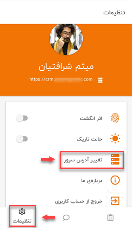
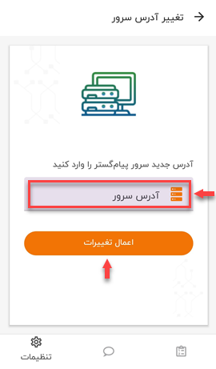

# تغییر آدرس IP نرم افزار

ممکن است که شما در چند شرکت که همه‌ی آن‌ها از اپ نرم‌افزار CRM پیام‌گستر استفاده می‌کنند، فعالیت داشته باشید؛
در این صورت برای انتقال بین نرم‌افزار شرکت‌ها باید آدرس سرور یا IP اپلیکیشن خود را تغییر دهید تا به‌این‌صورت از حساب کاربری‌ در شرکت اول خارج شده و وارد حساب کاربری خود در شرکت دوم شوید. یکی از کاربردهای دیگر تغییر آدرس IP، برای انتقال از سرور اصلی به سرور تستی یک مجموعه است. 
برای این منظور باید مسیر **منوی پایین صفحه** > **تنظیمات**  > **تغییر آدرس سرور**  را طی کنید.

پس از انتخاب **تغییر آدرس سرور** به صفحه‌ای هدایت می‌شوید که باید آدرس سرور جدید را در آن قسمت وارد کرده و گزینه‌ی **اعمال تغییرات** را بزنید.

> **نکته** 
در این مرحله، نرم‌افزار برای احراز هویت و گرفتن تاییدیه یکی‌بودن فرد درخواست‌کننده با کاربر، درخواست اسکن اثرانگشت شما را خواهد داشت. 

پس از وارد کردن آدرس IP جدید و اسکن اثرانگشت‌ خود، به‌صفحه‌ی اولیه‌ی ورود به نرم‌افزار منتقل می‌شوید که نام سرور جدید درخواستی‌تان در فیلد آدرس سرور ثبت گردیده و شما باید با وارد کردن نام کاربری و کلمه عبور IP جدید، وارد حساب کاربری جدید خود شوید.
