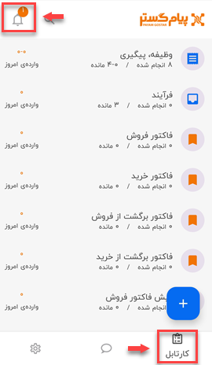
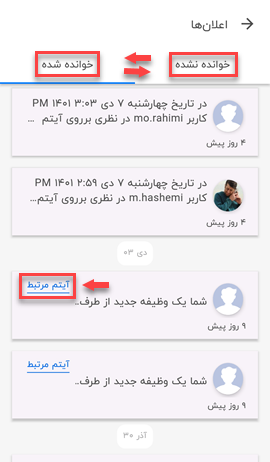

# مشاهده لیست اعلانات

گاهی پیش می‌آید که به‌دلایل مختلف نتوانید حساب کاربری‌ خود را بررسی کنید و پیا‌م‌های‌تان را بخوانید؛ بهترین راه‌کار در این زمان، استفاده از اعلانات (Notification) است. اعلانات باعث یادآوری و جلب توجه شما می‌شوند و می‌توانید به‌عنوان یک میانبر برای خواندن جدیدترین پیام‌های‌ خود از آن استفاده نمایید. 
### **1) مشاهده اعلانات**:
 برای مشاهده‌ی لیست اعلانات باید مسیر **منوی پایین صفحه** > **کارتابل** > **علامت زنگوله**  را طی کنید. در این صفحه می‌توانید تمامی پیام‌های سیستمی (هم‌چون وظایف، ذکر شدن در نظرات و...) حساب کاربری‌ خود را مشاهده کنید. 

> نکته 
عدد کنار آیکون زنگوله، نشان‌دهنده‌ی تعداد پیام‌های سیستمی خوانده نشده، توسط کاربر است. 

با کلیک بر روی زنگوله وارد صفحه‌ی مربوط به اعلانات می‌شوید و در آن‌جا تمامی پیام‌ها و یادآوری‌های سیستمی را می‌توانید در دو لیست جداگانه‌ی **خوانده شده** و **خوانده نشده** مشاهده کنید. در هر کدام از این لیست‌ها، پیام‌ها به‌تاریخ مرتب (Sort) شده و شما در ابتدا جدیدترین اعلان را در بالای صفحه خواهید دید. 

### **2) آیتم مرتبط**:
اگر کاربران روی آیتم سوابق برای شما نظری ثبت کرده باشند، با انتخاب گزینه‌ی **آیتم مرتبط** می‌توانید به صفحه‌ی سابقه‌ی مربوط به نظر بروید و در آن‌جا جزئیات بیشتری را مشاهده کنید و اقدامات بعدی را بر روی آن انجام دهید.

### **3) حذف اعلان**: 
در صورت تمایل برای حذف هر اعلان، باید پس از انتخاب آن، بر روی علامت حذف (سطل زباله) که پس از انتخاب مورد، برایتان در بالای صفحه ظاهر می‌شود، کلیک کنید.
