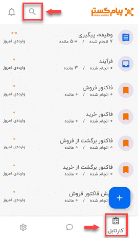
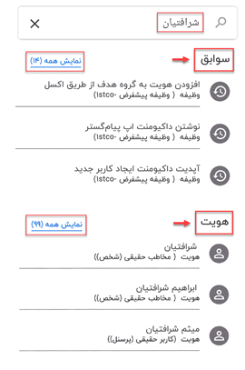

# جستجو در سوابق و هویت ها

اگر بخواهید در نسخه اپ پیام گستر، نام یا عبارتی را در بین سوابق و هویت‌ها جستجو کنید، باید از مسیر **کارتابل** > **جستجو** (علامت ذره‌بین) اقدام نمایید. با این امکان می‌توانید لیستی از تمامی سوابق (وظیفه، فرم و...) و هویت‌ها که نام مدنظر در یکی از فیلدهای آن هم‌چون عنوان، توضیحات، خلاصه سابقه و... آمده است را مشاهده نمایید. 

پس از تایپ عنوان مدنظر در نوار جستجو (Search bar) ابتدا لیست تمامی **سوابق** و سپس لیست تمامی **هویت‌**هایی که واژه جستجو شده در یکی از فیلدهای آن آمده، برای شما نمایش داده می‌شود.

پس از بررسی لیست ارائه شده و انتخاب مورد منظور، وارد صفحه‌ی مرتبط با هویت یا سابقه می‌شوید و در آن‌جا تمامی اطلاعات مختص به آن را مشاهده و در صورت تمایل می‌توانید تغییر دهید. 
**نمایش همه**:
در صفحه‌ی اصلی تعداد محدودی آیتم به شما نمایش داده می‌شود و برای مشاهده‌ی لیست تمامی موارد، باید بر روی **نمایش همه** کلیک کنید. پس از کلیک بر روی *نمایش همه سوابق*، شما به صفحه‌ی تاریخچه CRM منتقل می‌شوید  که علاوه بر امکان مشاهده‌ی تمامی سوابق ثبت شده در سیستم و استفاده از فیلترها برای رسیدن به سابقه‌ی مدنظر، می‌توانید لیست خروجی جستجوی‌تان را در پایین صفحه در قسمت **نتایج جستجو** مشاهده نمایید. با کلیک بر روی *نمایش همه هویت*، نرم‌افزار شما را به صفحه‌ی جستجوی پیشرفته هدایت می‌کند و در آن‌جا علاوه بر امکان مشاهده تمامی انواع هویت و استفاده از فیلترها، می‌توانید لیست خروجی جستجویتان را در  **نتایج جستجو**  مشاهده نموده و در صورت تمایل از همان‌جا وارد صفحه‌ی هویت مدنظر شوید.

>**نکته** 
مشاهده‌ی کامل نتیجه جستجو به داشتن مجوز **مشاهده لیست آیتم** بستگی دارد و لیست خروجی جستجوی‌ شما با توجه به مجوزهایی که به کاربری‌تان داده شده، می‌تواند متغیر باشد.

  به این نکته توجه داشته باشید که نتیجه‌ی جستجو در نسخه‌های سازمانی و استاندارد با هم تفاوت دارد؛ در نسخه‌ی استاندارد تنها جستجو بین هویت‌ها انجام می‌شود در حالی‌که در نسخه‌ی سازمانی جستجو بین تمامی آیتم‌های هویت، سوابق، پیام‌های دریافتی و ارسالی، پیامک و ایمیل انجام می‌شود.
