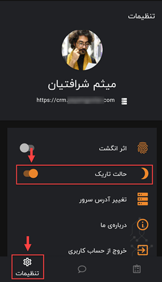

# تغییر تم نرم‌افزار موبایل

یکی از امکانات نسخه‌ی اپلیکیشن CRM پیام‌گستر، امکان تغییر پس‌زمینه یا همان پوسته‌ نرم افزار است. با توجه به اختلاف سلیقه‌ی اشخاص و افزایش تمایل‌شان به استفاده از تم تاریک (Dark theme)  این ویژگی برای شما فراهم شده است. 
برای تغییر تم از حالت روز به شب در اپ نرم‌افزار پیام گستر، باید از مسیر  **منوی پایین صفحه** > **تنظیمات** (Settings) > **حالت تاریک** رفته و   گزینه‌ی حالت تاریک را فعال کنید. 

 

>نکته 
پس زمینه تاریک (Dark mode) که به آن حالت شب (Night mode) هم می‌گویند باعث می‌شود در ساعات تاریکی هوا، چشم فرد هنگام کار با نرم‌افزار کمتر خسته و اذیت شود و آن هم به‌دلیل کاهش نور آبی‌ای است که از موبایل کاربر می‌تابد و در نهایت راحتی و سلامت شخص را هنگام کار افزایش می‌دهد. 
