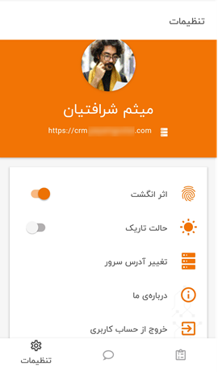

# اطلاعات حساب کاربری در اپلیکیشن

برای دسترسی به برخی از اطلاعات حساب کاربری خود می‌توانید از **منوی پایین برنامه** > **تنظیمات** (Settings) وارد صفحه‌ی مربوطه شوید. در این قسمت موارد زیر را می‌توانید بررسی کنید: 
. عکس پروفایل 
. نام و نام خانوادگی کاربر 
. آدرس سرور 

>**نکته** 
  این موارد (به‌جز آدرس سرور) از اپلیکیشن قابل تغییر نبوده و برای اعمال هرگونه تغییری بر روی آن‌ها باید به نسخه‌ی تحت وب مراجعه نمایید.
