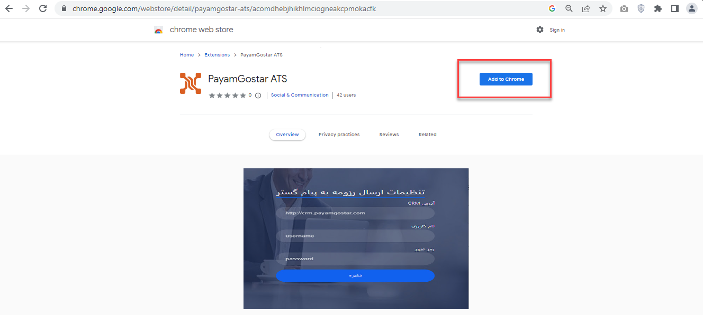
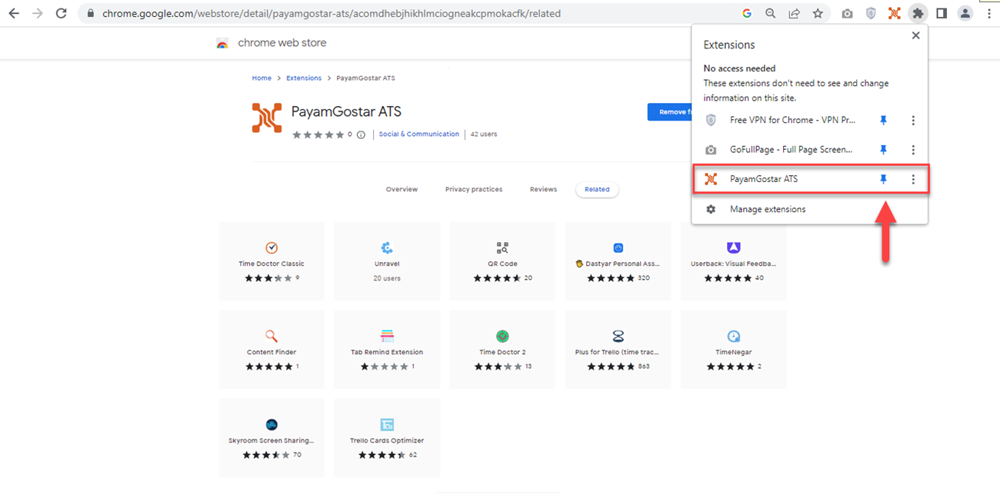
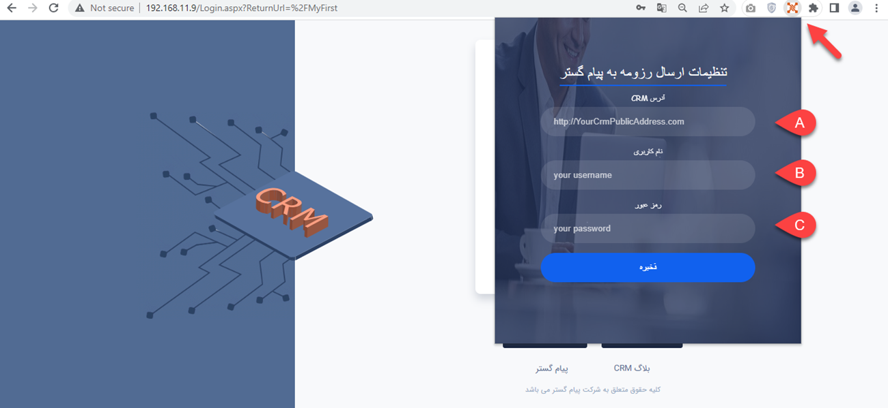
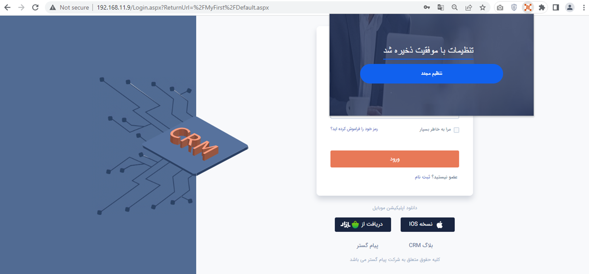

# نصب و فعال‌سازی راهکار مدیریت منابع انسانی (ATS) پیام‌گستر
برای فعال کردن قابلیت ATS پیام‌گستر، باید ابتدا افزونه کروم (extension) آن را دریافت و روی مروگر کروم خود نصب کنید. برای نصب افزونه به ترتیب زیر عمل کنید: 
1. در مرورگر کروم خود عبارت [**Payamgostar ATS**](https://chrome.google.com/webstore/detail/payamgostar-ats/acomdhebjhikhlmciogneakcpmokacfk) را جستجو کرده و یا بر روی عبارت مذکور کلیک کنید. در صفحه‌ی بازشده بر روی گزینه Add Extension کلیک نمایید. 

پس از نصب، با کلیک بر روی آیکون Extensions  می‌توانید آن را در لیست افزونه‌های نصب شده مشاهده کرده و در مرورگر خود سنجاق (Pin) کنید.

2. برای فعال کردن افزونه ATS روی آیکون مربوط به آن در مرورگر خود کلیک کرده و آدرس نرم‌افزار پیام‌گستر خود (A)، نام کاربری (B) و رمزعبور خود (C) را وارد کنید.

> **نکته** 
> برای فعال‌سازی موفق این افزونه به دو نکته زیر توجه کنید:
> - دقت داشته باشید که **یک ایمیل با قابلیت دریافت** باید حتما از قبل در پیام گستر ایجاد شده باشد تا در آیتم درخواست‌های پشتیبانی (که به صورت خودکار ایجاد می‌گردد) برای ارسال و دریافت پیام استفاده شود.
> - زمانی که برای اولین بار می‌خواهید این افزونه را در مرورگر خود نصب و فعال کنید، لازم است این مرحله توسط کاربر با مجوز **مدیرسیستم** انجام شود. زیرا به مجوز **شخصی‌سازی موجودیت‌ها** نیاز است.
>> داشتن مجوز مدیریت سیستم صرفا برای اولین کاربری که مسئولیت نصب افزونه را به عهده دارد الزامی است. سایر کاربران بدون نیاز به داشتن این مجوز می‌توانند افزونه را نصب کنند.

در صورتی که نصب و فعال‌سازی افزونه به طور صحیح انجام شده باشد، پیغام زیر را مشاهده می‌کنید. 

پس از فعالسازی افزونه ATS توسط مدیر سیستم (Admin)، **افرادی که مسئولیت استخدام را بر عهده دارند** نیز باید این افزونه را در مروگر خود نصب و فعال کنند. لازم به ذکر است نصب افزونه برای سایر کاربران نیاز به مجوز مدیریت سیستم **ندارد**. 
> **نکته** 
> استفاده از سیستم مدیریت منابع انسانی پیام‌گستر (ATS) نیازمند IP استاتیک است. در غیر این صورت، نصب افزونه انجام نخواهد شد. 