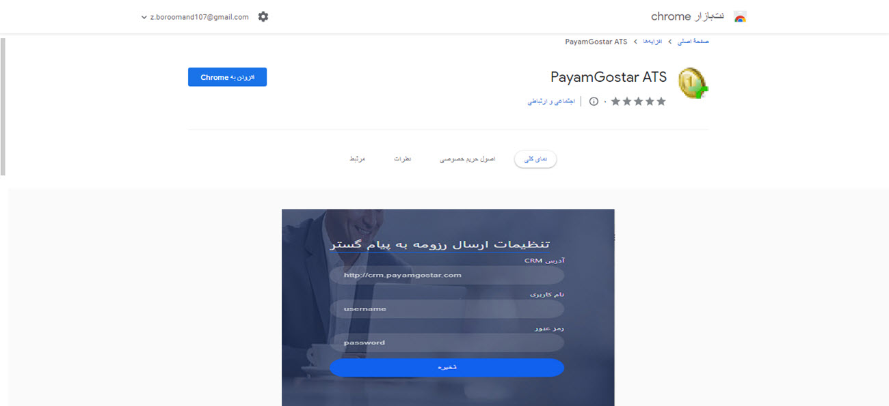
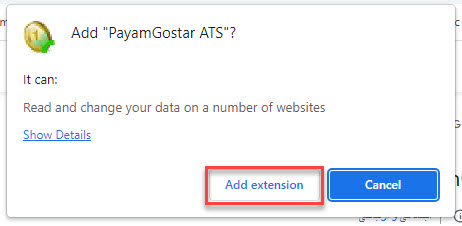
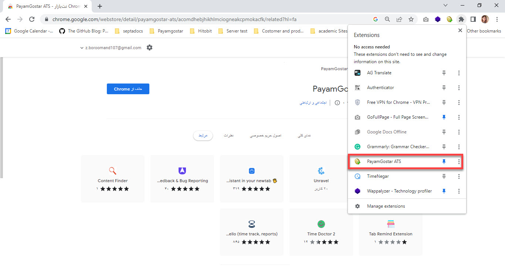
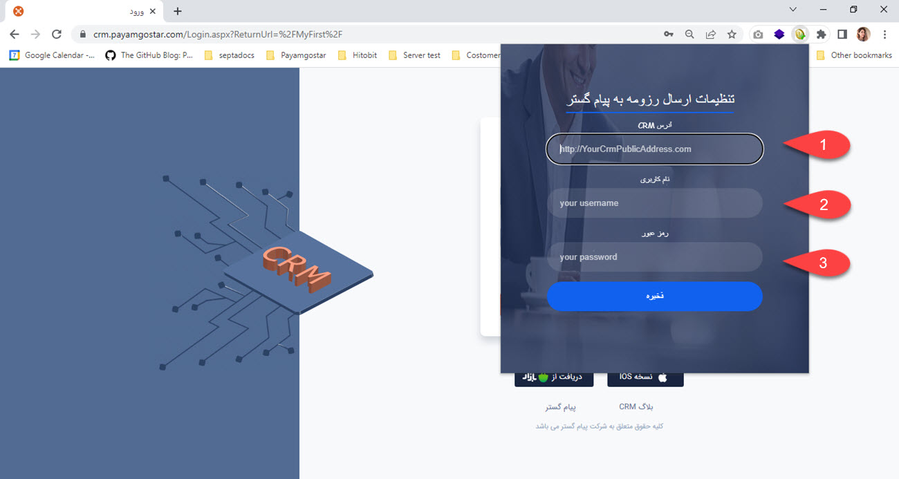
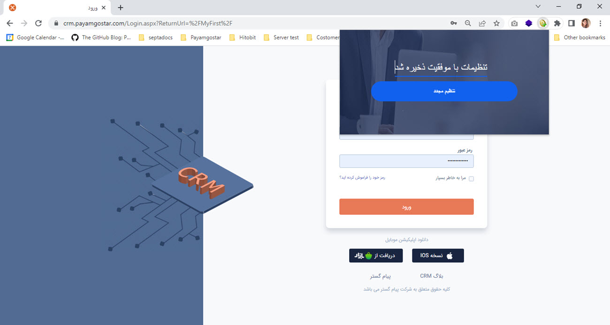

# نصب و فعال‌سازی ماژول ATS پیام‌گستر
برای فعال کردن قابلیت ATS پیام‌گستر، باید ابتدا اکستنشن یا افزونه کروم آن را دریافت کنید و آن را روی مروگر کروم خود نصب کنید. مراحل نصب به شرح زیر می‌باشد:
1. در مرورگر کروم خود عبارت **Payamgostar ATS** را جستجو کنید و روی گزینه Add Extension کلیک کنید.

پس از نصب، با کلیک روی آیکون Extensions  می‌توانید آن را در لیست افزونه‌های نصب شده مشاهده کرده و در مرورگر خود سنجاق (Pin) کنید.

2. برای فعال کردن افزونه ATS روی آیکون مربوط به آن در مرورگر خود کلیک کرده و آدرس نرم‌افزار CRM، نام کاربری و رمزعبور خود را وارد کنید. 

> **نکته** 
> برای فعال‌سازی موفق این افزونه به دو نکته زیر توجه کنید:
> - زمانی که برای اولین بار می‌خواهید این افزونه را در مرورگر خود نصب و فعال کنید، لازم است این مرحله توسط کاربر با مجوز **مدیرسیستم (یا راهبر نرم‌افزار)** انجام شود. زیرا به مجوز **شخصی‌سازی موجودیت‌ها** نیاز است.
> - دقت داشته باشید که **یک ایمیل با قابلیت دریافت** باید حتما از قبل در پیام گستر ایجاد شده باشد تا در آیتم درخواست‌های پشتیبانی (که به صورت خودکار ایجاد می‌گردد) برای ارسال و دریافت پیام استفاده شود.

در صورتی که نصب و فعال‌سازی افزونه به طور صحیح انجام پذیرفته باشد، پیغام زیر را مشاهده می‌کنید. 

4 آیتم CRM ذکر شده که شامل زیرنوع هویت، فرم درخواست جذب نیرو، فرم آگهی مرتبط با درخواست جذب نیرو و درخواست پشتیبانی مصاحبه است؛ در این مرحله به صورت خودکار با فعال سازی ATS در سیستم شما ایجاد می‌شوند. **یعنی دیگر نیازی به شخصی‌سازی و ساخت هرکدام از این زیرنوع‌ها نیست.** 
هنگامی که هریک از این آیتم‌ها ایجاد شدند، در تنظیمات شخصی‌سازی آن‌ها کد منحصربه‌فرد تخصیص داده می‌شود که از آن برای ارتباط با هرکدام از پلتفرم‌های جابینجا، جاب‌ویژن و لینکدین استفاده می‌شود. بنابراین حتی راهبر نرم‌افزار شما اجازه تغییر کد آیتم در قسمت شخصی سازی آیتم را ندارد.

