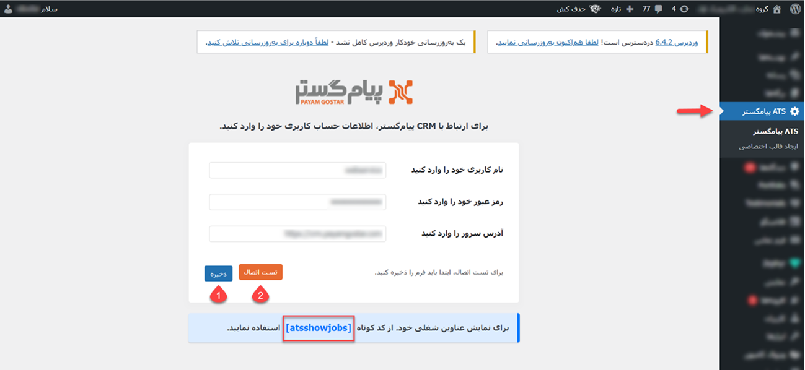

# پلاگین وردپرس پیام‌گستر
اگر قصد انتشار آگهی در سایت دیگری به جز جاب‌ویژن، جابینجا و لینکدین را دارید که با فرمت وردپرس نوشته شده باشد، باید از پلاگین وردپرس پیام‌گستر استفاده نمایید. 

1. ابتدا پلاگین را بر روی سیستم خود نصب نمایید برای نصب افزونه

2. پس از نصب افزونه، اطلاعات کاربری پیام‌گستر خود را وارد نمایید. به منظور اتصال به نرم‌افزار پیام‌گستر کافیست به مشابه تصویر زیر، نام کاربری، رمز عبور و آدرس سرور پیام‌گستر خود را وارد نمایید. منظور از آدرس سرور همان IP پیام‌گستر شماست.

3. 

## نصب پلاگین وردپرس
نصب پلاگین وردپرس پیام‌گستر به مشابه نصب سایر پلاگین‌ها در وردپرس انجام می‌پذیرد. بدین منظور پلاگین وردپرس پیام‌گستر را از آدرس //// دانلود کنید. سپس پلاگین دانلود شده را از مسیر زیر نصب نمایید: 

 افزونه‌ها > بارگذاری افزونه > انتخاب فایل (پلاگین دانلود شده) > نصب 

 ## تنظیمات پلاگین وردپرس
 با نصب پلاگین، تب ATS پیام‌گستر در ستون مربوطه به شما نمایش داده می‌شود. برای اتصال آن به نرم‌افزار CRM پیام‌گستر خود، اطلاعات سرور و حساب کاربری ادمین CRM را در این قسمت وارد نمایید. 
در این بخش منظور از آدرس سرور، IP نرم‌افزار پیام‌گستر شما و همچنین منظور از نام‌ کاربری و رمز عبور، نام کاربری و رمز عبور ادمین پیام‌گستر می‌باشد. 

توجه داشته باشید که پس از درج اطلاعات،‌ابتدا فرم را ذخیره (شماره ۱) و سپس اتصال را بررسی نمایید (شماره ۲). چنانچه پیغام «اتصال به CRM برقرار شد!» را بر روی کلید مشاهده کنید، تنظیمات شما با موفقیت اعمال شده است. 
برای نمایش اطلاعات (فرم موقیعیت‌های شغلی) از کد کوتاه  (Short code) که در کادر پایین در اختیار شما قرار داده می‌شود، استفاده کنید. 

 ## ایجاد قالب اختصاصی برای فرم موقعیت شغلی
به صورت پیش‌فرض، فرم منتشر شده در سایت دارای ۶ فیلد شرح شغل، تجارب، حقوق، توانایی‌ها، جنسیت و ارسال رزومه می‌باشد. این فیلدها با توجه به اطلاعات مندرج در فرم/// در شده و در سایت نمایش داده می‌شود.
