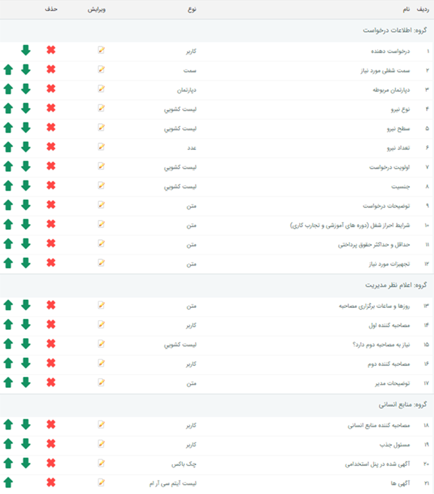
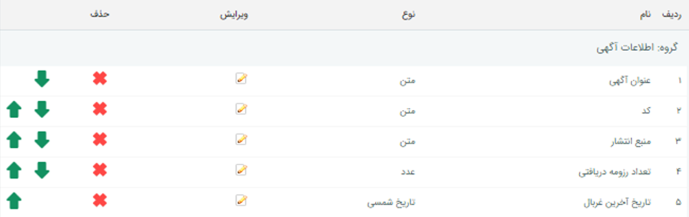
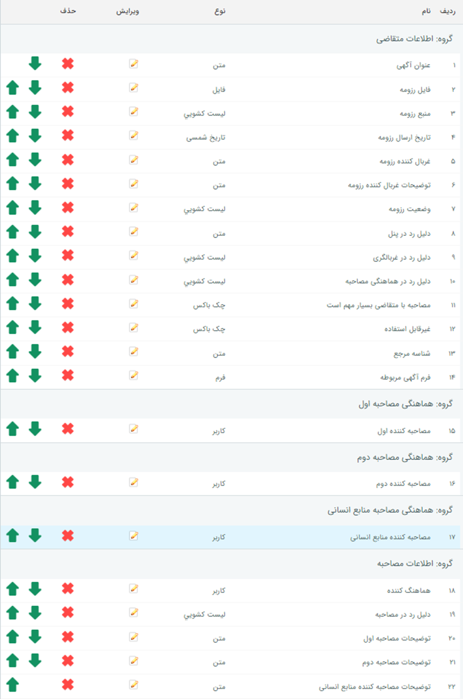

# تنظیمات راهکار مدیریت منابع انسانی ATS پیام‌گستر

با نصب و فعالسازی افزونه ATS، چهار زیرنوع موجودیت در نرم‌افزار شما ساخته می‌شود که اطلاعات مربوط به روند درخواست نیرو، دریافت رزومه، ارزیابی رزومه و در نهایت جذب نیرو از طریق آن‌ها انجام می‌شود. زیرنوع‌های موجودیت‌ها شامل موارد زیر است: 

- **زیرنوع هویت از نوع مخاطب حقیقی:** این موجودیت برای ثبت اطلاعات کارجو در پیام‌گستر ایجاد می‌گردد. 

> **نکته**  
برای اینکه هویت‌های ساخته شده (هویت کارجوها) در بانک اطلاعاتی در دسته‌بندی مورد نظر شما ذخیره گردد، یک دسته‌بندی با نام «کارجوها» و کد کاربری «ApplicantCategory» ایجاد نمایید. برای کسب اطلاعات بیشتر در مورد نحوه‌ی ایجاد دسته‌بندی، به راهنمای [ایجاد دسته‌بندی هویت‌ها](https://github.com/1stco/PayamGostarDocs/blob/master/Help/Integrated-bank/Database/Grouping/Grouping.md) مراجعه نمایید. 
>> شما می‌توانید نام دیگری برای گروه (دسته‌بندی) مورد نظر تعیین نمایید لکن **کد کاربری حتما باید مطابق با عبارت فوق درج گردد**. 

- **فرم با عنوان «درخواست جذب نیرو»:** این فرم برای ثبت درخواست نیرو توسط مدیران به منظور تعیین موقعیت شغلی مورد نظر که متناسب با آن، آگهی استخدام منتشر شده است ایجاد می‌گردد. فیلدهای ساخته شده در این فرم در تصویر زیر قابل مشاهده است. 

- **فرم با عنوان «آگهی مرتبط با درخواست جذب نیرو»:** این فرم اطلاعات آگهی منتشر شده در پلتفرم کاریابی (جابینجا/جاب‌ویژن/لینکدین) را در بردارد و در سابقه فرم درخواست جذب نیرو ذخیره می‌شود. 

 - **درخواست پشتیبانی با عنوان «مصاحبه»:** این درخواست به منظور تعیین نتیجه بررسی رزومه (رد/تایید) ایجاد می‌گردد و شامل اطلاعاتی نظیر فایل رزومه، آگهی مرتبط، وضعیت رزومه و سایر اطلاعات می‌باشد که در تصویر زیر قابل مشاهده هستند. 

 

>**نکته** 
> 4 آیتم CRM ذکر شده پس از فعال‌سازی افزونه ATS به صورت خودکار در سیستم ایجاد می‌شود. **یعنی دیگر نیازی به شخصی‌سازی و ساخت هرکدام از این زیرنوع‌ها نیست.** 
>>هنگامی که هریک از این آیتم‌ها ایجاد شدند، در تنظیمات شخصی‌سازی هر یک، کد منحصربه‌فردی به آن‌ها تخصیص داده می‌شود که از آن برای ارتباط با هرکدام از  پلتفرم‌های انتشار آگهی استفاده می‌شود. بنابراین حتی راهبر نرم‌افزار شما **اجازه تغییر کد آیتم در قسمت شخصی‌سازی را ندارد**. 
>> در صورت نیاز، شما می‌توانید فیلدهای مورد نظر خود را به فرم‌های ایجاد شده اضافه نمایید اما حذف فیلدهایی که به صورت خودکار ایجاد شده‌اند، امکان‌پذیر نمی‌باشد. در صورت حذف هر کدام از این فیلدها توسط کاربر، سیستم مجدد آن را ایجاد خواهد کرد. 

چنانچه پیش‌تر به آن اشاره شد، موجودیت‌های مورد نیاز سیستم ATS به صورت خودکار ایجاد می‌گردد؛ اما فرایند مورد نیاز به آن باید با توجه به سازمان شما طراحی و پیاده‌سازی گردد. به این منظور لازم است که فرایندها بر روی آیتم‌های **فرم درخواست نیرو** و **درخواست ایمیلی مصاحبه** پیاده‌سازی گردد. 
به عنوان مثال فرض کنید که شما می‌خواهید فرم درخواست جذب، پس از ثبت توسط مدیر هر واحد به درست مسئول منابع انسانی (و یا هر سمت دیگری) ارجاع داده شود. این فرایند باید بر روی آیتم فرم درخواست نیرو پیاده‌سازی گردد. و یا در ادامه مسیر قصد دارید برای درخواست‌های پشتیبانی مصاحبه که در سیستم ثبت شده است به کارتابل کاربر تعیین شده به عنوان مصاحبه‌کننده اول رفته و با توجه به اعلام نتیجه از طرف ایشان در سناریو اول رد و بایگانی شده و در سناریو دوم تایید شده و برای مصاحبه دوم برود. این فرایند باید بر روی آیتم درخواست ایمیلی مصاحبه پیاده‌سازی گردد. 
البته شما بدون طراحی و پیاده‌سازی فرایند هم می‌توانید با استفاده از مرحله و نمایش کانبان از سیستم ATS استفاده نمایید. 

> **نکته** 
کاربری که از افرونه‌ی ATS استفاده می‌کند باید مجوزهای زیر را داشته باشد: 
>- مجوز **ذخیره اولیه** و **ویرایش** زیرنوع هویت
>- مجوز **مشاهده لیست** فرم درخواست جذب نیرو
>- مجوز **ذخیره اولیه** و **ویرایش** آگهی برای به‌روزرسانی
>- مجوز **ذخیره اولیه** و **ویرایش** برای درخواست پشتیبانی مصاحبه
به این منظور، مجوزهای مروبطه را از بخش [**دسترسی موجودیت‌ها**](https://github.com/1stco/PayamGostarDocs/blob/master/Help/Settings/Manage-groups-and-users/permissions/Availability-of-entities/Availability-of-entities.md) تنظیم نمایید. 

بر اساس آنچه در نکته فوق به آن اشاره شد، پس از ایجاد خودکار آیتم‌ها توسط سیستم، مدیر سیستم (Admin) باید اقدام به اعطای مجوزهای لازم به کاربران کند. علاوه بر آن می‌توانید فرایند مورد نظر را بر روی هر یک از آیتم‌های ایجاد شده (فرم درخواست جذب نیرو و درخواست پشتیبانی مصاحبه) پیاده‌سازی نمایید. 

> **نکته** 
> با وجود اینکه نداشتن ماژول BPMS مانع نصب و استفاده از راهکار ATS نیست اما طراحی و پیاده‌سازی فرایند متناسب با سازمان بر روی آیتم‌های نام‌برده می‌تواند در سهولت و سازماندهی روند جذب تاثیر چشم‌گیری داشته باشد. 
>> در صورت عدم پیاده‌سازی فرایند برای آیتم‌های مربوطه توصیه می‌شود که با استفاده از ایجاد مرحله برای  آن‌ها، تفکیک فرم‌های منتشرشده و آیتم‌های جدید را برای مسئولان آسان‌تر نمایید. 

برای راه‌اندازی راهکار ATS پیام‌گستر طبق مراحل زیر عمل کنید: 
1. نصب افزونه ATS پیام‌گستر توسط مدیر سیستم
2. نصب افزونه ATS پیام‌گستر توسط سایر کاربران
3. اعطای مجوزهای لازم به کاربران
4. طراحی و پیاده‌سازی فرایندهای مورد نیاز بر روی فرم درخواست جذب نیرو و درخواست پشتیبانی مصاحبه
