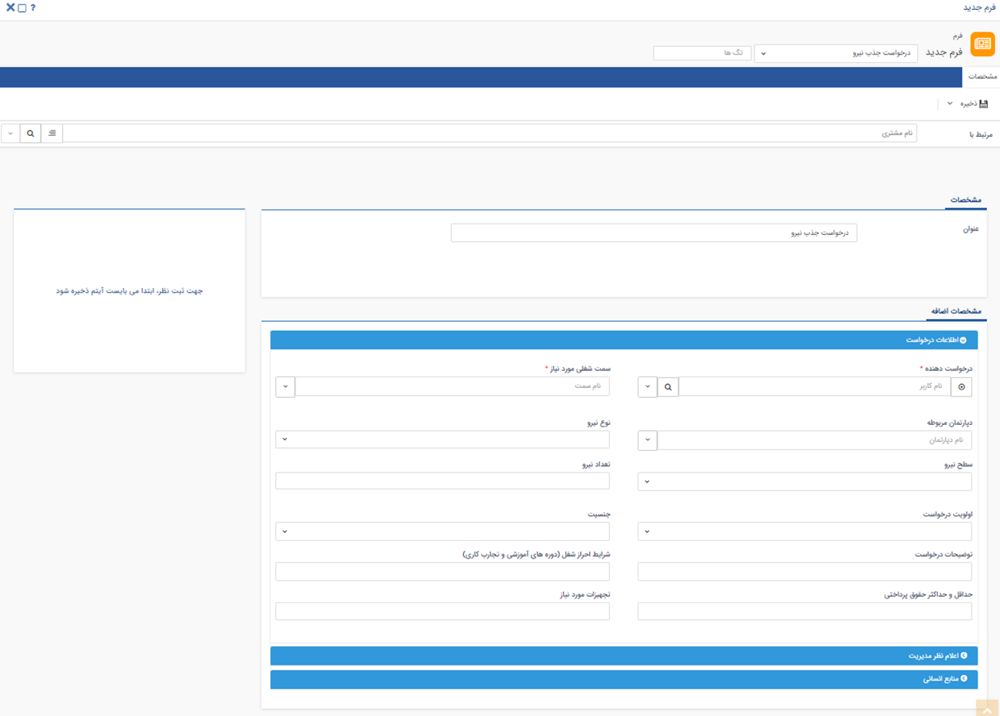

# ثبت درخواست نیرو و ارزیابی رزومه‌ها از طریق افزونه ATS  پیام‌گستر

پس از [**فعالسازی افزونه ATS**](https://help.payamgostar.com/docs/PayamgostarATS/%D9%86%D8%B5%D8%A8-%D9%88-%D9%81%D8%B9%D8%A7%D9%84-%D8%B3%D8%A7%D8%B2%DB%8C-%D9%85%D8%A7%DA%98%D9%88%D9%84-ATS-%D9%BE%DB%8C%D8%A7%D9%85%E2%80%8C%DA%AF%D8%B3%D8%AA%D8%B1_dia0350a5b-7a8e-4dd9-b052-08db74fa6f4a)، شما می‌توانید از سایت‌های جابینجا، جاب‌ویژن و یا لینکدین برای انتشار آگهی و جذب نیرو استفاده نمایید. فرایند جذب نیرو شامل بخش‌های ثبت درخواست نیرو، انتشار آگهی، بررسی رزومه‌ها و تعیین نتیجه است. 
با توجه به اینکه مراحل طی شده در پلتفرم‌های جاب‌ویژن و جابینجا مشابه یکدیگر است، به بررسی مراحل و اقدامات مورد نیاز در دو نوع پلتفرم داخلی (جابینجا و جاب‌ویژن) و پلتفرم خارجی (لینکدین) می‌پردازیم. 

## مراحل استفاده از ATS پیام‌گستر در پلتفرم‌های جابینجا و جاب‌ویژن
در این آموزش مراحل را در پلتفرم جابینجا بررسی خواهیم کرد. این روند در جاب‌ویژن نیز به همین صورت خواهد بود. 
برای ثبت درخواست نیرو و بررسی رزومه‌های دریافتی از طریق ATS پیام‌گستر طبق مراحل زیر عمل کنید: 
1. مدیر هر واحد باید متناسب با درخواست موقعیت شغلی مورد نظر، یک فرم درخواست جذب نیرو ثبت کرده و فیلدهای آن را تکمیل کند.

>**نکته**  {#RequestTopic}
> به هنگام ثبت فرم درخواست جذب نیرو، عنوان فرم را به عنوان درخواست مورد نظر تغییر دهید. بهترین شیوه نام‌گذاری عنوان، درج «**عنوان شغلی**، **دپارتمان مربوطه**، **ماه** و **سال انتشار** » آن است (به عنوان مثال: درخواست جذب نیرو مسئول دفتر دپارتمان مدیریت، تیر ۱۴۰۲). این امر به جهت قابل تشخص بودن فرم در مرحله اتصال به پلتفرم‌های کاریابی حائز اهمیت است. 

 پس از آن، این درخواست باید به واحد منابع انسانی ارجاع داده شود. چنانچه بر روی این فرم، فرایند مربوطه پیاده‌سازی شده باشد، به مشابه سایر فرایندها می‌توانید اقدام مورد نیاز را انجام دهید. در غیر این صورت (عدم پیاده‌سازی فرایند) از مسئول مربوطه بخواهید از قسمت لیست فرم‌های درخواست جذب نیرو به این فرم‌ها رسیدگی کند. 
 > **نکته** 
 > در صورت عدم پیاده‌سازی فرایند بر روی آیتم فرم درخواست جذب نیرو، می‌توانید از ویجت نظرات موجود در کنار آیتم‌ها برای اطلاع‌رسانی به مسئول منابع انسانی استفاده کنید (از کاربر در نظری نام ببرید). 

  پس از دریافت فرم توسط مسئول منابع انسانی، او  باید یک آگهی استخدام بر اساس فرم دریافتی در جابینجا (و یا جاب‌ویژن) منتشر کند. 
2. **مسئول استخدام** از تیم منابع انسانی، باید در سایت مورد نظر (در این مثال سایت جابینجا) وارد شده و کاربر/کاربران مورد نظر را به عنوان مسئول بررسی (تایید/رد) رزومه‌ها تعیین کند.

>**نکته** 
> در این مرحله می‌توان چند کاربر را به عنوان مسئول تایید یا رد رزومه‌ها تعیین کرد. در اطلاعات فرم‌هایی که در پیام‌گستر ایجاد می‌شوند، برای هر فرم، نام کاربری که آن رزومه‌ را تایید یا رد کرده ثبت می‌شود. یعنی کاربری که در افزونه ورود کرده، ایجاد کننده و ویرایش کننده در نظر گرفته می‌شود. 
3. برای بررسی رزومه‌های ثبت‌شده، به صفحه جابینجا مراجعه کرده و در قسمت لیست آگهی‌های فعال خود روی آگهی استخدام مورد نظر خود کلیک کنید (به عنوان مثال در اینجا روی آگهی استخدام مسئول دفتر کلیک می‌کنیم). با کلیک روی هر آگهی، لیست رزومه‌های ارسالی توسط متقاضیان را مشاهده خواهید کرد که وضعیت هرکدام از آن‌ها نمایان است. 

روی رزومه‌ای که وضعیت آن **در انتظار تعیین وضعیت** است کلیک کرده و اطلاعات رزومه‌ی آن را مطالعه نمایید. در سمت چپ صفحه سه دکمه **نامناسب**، **تایید برای مصاحبه** و **استخدام شده** در اختیار شما قرار دارد که با کلیک بر روی هرکدام رویدادهای متناسب با آن سناریو رخ می‌دهد. 

> **نکته** 
>  هنگام رد/تایید اولین رزومه در هر آگهی (اولین اعلام نتیجه)، باید از بین لیست فرم‌های درخواست‌ جذب ایجاد شده در پیام‌گستر، درخواست مرتبط با آن آگهی را انتخاب کنید. انتخاب [**عنوان مناسب فرم درخواست جذب نیرو به هنگام ثبت**](https://github.com/1stco/PayamGostarDocs/blob/master/Help/PayamgostarATS/EvaluationResumesByATS.md#RequestTopic) که پیش‌تر به آن اشاره شد، شناسایی فرم مورد نظر را آسان می‌کند. 
>> در این مرحله به صورت همزمان، علاوه بر ایجاد هویت متقاضی در پیام‌گستر، سیستم یک فرم آگهی مرتبط با درخواست جذب ایجاد می‌کند تا در فیلد فرم موجود در درخواست پشتیبانی مصاحبه پیوست شود. هر فرم درخواست جذب، یک کد منحصربه فرد در انتهای URL دارد که آن کد در فیلد کد موجود در فرم آگهی مرتبط  درج خواهد شد. در این خصوص نیاز به انجام اقدام از طرف شما نیست.  

**به عنوان مثال** در مورد فرم درخواست جذب مسئول دفتر، هنگام تایید یا رد رزومه‌ها، باید از لیست فرم‌های نمایش داده شده در پنل (که همان فرم‌های درخواست جذب نیرو ثبت شده در پیام‌گستر هستند)، فرم «درخواست جذب مسئول دفتر دپارتمان مدیریت، تیر ۱۴۰۲» را انتخاب کنید. 
صفحه انتخاب فرم درخواست جذب مرتبط با آگهی استخدام در اولین تایید به شکل زیر نمایش داده می‌شود: 

صفحه انتخاب فرم درخواست جذب مرتبط با آگهی استخدام در اولین تایید به شکل زیر نمایش داده می‌شود: 

4. اطلاعات مربوط به نتیجه‌ی بررسی رزومه کارجو از طریق درخواست مصاحبه (زیرنوع درخواست پشتیبانی) در سابقه هویت در پیام‌گستر ثبت می‌شود. بنابراین در این مرحله در سمت پیام‌گستر یک درخواست پشتیبانی با نام مصاحبه، ایجاد می‌شود. فایل رزومه و اطلاعات متقاضی در این آیتم ثبت شده و مراحل هماهنگی‌های مصاحبه بر روی این درخواست پیش می‌رود. 

در صورت رد رزومه در پنل، فیلد «دلیل رد در پنل» با علت انتخابی شما پر می‌شود. به همین ترتیب، در صورت تایید رزومه نیز گزینه تایید برای فیلد مربوطه انتخاب و ثبت می‌شود. اگر بر روی آیتم درخواست پشتیبانی مصاحبه، فرایندی طراحی و پیاده‌سازی شده باشد، بر اساس آن درخواست مصاحبه به مسئول مربوطه ارجاع داده می‌شود. در غیر این صورت، کابر خود موظف به چک کردن درخواست‌های ثبت‌شده می‌باشد. 
> **نکته** 
و در صورت عدم پیاده‌سازی فرایند بر روی آیتم‌ درخواست پشتیبانی مصاحبه، کاربر می‌تواند از فیلتر پیشرفته برای جداسازی درخواست‌های تایید شده و ثبت شده در بازه زمانی مورد نظر خود استفاده کند. 

## مراحل استفاده از ATS پیام‌گستر در پلتفرم‌ لینکدین
1. برای استفاده از لینکدین برای انتشار آگهی، در مرحله اول کاملا مشابه بخش قبل عمل کنید. این بدین معناست که فرم درخواست جذب نیرو توسط مدیر هر بخش ثبت شده، به مسئول منابع انسانی ارجاع داده می‌شود و آگهی مورد نظر توسط ایشان در لینکدین منتشر می‌گردد.
2. رزومه‌های ارسال شده توسط متقاضی در قسمت مکالمه برنامه لینکدین (Chat) برای شما ارسال می‌شود. در نتیجه مسئول منابع انسانی می‌تواند از همین قسمت اقدام به جمع‌آوری رزومه‌ها کند. بدین منظور کافیست در قسمت پایین صفحه‌ی مکاتبات با هر شخص، بر روی **ارسال به پیام‌گستر** کلیک کند. 
 
با این کار، هویت متقاضی در پیام‌گستر ایجاد شده و اطلاعات او در سیستم ثبت می‌شود.
> **نکته** 
> اطلاعات شخص از جمله نام و نام خانوادگی، تاریخ تولد، آدرس ایمیل و شماره تماس که در اطلاعات کاربری او در لینکدین تعریف شده باشد، به صورت خودکار در صفحه هویت درج می‌گردد. 

با کلیک بر روی گزینه‌ی ارسال به پیام‌گستر، فرم‌های درخواست جذب نیرو (موجود در پیام‌گستر)، برای انتخاب فرم مربوط به آگهی برای کاربر نمایش داده می‌شود. با انتخاب فرم مربوط به این درخواست (مثلا فرم درخواست جذب نیرو مسئول دفتر دپارتمان مدیریت، تیر ۱۴۰۲)، فرم آگهی مرتبط با درخواست ثبت و در سابقه فرم درخواست پیوست می‌شود. 
4. در این مرحله درخواست مصاحبه به صورت خودکار برای هویت ثبت می‌گردد و فایل رزومه شخص (آخرین فایل موجود در صفحه مکاتبات لینکدین) به آن پیوست می‌شود. در صورتی که برای آیتم درخواست مصاحبه فرایندی طراحی و پیاده‌سازی شده باشد، درخواست برای تعیین وضعیت به مسئول مربوطه ارجاع داده می‌شود. در غیر این صورت مسئول بررسی اولیه‌ی رزومه‌ها، خود باید اقدام به بررسی درخواست‌های مصاحبه‌ی ثبت شده نماید. 
