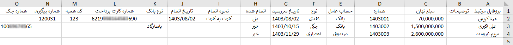
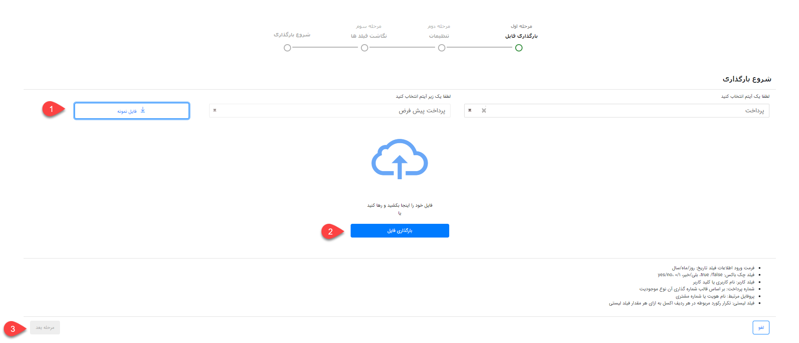
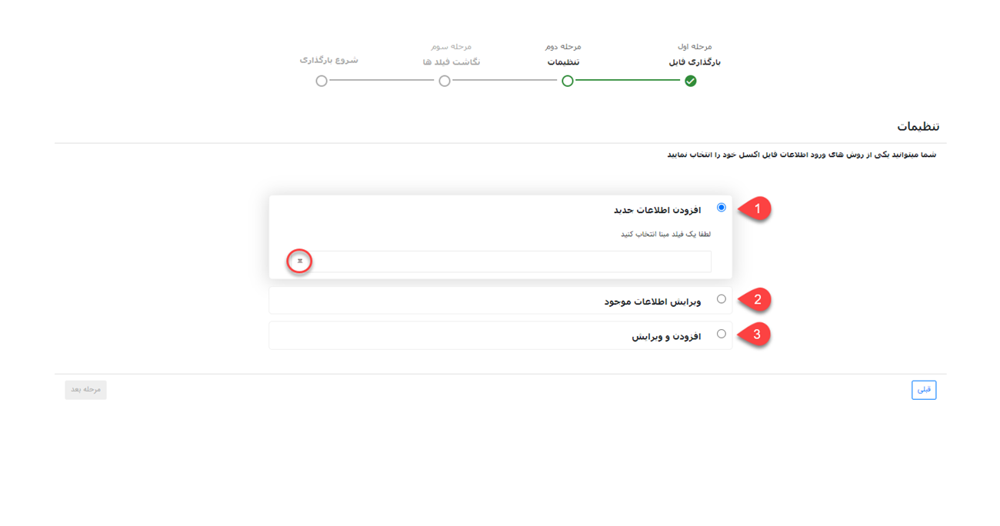
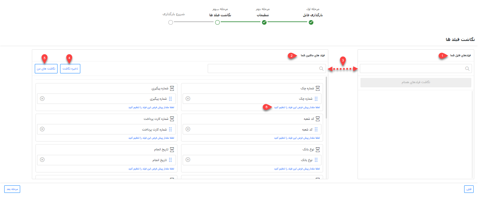
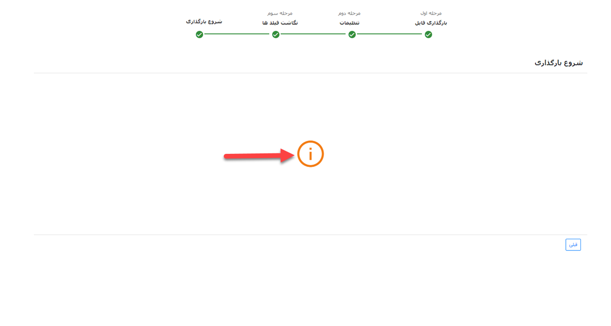

# ثبت پرداخت از طریق اکسل

در صورت نیاز به بارگذاری اطلاعات تعدادی از پرداخت‌ها به صورت یکجا، می‌توانید از روش ورود اکسلی استفاده نمایید. بدین ترتیب می‌توانید اطلاعات پرداخت‌های مورد نظر را در اکسل درج نمایید (یا از سایر نرم‌افزارهای خود خروجی بگیرید) و سپس بارگذاری کنید. در این حالت پرداخت‌های مورد نظر ایجاد شده و اطلاعات آن در فیلدهای مربوطه وارد می‌شود. علاوه بر آن از این روش می‌توانید برای ویرایش پرداخت‌های موجود استفاده نمایید. 
برای اینکه بارگذاری پرداخت‌ها بدون مواجهه با خطا و با موفقیت به اتمام برسد، لازم است که قوانین تهیه و بارگذاری اکسل را رعایت کنید. در این راهنما تمامی موارد لازم برای تنظیم صحیح فایل اکسل، به همراه شیوه بارگذاری آن مطرح شده‌است. بدین منظور در این راهنما به موارد زیر می‌پردازیم: 
- [شیوه‌ی تهیه و تنظیم فایل اکسل پرداخت‌ها](#PaymentExcel)
- [روش بارگذاری فایل اکسل پرداخت‌ها](#PaymetExcelUploading)
- [مجوزهای لازم برای بارگذاری اکسل پرداخت‌ها](#PaymentExcelPermision)

## تنظیمات فایل اکسل{#PaymentExcel}
برای ورود اطلاعات پرداخت‌ها از طریق اکسل، ابتدا باید اکسل مورد نظر را بر اساس فرمت مورد پذیرش نرم‌افزار تنظیم کنید. بدین منظور می‌توانید اکسلی با ستون‌هایی که در تصویر می‌بینید (فیلدهای آیتم پرداخت‌) ایجاد کنید و یا از فایل نمونه استفاده نمایید. فایل نمونه در مرحله‌ی اول بارگذاری به شما ارائه می‌شود (جلوتر به آن می‌رسیم). 

تصویر فوق،‌ ستون‌های مورد نیاز برای بارگذاری پرداخت را بر اساس فیلدهای پیش‌فرض آیتم پرداخت‌ نشان می‌دهد. در صورت افزودن فیلدهای اضافه (در شخصی‌سازی)، برای هر فیلد یک ستون با نام مشابه آن ایجاد نمایید. چنانچه از فایل نمونه‌ای که نرم‌افزار به شما می‌دهد استفاده می‌کنید، این فیلدها به صورت خودکار در فایل اکسل قرار داده‌می‌شود. 
برای تکمیل اطلاعات مربوط به فیلدهای پیش‌فرض به راهنمایی‌های زیر توجه داشته‌باشید:
- **پروفایل مرتبط:** نام هویت و یا شماره مشتری دریافت‌کننده (کسی که آیتم پرداخت باید برای او ثبت شود) را در این قسمت وارد نمایید. توجه داشته‌باشید که نام هویت را دقیقاً مطابق با نام و نام‌خانوادگی یا شرکت  مندرج در پروفایل وی در پیام‌گستر در اکسل خود وارد نمایید.
- **مبلغ نهایی:** مبلغ مورد نظر (مبلغی که پرداخت کرده‌اید) را در این ستون وارد نمایید. توجه داشته‌باشید مبلغ را به ریال درج کنید.
- **شماره**:  شماره پرداخت را بر اساس الگوی شماره‌گذاری‌ای که برای زیرنوع پرداخت تعریف شده‌است، مشخص نمایید. برای ثبت درست شماره بر اساس الگوی شماره‌گذاری، آخرین شماره‌ی اختصاص داده شده به آخرین پرداخت ثبت شده‌ در سیستم را چک کرده و شماره‌ی بعدی را به اولین پرداخت مندرج اکسل خود اختصاص دهید. علاوه بر آن، توجه داشته‌باشید که از درج شماره یکسان برای پرداخت‌های مختلف اجتناب کنید.

> **نکته** 
>  در حالت پیش‌فرض،‌ «شماره» تنها مبنای شناسایی پرداخت‌ها بوده و در نتیجه درج آن الزامی می‌باشد؛ مگر اینکه فیلد دیگری طی شخصی‌سازی به آیتم اضافه‌ شده‌باشد که بتواند مبنای جستجو قرار گیرد. 

- **توضیحات:** در صورت نیاز، توضیحات پرداخت را در این قسمت درج نمایید.
- **حساب عامل:** حسابی که مبلغ از آن برداشت شده‌است (یا در آینده برداشت می‌شود) را در این ستون درج نمایید. توجه داشته‌باشید حساب درج شده در این قسمت باید از بین حساب‌های تعریف شده در نرم‌افزار انتخاب شود. برای بررسی این موضوع کافیست یک پرداخت جدید از زیرنوع مورد نظر باز کرده و لیست «برداشت از» را بررسی کنید. در صورت نیاز به افزودن حساب جدید به لیست، از بخش [مدیریت حساب‌های مالی](https://help.payamgostar.com/docs/SalesAndPurchase/%D9%85%D8%AF%DB%8C%D8%B1%DB%8C%D8%AA-%D8%AD%D8%B3%D8%A7%D8%A8%E2%80%8C%D9%87%D8%A7%DB%8C-%D9%85%D8%A7%D9%84%DB%8C_di6112c82e-2739-4882-535a-08d966729247)، حساب مورد نظر را اضافه نمایید.
- **نوع:** نوع پرداخت را از بین گزینه‌های نقدی، چکی و اعتباری انتخاب نمایید. توجه داشته‌باشید که نوع انتخابی،‌ در زیرنوع پرداختی که قصد بارگذاری آن را دارید فعال  باشد. برای بررسی این موضوع می‌توانید یک پرداخت جدید از زیرنوع مورد نظر باز کرده و لیست نوع پرداخت را بررسی کنید. در صورت نیاز به فعال کردن نوع دیگری از پرداخت (نقدی/چکی/اعتباری)، به صفحه شخصی‌سازی زیرنوع پرداخت مراجعه نمایید.
- **انجام شده:** در صورت انتخاب نوع پرداخت نقدی، این گزینه را با درج «بلی» فعال اعلام کنید. در صورت انتخاب نوع پرداخت چکی یا اعتباری، پرداخت شدن و یا نشدن آن را بنا بر شرایط مشخص نمایید. پرداخت شدن مبلغ را با ذکر «بلی» و عدم پرداخت را با ذکر «خیر» در این ستون مشخص کنید.
- **تاریخ انجام:** تاریخ پرداخت را در این ستون درج نمایید.
- **نحوه انجام:** صورت انتخاب نوع پرداخت نقدی، روش پرداخت را از بین گزینه‌های کارت به کارت، واریز به حساب بانکی،‌ پرداخت آنلاین و پرداخت حضوری انتخاب نمایید.
- **شماره پیگیری:** در صورت انتخاب نوع پرداخت نقدی، شماره پیگیری را در این ستون وارد نمایید.
- **کد شعبه:** در صورت انتخاب نوع پرداخت نقدی، کد شعبه را در این ستون وارد نمایید.
- **شماره کارت پرداخت:** در صورت انتخاب نوع پرداخت نقدی، شماره کارت را در این ستون وارد نمایید.
- **شماره چک:** در صورت انتخاب نوع پرداخت چکی، شماره چک را در این ستون وارد نمایید.
- **نوع بانک:** در صورت انتخاب نوع پرداخت چکی، نام بانک را در این ستون وارد نمایید. توجه داشته‌باشید که نام بانک را از بین بانک‌های تعریف شده در نرم‌افزار انتخاب کنید. برای بررسی این موضوع یک پرداخت جدید از زیرنوع انتخابی را باز کرده، نوع را بر روی چکی تنظیم کرده و در لیست بانک،‌ اسامی موجود را مشاهده نمایید . در صورت نیاز به تعریف بانک جدید، از بخش مدیریت آیتم‌های سیستم، «نام بانک» را جستجو کرده و گزینه‌ی مورد نظر را به آن اضافه نمایید.
- **تاریخ سررسید:** در صورت انتخاب نوع پرداخت چکی یا اعتباری، تاریخ سررسید پرداخت را در این ستون وارد نمایید.

> **نکته**  
> بر اساس فیلدهای موجود در پرداخت و نکات فوق، ستون‌های «حساب عامل»، «پروفایل مرتبط»، «مبلغ نهایی»، «شماره»، «انجام شده»، «تاریخ انجام» و «نوع» را برای همه‌ی انواع پرداخت پر کنید. با توجه به نوع پرداخت ستون‌های مربوطه به شرح زیر می‌باشد:  
> - **نقدی:** نحوه انجام، کد شعبه، شماره کارت پرداخت، شماره پیگیری
> - **چکی:** نوع بانک، شماره چک و تاریخ سررسید
> - **اعتباری:** تاریخ سررسید 

چنانچه پرداخت شما دارای اطلاعاتی بیشتر از فیلدهای موجود در نرم‌افزار باشد، باید فیلد مورد نیاز آن را از طریق شخصی‌سازی ایجاد نمایید. پس از آن می‌توانید اطلاعات این فیلدها را نیز با استفاده از اکسل وارد کنید. بدین منظور کافی است ستونی هم نام با فیلد خود به ستون‌های موجود در اکسل اضافه نمایید. در این خصوص به نکات زیر توجه داشته‌باشید: 
- امکان ورود اطلاعات فیلدهایی از نوع فایل، تصویر، html، کمپین، برچسب، لیست مرتبط، فیلد آیتم‌های CRM (مثل فیلد پرداخت،‌فاکتور و... به جز فیلد شخص/شرکت)، فیلد اضافه از نوع رنگ، فیلد لیستی از نوع فایل و فیلد لیستی از نوع کاربر/گروه از طریق اکسل وجود ندارد.
- در صورت استفاده از فیلد چک باکس،‌ با استفاده از «بلی» چک باکس تیک خورده و در صورت ذکر «خیر» چک باکس بدون تیک لحاظ می‌شود. البته از عبارات yes/no و true/false و همچنین اعداد 1/0 نیز می‌توانید بدین منظور استفاده نمایید.
- در صورت استفاده از فیلد کاربر، از بین کاربران تعریف شده در نرم‌افزار نام کاربر و یا کد کاربر مورد نظر را در این قسمت درج نمایید.
- برای ورود اطلاعات به فیلدهایی از نوع لیست کشویی فقط از عبارات موجود در لیست می‌توانید استفاده نمایید. فیلدهای لیست کشویی پیش‌فرض نرم‌افزار در بخش مدیریت آیتم‌های سیستم و لیست‌های کشویی اضافه‌ شده توسط شما در بخش شخصی‌سازی آن آیتم قابل مشاهده و ویرایش می‌باشند. چنانچه برای یک فیلد لیست کشویی، دو گزینه با عنوان مشابه تعریف شده باشد، ورود اطلاعات (مقداردهی) آن از طریق اکسل با خطا مواجه می‌شود.

>**نکته** 
> توجه داشته‌باشید که امکان بارگذاری چند نوع پرداخت (زیرنوع‌های مختلف) به صورت یکجا وجود ندارد. برای بارگذاری پرداخت، برای هر زیرنوع پرداخت به یک اکسل جداگانه نیاز دارید.  

## مراحل بارگذاری فایل اکسل{#UploadFileExcel}
بارگذاری اکسل در پیام‌گستر، چهار مرحله‌ی اصلی دارد:
### بارگذاری فایل
برای بارگذاری فایل اکسل از مسیر تب **فروش** > **پرداخت** > **زیرنوع پرداخت** مورد نظر را انتخاب کنید و وارد صفحه لیست پرداخت‌ها شوید. بر روی کلید «ورود اطلاعات از اکسل» کلیک کنید تا صفحه بارگذاری به شما نمایش داده‌شود. 
در گام اول **نوع** و **زیرنوع** آیتم انتخاب شده نمایش داده‌می‌شود. توجه داشته‌باشید که زیرنوع پرداختی که قصد بارگذاری آن را دارید در قسمت زیرنوع انتخاب شده‌باشد. در غیر این صورت، چنانچه زیرنوع پرداخت به درستی انتخاب نشده‌است، آن را به زیرنوع مورد نظر تعییر دهید. 

با کلیک بر روی کلید فایل نمونه (شماره ۱) می‌توانید قالب نمونه اکسل را دریافت نمایید. همان طور که پیش‌تر به آن اشاره شد، در این قالب ستون‌هایی برای درج اطلاعات فیلدهای پیش‌فرض پرداخت تعبیه شده‌است و در صورت اضافه شدن فیلدهای اضافه طی شخصی‌سازی، برای وارد کردن اطلاعات آن‌ها نیز ستون‌هایی به فایل افزوده می‌شود. 
پس از تنظیم فایل اکسل، با کلیک بر روی کلید بارگذاری فایل (شماره ۲)، فایل مورد نظر را انتخاب و بارگذاری کنید. پس از اتمام بارگذاری، کلید مرحله‌ی بعد (شماره ۳) در پایین صفحه برای شما فعال می‌شود. با کلیک بر روی این کلید، برای اعمال تنظیمات به مرحله‌ی بعدی می‌روید. 

### تنظیمات بارگذاری فایل
در این بخش باید تنظیمات لازم جهت تعیین روش ورود اطلاعات را مشخص کنید.

**1. افزودن اطلاعات جدید** 
با انتخاب این گزینه، تمامی پرداخت‌های جدید موجود در اکسل بر اساس مبنای انتخابی شما شناسایی و بارگذاری می‌شود. در این مرحله باید فیلد «شماره» را مبنای شناسایی انتخاب کنید. بر اساس شماره‌ی پرداخت‌، جستجوی تکراری بودن انجام شده و در صورت تکراری نبودن پرداخت‌ (یعنی اگر پرداختی با این شماره در سیستم وجود نداشته‌باشد) ،آن پرداخت به لیست پرداخت‌ها اضافه می‌شود. 
**2. ‌ویرایش اطلاعات موجود** 
در این حالت بر اساس فیلدی که به عنوان مبنا انتخاب شده است (شماره)، جستجو انجام می‌شود. در صورت وجود پرداخت‌ با شماره مشابه، پرداخت‌ مربوطه ویرایش شده و اطلاعات موجود در اکسل برای آن درج می‌شود. در صورت  یافت نشدن پرداخت‌ با چنین شماره‌ای،‌ اطلاعات آن سطر از اکسل بارگذاری نخواهدشد .
با انتخاب چک باکس " فقط فیلد‌های خالی پر شوند" تنها فیلدهای خالی پرداخت مقداردهی شده و فیلدهایی که دارای اطلاعات می‌باشند بدون تغییر باقی می‌مانند. 

>**نکته** 
> هنگام ویرایش، جستجو فقط در بین پرداخت‌های موجود از زیرنوع انتخابی انجام می‌شود. فلذا اگر پرداختی با شماره یکسان در زیرنوع‌های دیگر یافت شود، پرداخت‌ مذکور ویرایش نخواهدشد. 

**3. افزودن و ویرایش** 
در این حالت بر اساس فیلد مبنای انتخاب شده جستجو انجام می‌شود. در صورت وجود پرداخت‌، با اطلاعات فیلد مبنا، پرداخت مربوطه ویرایش می‌شود و در صورت یافت نشدن پرداخت با عنوان یا شماره یکسان (فیلد مبنا)، آن رکورد به عنوان پرداخت‌ جدید به نرم‌افزار اضافه می‌شود. 
با انتخاب چک باکس "فقط فیلد‌های خالی پر شوند"،‌ در پرداخت‌هایی که بر اساس فیلد مبنا یافت شده (پرداخت‌های موجود) و نیازمند ویرایش می‌باشند، ‌تنها فیلدهای خالی مقداردهی شده و فیلدهایی که دارای اطلاعات می‌باشند بدون تغییر باقی می‌مانند. 

>**نکته** 
> در حالت ویرایش (حالت ۲ و ۳)، چنانچه بر اساس مبنای جستجو، چند پرداخت با اطلاعات مورد نظر یافت شود، ویرایش بر روی هیچ یک از پرداخت‌ها انجام نمی‌گیرد. اگر مبنای جستجو شماره باشد، چنین امکانی وجود ندارد. چراکه سیستم اجازه‌ی ثبت دو پرداخت با شماره یکسان را به کاربر نمی‌دهد. لکن چنانچه فیلد دیگری که طی شخصی‌سازی اضافه‌کرده‌اید مبنای جستجوی شما باشد، باید به این نکته توجه داشته‌باشید. 

به این موضوع توجه داشته‌باشید که در زمان ویرایش، مقادیر مندرج در اکسل جایگزین مقادیر قبلی می‌شوند. بنابراین در صورتی که نیاز است مقادیر جدید بدون حذف مقادیر قبلی به آن‌ها اضافه‌شوند، باید مقادیر قبلی موجود هر فیلد که قصد حفظ آن را دارید، در اکسل تکرار شوند. 
برای ادامه‌ی فرآیند بارگذاری، بر روی کلید مرحله بعدی کلیک کنید. 

### نگاشت فیلدها
در مرحله سوم، سرستون‌های فایل اکسل در بخش «فیلدهای فایل شما» (شماره ۱) و فیلدهای موجود در مشخصات پرداخت‌ در بخش «فیلدهای ماشین شما» (شماره ۲) نمایش داده‌می‌شود. در واقع در این بخش مشخص می‌شود که اطلاعات هر ستون اکسل باید در کدام فیلد پرداخت‌ وارد شود. 
در صورت یکسان بودن نام ستون با عناوین مندرج در فایل نمونه،‌ نگاشت به صورت خودکار انجام می‌گیرد. در غیر این صورت باید با drag & drop نام هر ستون را از بخش فیلدهای فایل شما (سمت راست) به فیلد مربوطه در بخش فیلدهای ماشین شما (سمت چپ) متصل نمایید. در این شرایط برای یافتن عنوان مورد نظر در هر دو بخش می‌توانید از قابلیت جستجو (شماره ۳)‌ استفاده کنید. 

اگر نگاشت خود را به صورت دستی انجام داده‌اید، می‌توانید نگاشت خود را ذخیره نمایید (شماره ۴). در صورت استفاده مجدد از این اکسل یااکسل مشابه برای بارگذاری، با کلیک بر روی نگاشت‌های من (شماره ۵)، نگاشت به صورت خودکار انجام می‌شود. شما می‌توانید نگاشت‌های پرکاربرد خود را در سیستم ذخیره نموده و در وقت خود صرفه‌جویی کنید. در لیست نگاشت‌های من امکان ویرایش یا حذف نگاشت ذخیره شده نیز وجود دارد. 
شما این امکان را دارید که برای هر فیلد مقداری را به عنوان مقدار پیش‌فرض (شماره ۶) در نظر بگیرید تا در صورت خالی بودن مقدار فیلد در اکسل، فیلد با مقدار پیش‌فرض که در این قسمت تعریف کرده‌اید پر می‌شود. 
برای شروع بارگذاری، روی کلید مرحله بعدی کلیک کنید.  

### شروع بارگذاری
بارگذاری فایل ممکن است لحظاتی زمان ببرد. پس از اتمام فرآیند بارگذاری، در صورت بارگذاری موفق اکسل،‌ انجام موفقیت‌آمیز آن در این صفحه اعلام می‌شود. پیشنهاد می‌شود که پس از آن به صفحه‌ی لیست دریافت‌ها بروید و نتیجه را بررسی کنید. افزوده شدن پرداخت‌‌های جدید را با مقایسه تعداد دریافت‌ها با سطرهای اکسل و ویرایش پرداخت‌‌ها را با بررسی چند نمونه‌ی تصادفی می‌توانید به راحتی چک کنید. 
در منوی گزارش‌ها، بخش وضعیت عملیات انبوه می‌توانید نتایج ورود اطلاعات را مشاهده کنید. اگر فرآیند بارگذاری آغاز شود اما به هر دلیلی امکان بارگذاری برخی سطرها وجود نداشته‌باشد، با دانلود فایل اکسل از این بخش می‌توانید خطا و علت خطا را مشاهده نمایید. برای دانلود فایل، بر روی جزئیات رکورد مربوطه کلیک کرده و خروجی اکسل دریافت کنید. در اکسل دریافتی، سطرهای دارای مشکل با رنگ قرمز مشخص شده و در ستون آخر دلیل بروز خطا درج شده‌است. 

چنانچه بارگذاری فایل با خطا مواجه شده‌باشد و بارگذاری انجام نشود، پیغامی مشابه تصویر فوق به شما نمایش داده‌می‌شود. توجه داشتّ‌باشید که در این حالت، به سبب آغاز نشدن فرآیند بارگذاری، امکان دریافت فایل خطا از بخش گزارشات انبوه وجود ندارد. در چنین شرایطی فایل اکسل خود را مجدد بررسی و با فرمت راهنما مطابقت دهید. پس از رفع خطاهای فایل، مجدد اقدام به بارگذاری نمایید.  

## مجوزهای مورد نیاز برای بارگذاری پرداخت‌ از طریق اکسل{#PaymentExcelPermision}
برای ثبت پرداخت‌ از طریق اکسل،‌ کاربر باید دارای مجوزهای زیر باشد:
- **برای افزودن اطلاعات جدید** 
برای افزودن اطلاعات جدید (مورد ۱ در تنظیمات بارگذاری فایل) باید مجوز **ذخیره اولیه** زیرنوع پرداخت‌ انتخابی را داشته‌باشد.
- **برای ویرایش اطلاعات موجود** 
برای ویرایش اطلاعات موجود (مورد ۲ در تنظیمات بارگذاری فایل) باید مجوز **ویرایش** زیرنوع پرداخت‌ انتخابی را داشته‌باشد.
- **برای افزودن و ویرایش** 
برای افزودن و ویرایش اطلاعات (مورد ۳ در تنظیمات بارگذاری فایل) باید مجوز **ذخیره اولیه** و همچنین مجوز **ویرایش** زیرنوع پرداخت‌ انتخابی را داشته‌باشد.
- **برای انتخاب نوع پرداخت‌** 
برای انتخاب هر نوع پرداخت‌ نقدی/چکی/اعتباری باید به ترتیب مجوز **تعیین نوع پرداخت‌ نقدی**، **تعیین نوع پرداخت‌ چکی** و **تعیین نوع پرداخت‌ اعتباری** را در زیرنوع پرداخت‌ انتخابی داشته‌باشد.

> **نکته** 
> اگر زیرنوع پرداختی که قصد بارگذاری اکسل آن را دارید، در حالت نیازمند تایید تنظیم شده‌است، به صورت موقت گزینه‌ی نیازمند تایید بودن آن را غیرفعال نموده، پرداخت‌های خود را بارگذاری و سپس آن را به حالت نیازمند تایید تغییر دهید. چرا که در غیر این صورت، تمامی پرداخت‌های بارگذاری برای تایید به کارتابل مسئول تایید منتقل می‌شوند. به طور مشابه، اگر چرخه‌ای بر روی آیتم پرداخت فعال است که نیاز نیست پرداخت‌های بارگذاری‌شده آن را طی کنند، چرخه را پیش از بارگذاری فایل به صورت موقت غیرفعال نمایید. 