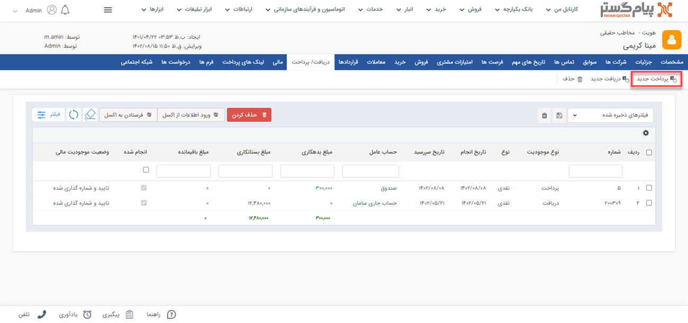

#  ثبت پرداخت جدید
با استفاده از این آیتم می‌توانید پرداخت‌های نقدی، چکی یا اعتباری مرتبط با مشتریان خود را ثبت نمایید.

> **نکته** 
 ابتدا قسمت[ اطلاعات مشترک سوابق ](https://github.com/1stco/PayamGostarDocs/blob/master/Help/Integrated-bank/Database/Records/Joint-record-information/Joint-record-information.md)را مطالعه کنید.
 
برای ثبت پرداخت جدید از طریق مسیر های زیر اقدام نمایید:
- **ویجت دسترسی سریع** > **پرداخت**

- **تب فروش** > **پرداخت**

- **صفحه اصلی پروفایل مشتری** > **مشخصات** > **پرداخت جدید**

- **صفحه اصلی پروفایل مشتری** > **سوابق** > **پرداخت جدید**

- **صفحه اصلی پروفایل مشتری** > **دریافت/پرداخت** > **پرداخت جدید**

مشخصات پرداخت‌ها در پیام‌گستر به شرح زیر می‌باشد:

1. **فاکتور مرتبط:** در صورتی که این پرداخت مرتبط با یک فاکتور خرید ثبت شده در پیام گستر باشد، از قسمت فاکتور مرتبط می‌توانید از لیست فاکتورهای صادر شده برای این مشتری، فاکتور مورد نظر را انتخاب کنید و به این دریافت الصاق کنید.
2. **شماره پرداخت:** در صورتیکه مجوز شماره گذاری این نوع پرداخت را داشته باشید، می‌توانید به صورت دستی این پرداخت را شماره‌گذاری کنید. در غیر این صورت پس از ذخیره پرداخت، کاربرانی که مجوز شماره‌گذاری داشته باشند آن را در کارتابل پرداخت‌های خود مشاهده خواهند نمود و می توانند آن را شماره گذاری کنند. در صورت نیاز، کاربر دارای مجوز شماره گذاری پرداخت یا مدیر مالی میتواند این شماره را به دلخواه تغییر دهد.

> **نکته** 
 توجه داشته باشید در صورتی که در تنظیمات این نوع پرداخت در شخصی سازی، قسمت "نیاز به شماره‌گذاری دارد" غیر فعال باشد، این پرداخت پس از ثبت به صورت خودکار شماره گذاری خواهد شد.

در صورت اتصال پیام‌گستر به نرم افزار مالی در نظر داشته باشید که تغییر این شماره ممکن است در هماهنگی با سیستم مالی مشکل ایجاد کند. 

3. **مبلغ:** مبلغ پرداخت شده را تعیین کنید.
4. **برداشت از:** حسابی که این واریز به آن انجام شده است را تعیین کنید.
لیست حساب های مالی نمایش داده شده در این قسمت را می‌توانید از قسمت [مدیریت حساب های مالی](https://github.com/1stco/PayamGostarDocs/blob/master/Help/Basic-Information/Financial-account-management/Financial-account-management.md) ویرایش کنید.
5. **نوع پرداخت:** شما می‌توانید تمام پرداخت‌های یک مشتری را ثبت نمایید. این پرداخت می‌تواند به صورت نقدی، چکی یا اعتباری باشد. (تعدادی از شرکت‌ها وجود دارند که مقداری پول به عنوان شارژ و یا اعتبار نزد خود دارند، مشتریان می‌توانند از این اعتبار برای پرداخت‌ها استفاده نمایند.)
6. **روش پرداخت نقدی:** در صورتیکه نوع پرداخت از مشتری نقدی باشد می‌توانید روشی که وجه به دست شما رسیده است را از بین گزینه های( کارت به کارت،واریز به حساب بانکی، پرداخت آنلاین،پرداخت حضوری و لینک پیام‌گستر پرداخت) انتخاب کنید.

>**نکته**  
توجه کنید که فیلدهای این قسمت با توجه به نوع دریافتی که انتخاب کرده‌اید، تغییر می‌کند. (برای مثال برای دریافت کارت به کارت از نوع نقدی باید شماره پیگیری و شماره رسید را ذخیره کنید در صورتی که دریافت به صورت چک باشد می‌توانید شماره چک و تاریخ سررسید آن را نیز مشخص کنید.) 

7. **اطلاعات زمان پرداخت:** چک باکس "دریافت شده" برای پرداخت‌های چکی و اعتباری معنی دارد و برای پرداخت های نقدی نمی توان آن را غیرفعال نمود. در صورتیکه گزینه پرداخت شده را انتخاب کنید، باید تاریخ پرداخت را وارد نمایید. 
8. **یادآوری به دریافت‌کننده:**  استفاده از این گزینه می‌توانید یک یادآوری در زمان مشخص برای پرداخت‌کننده با توجه به تاریخ سر رسید چک ایجاد نمایید. با انتخاب این گزینه صفحه ارسال پیام برای شما باز خواهد شد و پیامی پیش‌فرض در آن نمایش داده می‌شود.
(برای اطلاع در خصوص شیوه تنظیم متن به[ اطلاعات مشترک ابزارها ](https://github.com/1stco/PayamGostarDocs/blob/master/Help/Marketing/moshtarak-abzar/moshtarak-abzar.md)مراجعه کنید.) 
9. **توضیحات:** توضیحات بیشتری که مرتبط با این پرداخت وجود دارد را می‌توانید در این قسمت وارد کنید.
