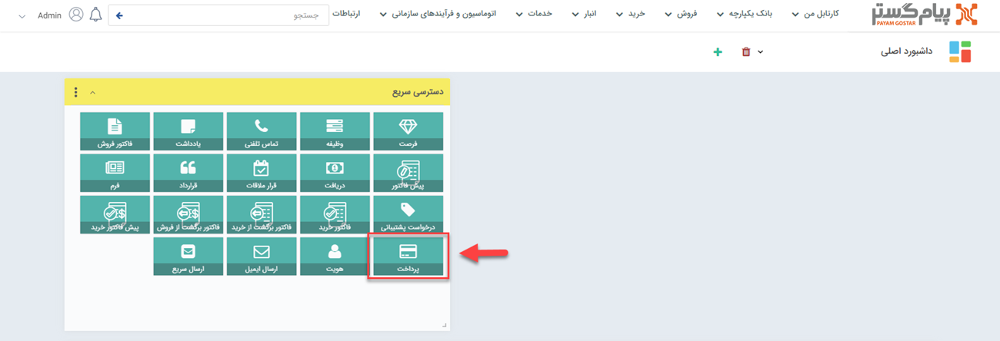
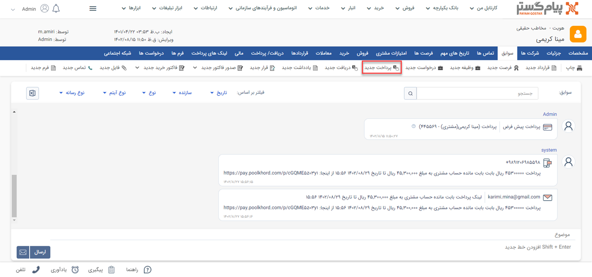

#  ثبت پرداخت جدید
چنانچه پرداختی از جانب سازمان شما به هویتی (مثلا یکی از تامین‌کنندگان) انجام شده باشد،‌ باید با استفاده از آیتم پرداخت آن را در سوابق هویت ثبت کنید. با استفاده از این آیتم می‌توانید پرداخت‌های نقدی، چکی یا اعتباری مرتبط با تامین‌کنندگان خود را ثبت نمایید. با ثبت و تایید پرداخت برای یک هویت، به میزان درج شده در آیتم پرداخت از بستانکاری او کم می‌شود. به عبارت دیگر از بدهکاری شما به مشتری کاسته می‌شود.

## مسیرهای ثبت پرداخت
برای ثبت پرداخت در نرم‌افزار راه‌های مختلفی وجود دارد. از طریق یکی از مسیرهای زیر اقدام به ثبت پرداخت نمایید: 

- **ویجت دسترسی سریع** > **پرداخت**

- **تب فروش** > **پرداخت** > **زیرنوع پرداخت** > **افزودن پرداخت**

- **صفحه اصلی پروفایل مشتری** > **آیتم جدید** > **پرداخت جدید**

برای مشاهده لیست «آیتم‌های جدید» بر روی فلش کنار «تماس جدید» قابل مشاهده در نوار سفید بالای صفحه مراجعه نمایید.

- **صفحه اصلی پروفایل مشتری** > **تب سوابق** > **پرداخت جدید**

- **صفحه اصلی پروفایل مشتری** > **تب دریافت/پرداخت** > **پرداخت جدید**

## شیوه‌ی ثبت پرداخت
برای ثبت پرداخت لازم است فیلدهای مورد نیاز آیتم را با اطلاعات موجود تکمیل و سپس ذخیره نمایید. مشخصات پرداخت‌ها در پیام‌گستر به شرح زیر می‌باشد:

1. **مرتبط با:** نام هویتی که پرداخت برای او انجام شده است را مشخص کنید.

> **نکته** 
> در صورت ثبت پرداخت از صفحه هویت (مسیر سوم، چهارم و پنجم) این بخش با صورت خودکار با نام هویت پر می‌شود.  

2. **فاکتور مرتبط:** در صورتی که این پرداخت مرتبط با یک فاکتور خرید ثبت شده در پیام‌گستر باشد، از قسمت فاکتور مرتبط می‌توانید از لیست فاکتورهای خرید موجود در سوابق این هویت (پروفایل مرتبط)، فاکتور مورد نظر را انتخاب کنید و به این پرداخت الصاق کنید.
3. **شماره پرداخت:** در صورتیکه مجوز شماره‌گذاری این نوع پرداخت را داشته باشید، می‌توانید به صورت دستی این پرداخت را شماره‌گذاری کنید. در غیر این صورت پس از ذخیره پرداخت، کاربرانی که مجوز شماره‌گذاری داشته باشند آن را در کارتابل پرداخت‌های خود مشاهده خواهند نمود و می توانند آن را شماره‌گذاری کنند. در صورت نیاز، کاربر دارای مجوز شماره‌گذاری پرداخت یا مدیر مالی میتواند این شماره را به دلخواه تغییر دهد.

> **نکته** 
 توجه داشته باشید در صورتی که در تنظیمات این نوع پرداخت در شخصی‌سازی، قسمت "نیاز به شماره‌گذاری دارد" غیر فعال باشد، این پرداخت پس از ثبت به صورت خودکار شماره‌گذاری خواهد شد.

4. **مبلغ:** مبلغ پرداخت شده را تعیین کنید.
5. **برداشت از:** حسابی که مبلغ از آن برداشت شده را تعیین کنید.
لیست حساب‌های مالی نمایش داده شده در این قسمت را می‌توانید از قسمت [مدیریت حساب‌های مالی](https://github.com/1stco/PayamGostarDocs/blob/master/Help/Basic-Information/Financial-account-management/Financial-account-management.md) ویرایش کنید.
6. **نوع پرداخت:** نوع پرداخت را از بین عناوین نمایش داده شده انتخاب نمایید. این پرداخت می‌تواند به صورت نقدی، چکی یا اعتباری باشد.
7. **جزئیات پرداخت:** این بخش با توجه به نوع پرداختی که مشخص کرده‌اید متفاوت خواهد بود. در صورت انتخاب هر یک از انواع پرداخت (نقدی/چکی/اعتباری) فیلدهای متناسب با آن در این بخش نمایش داده می‌شود.
### فیلدهای پرداخت نقدی
- **روش پرداخت نقدی:** در این فیلد می‌توانید روش پرداخت وجه را از بین گزینه‌های کارت به کارت، واریز به حساب بانکی، پرداخت آنلاین و پرداخت حضوری انتخاب کنید.
- **کد شعبه:** در صورت نیاز، کد شعبه‌ای که واریز را در آن انجام داده‌اید در این قسمت درج کنید.
- **شماره کارت/رسید:** شماره رسید واریزی و یا شماره کارتی که واریز به آن انجام گرفته است را در این قسمت درج نمایید.
- **شماره پیگیری:** در واریز وجه،‌می‌توانید شماره پیگیری مندرح در فیش واریز را در این قسمت ثبت نمایید.
### فیلدهای پرداخت چکی
- **بانک:** مشخص کنید چک را از کدام بانک صادر کرده‌اید. درج بانک در اطلاعات پرداخت به شما کمک می‌کند برای پر کردن‌های حساب‌های مربوطه به راحتی گزارش دریافت نمایید.
- **شماره چک:** شماره چکی که صادر کرده‌اید را درج نمایید تا در صورت نیاز بتوانید آن را پیگیری نمایید.
- **سررسید:** تاریخ سررسید چک را در این قسمت ثبت نمایید.
### فیلدهای پرداخت اعتباری
- **سررسید:** تاریخی که برای پرداخت اعتباری با تامین‌کننده خود مقرر کرده‌اید را ثبت نمایید.
8. **پرداخت شده:** در صورتی که نوع پرداخت شما نقدی باشد،‌این چک باکس به صورت خودکار فعال است (تیک زده شده است)؛ چراکه وجه قطعا از جانب شما پرداخت شده است. در صورت انتخاب پرداخت چکی یا اعتباری، شما باید بعد از پرداخت این گزینه را فعال کنید (تیک بزنید)
9. **تاریخ پرداخت:** در حالت پرداخت نقدی،‌ درج تاریخ پرداخت به هنگام ثبت الزامی است. این تاریخ لزوما با تاریخ ثبت آیتم پرداخت یکسان نیست. به عنوان مثال ممکن است شما پرداخت وجه را روز گذشته انجام داده باشید و امروز اقدام به ثبت پرداخت آن در سیستم نمایید. در این قسمت باید تاریخ پرداخت اصلی (در مثال قبل، روز گذشته) را لحاظ کنید. در صورت پرداخت چکی و یا اعتباری می‌توانید آن را در آینده و به هنگام تسویه چک و یا بدهی اعتباری خود ثبت نمایید.
10. **یادآوری به دریافت‌کننده:** پس از ثبت و ذخیره پرداخت می‌توانید یادآوری به دریافت‌کننده را فعال نمایید. با این کار در زمان تعیین‌شده توسط شما،‌ برای دریافت‌کننده (مرتبط با) پیامی با متن انتخابی شما ارسال می‌شود. برای تنظیم پیام کافیست بر روی «ندارد» آبی رنگ،‌ کلیک نمایید.
در صورت نیاز به راهنمایی برای نحو تنظیم پیام به [ارسال پیام]() مراجعه نمایید.
11. **توضیحات:** در صورت نیاز به توضیحات مرتبط بااین پرداخت می‌توانید آن را در این قسمت درج نمایید.

> **نکته** 
> چنانچه پرداخت ثبت شده نیازمند تایید و شماره‌گذاری باشد (در قسمت [شخصی‌سازی](https://github.com/1stco/PayamGostarDocs/tree/master/Help/Settings/Personalization-crm/Factor-management/Factor-management.md) گزینه نیاز به تایید و شماره‌گذاری برای فعال شده باشد)، پس از ثبت، مسئول تایید و شماره‌گذاری باید اقدام به این کار نماید.
>> پرداخت تایید نشده در سیستم از بستانکاری هویت نمی‌کاهد.