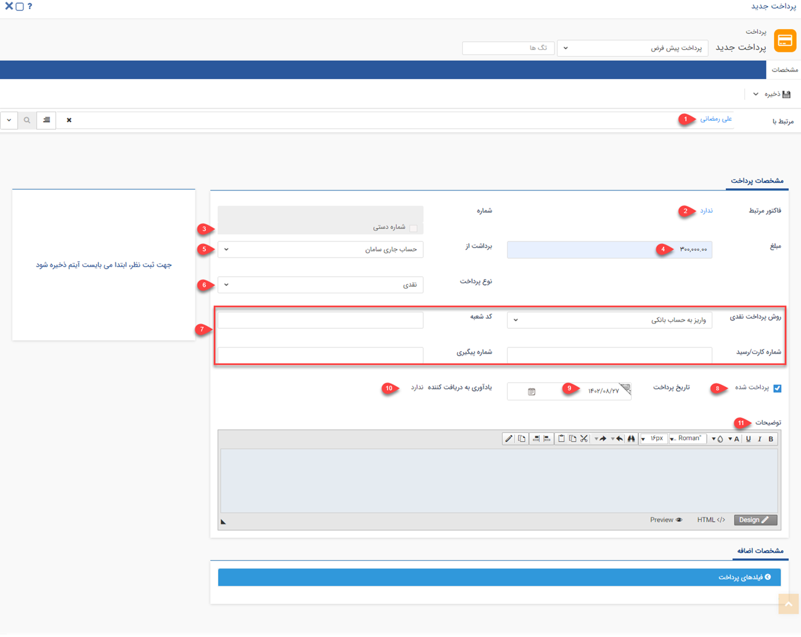

#  ثبت پرداخت جدید
چنانچه پرداختی از جانب سازمان شما به هویتی (مثلاً یکی از تامین‌کنندگان) انجام شده‌باشد،‌ باید با استفاده از آیتم پرداخت، آن را در سوابق هویت (تامین‌کننده) ثبت کنید. با استفاده از این آیتم می‌توانید پرداخت‌های نقدی، چکی یا اعتباری مرتبط با تامین‌کنندگان خود را ثبت نمایید. با ثبت و تایید پرداخت برای یک هویت، **به میزان درج شده در آیتم پرداخت**، از **بستانکاری او کم** می‌شود. به عبارت دیگر از بدهکاری شما به مشتری کاسته می‌شود. 
لازم به ذکر است که پرداخت همیشه برای تامین‌کننده و برای پرداخت بدهی‌های ناشی از خرید ثبت نمی‌شود. پرداخت ممکن است بنا به هر دلیلی مانند عودت کالا و عودت وجه برای مشتری نیز ثبت شود. 

## مسیرهای ثبت پرداخت
برای ثبت پرداخت جدید مسیرهای‌ مختلفی وجود دارد. از طریق یکی از مسیرهای زیر اقدام به ثبت پرداخت نمایید: 

- **ویجت دسترسی سریع** > **پرداخت**

- **تب فروش** > **پرداخت** > **زیرنوع پرداخت** > **افزودن پرداخت**

- **صفحه اصلی پروفایل مخاطب** > **آیتم جدید** > **پرداخت جدید**

برای مشاهده لیست «آیتم‌های جدید» بر روی فلش کنار «تماس جدید» (قابل مشاهده در نوار سفید بالای صفحه) مراجعه نمایید.

- **صفحه اصلی پروفایل مخاطب** > **تب سوابق** > **پرداخت جدید**

- **صفحه اصلی پروفایل مخاطب** > **تب دریافت/پرداخت** > **پرداخت جدید**

> **نکته** 
> توجه داشته باشید که چنانچه از صفحه هویت مورد نظر اقدام به ثبت پرداخت نمایید (مسیر سوم، چهارم و پنجم)، بخش «مرتبط با» به صورت خودکار با نام هویت پر می‌شود. به عبارت دیگر پرداخت به نام هویت ثبت می‌شود. اما اگر از مسیرهای صفحه اصلی (مسیر اول و دوم) اقدام به ثبت پرداخت نمایید، باید نام هویت را در قسمت «مرتبط با» جستجو و انتخاب کنید. 

## شیوه‌ی ثبت پرداخت
در صورت داشتن چند زیرنوع پرداخت، به انتخاب صحیح آن توجه داشته‌باشید. زیرنوع آیتم در قسمت بالای صفحه قابل مشاهده و قابل تغییر می‌باشد. در تصویر زیر، «پرداخت پیش‌فرض» برای ثبت نمونه انتخاب شده‌است. 
برای ثبت پرداخت لازم است فیلدهای مورد نیاز آیتم را با اطلاعات موجود تکمیل و سپس ذخیره نمایید. مشخصات پرداخت‌ها در پیام‌گستر به شرح زیر می‌باشد: 

1. **مرتبط با**: نام هویتی که این پرداخت برای او ثبت شده را در این قسمت درج کنید. چنانچه پیش‌تر به آن اشاره شد، اگر از صفحه هویت اقدام به ثبت پرداخت کرده‌باشید، نام هویت به صورت خودکار در این بخش ثبت شده‌است. 
2. **فاکتور مرتبط:** در صورتی که این پرداخت مرتبط با یک فاکتور خرید باشد، از قسمت «فاکتور مرتبط» می‌توانید از لیست فاکتورهای خرید موجود در سوابق این تامین‌کننده، فاکتور خرید مورد نظر را انتخاب و به این پرداخت الصاق کنید. 
3. **شماره پرداخت:** در صورتی که مجوز شماره‌گذاری این نوع پرداخت را داشته باشید، می‌توانید به صورت دستی این پرداخت را شماره‌گذاری کنید. در غیر این صورت پس از ذخیره پرداخت، کاربرانی که مجوز شماره‌گذاری داشته‌باشند آن را در کارتابل پرداخت‌های خود مشاهده خواهند‌ نمود و می‌توانند آن را شماره‌گذاری کنند. در صورت نیاز، کاربر دارای مجوز شماره‌گذاری پرداخت، ویرایش شماره پس از شماره‌گذاری یا مدیر مالی می‌تواند این شماره را به دلخواه تغییر دهد. 
4. **مبلغ:** مبلغ پرداخت شده را وارد کنید. 
5. **برداشت از:** حسابی که مبلغ از آن برداشت شده‌است را مشخص کنید. توجه داشته باشید که شما فقط می‌توانید از بین حساب‌‌های تعریف شده، گزینه‌ی مورد نظر را انتخاب نمایید. در صورت نیاز به تعریف حساب دیگر (افزودن گزینه‌ی جدید) آن را از مدیر سیستم خود بخواهید. 

> **راهنمای مدیر سیستم** 
> لیست حساب‌های مالی نمایش داده شده در این قسمت را می‌توانید از قسمت [مدیریت حساب های مالی](https://github.com/1stco/PayamGostarDocs/blob/master/Help/Basic-Information/Financial-account-management/Financial-account-management.md) ویرایش کنید. 

6. **نوع پرداخت:** نوع پرداخت را از بین عناوین نمایش داده‌شده انتخاب نمایید. این پرداخت می‌تواند به صورت نقدی، چکی یا اعتباری باشد. توجه داشته‌باشید که که ممکن است امکان انتخاب همه‌ی انواع پرداخت برای شما مجاز نباشد. این محدودیتی است که از طرف مدیر سیستم برای این زیرنوع پرداخت اعمال شده‌است. 
7. **جزئیات پرداخت:** این بخش با توجه به نوع پرداختی که مشخص کرده‌اید متفاوت خواهد بود. در صورت انتخاب هر یک از انواع پرداخت (نقدی/چکی/اعتباری) فیلدهای متناسب با آن در این بخش نمایش داده‌می‌شود.

### فیلدهای پرداخت نقدی
- **روش پرداخت نقدی:** در این فیلد می‌توانید روش پرداخت وجه را از بین گزینه‌های کارت به کارت، واریز به حساب بانکی، پرداخت آنلاین و پرداخت حضوری انتخاب کنید.
- **کد شعبه:** در صورت نیاز، کد شعبه‌ای که واریز را در آن انجام داده‌اید در این قسمت درج کنید.
- **شماره کارت/رسید:** شماره رسید واریزی و یا شماره کارتی که واریز به آن انجام گرفته‌است را در این قسمت درج نمایید.
- **شماره پیگیری:** در واریز وجه می‌توانید شماره پیگیری مندرج در فیش واریز را در این قسمت ثبت نمایید.

### فیلدهای پرداخت چکی
- **بانک:** مشخص کنید چک را از کدام بانک صادر کرده‌اید. درج بانک در اطلاعات پرداخت به شما کمک می‌کند برای اطمینان از کافی بودن موجودی حساب‌های مربوطه به راحتی گزارش دریافت نمایید.
- **شماره چک:** شماره چکی که صادر کرده‌اید را درج نمایید تا در صورت نیاز بتوانید آن را پیگیری کنید.
- **سررسید:** تاریخ سررسید چک را در این قسمت ثبت نمایید.

### فیلدهای پرداخت اعتباری
- **سررسید:** تاریخی که برای پرداخت اعتباری با تامین‌کننده خود مقرر کرده‌اید را ثبت نمایید.
8. **پرداخت شده:** در صورتی که نوع پرداخت شما نقدی باشد،‌این چک باکس به صورت خودکار فعال است؛ چراکه وجه قطعا از جانب شما پرداخت شده است. در صورت انتخاب پرداخت چکی یا اعتباری، شما باید **بعد از پرداخت** این گزینه را فعال کنید.
9. **تاریخ پرداخت:** در حالت پرداخت نقدی،‌ درج تاریخ پرداخت به هنگام ثبت الزامی است. این تاریخ لزوما با تاریخ ثبت آیتم پرداخت یکسان نیست. به عنوان مثال ممکن است شما پرداخت وجه را روز گذشته انجام داده باشید و یک روز بعد اقدام به ثبت پرداخت آن در سیستم نمایید. در این قسمت باید تاریخ پرداخت اصلی (در مثال قبل، روز گذشته) را لحاظ کنید. در صورت پرداخت چکی و یا اعتباری می‌توانید آن را در آینده و به هنگام تسویه چک و یا بدهی اعتباری خود ثبت نمایید.
10. **یادآوری به دریافت‌کننده:** پس از ثبت و ذخیره پرداخت می‌توانید یادآوری به دریافت‌کننده را فعال نمایید. با این کار در زمان تعیین‌شده توسط شما،‌ برای دریافت‌کننده (مرتبط با) پیامی با متن انتخابی شما ارسال می‌شود. برای تنظیم پیام کافیست بر روی «ندارد» آبی رنگ،‌ کلیک نمایید.

در صفحه نمایش داده‌شده تاریخ و زمان ارسال را مشخص نمایید. در صورت نیاز می‌توانید رسانه و خط ارسال پیام یادآوری را نیز تغییر دهید.  

> **نکته** 
> توجه داشته باشید که این پیام به منظور یادآوری برای تامین‌کننده (شخص دریافت‌کننده) ارسال می‌شود. فلذا در نوشتن متن پیام دقت نمایید. 

در صورت نیاز به تغییر متن پیام پیش‌فرض، آن را از همین بخش ویرایش نمایید. در متن پیام خود می‌توانید از عبارات هوشمند کنار صفحه نیز استفاده کنید. با این کار متن پیام با اطلاعات مخاطب شما پر می‌شود. به عنوان مثال اگر در متن پیام خود از عبارت کلیدی «پروفایل مرتبط» استفاده کنید، نام تامین‌کننده در پیام‌گستر به صورت خودکار به جای این عبارت قرار می‌گیرد. پس از تکمیل اطلاعات، یادآوری تنظیم شده را ذخیره کرده و در صفحه پرداخت به تکمیل فیلدهای آیتم پرداخت ادامه دهید. 

11. **توضیحات:** اگر توضیحات بیشتری مرتبط با این پرداخت وجود دارد، می‌توانید در این قسمت ثبت کنید.

> **نکته**  
> اگر طی روند شخصی‌سازی، فیلدی برای ثبت اطلاعات در پرداخت در نظر گرفته‌شده باشد، آن را در  قسمت «مشخصات اضافه» مشاهده می‌کنید. 

در نهایت کافیست بر روی دکمه «ذخیره» در سمت راست بالای صفحه کلیک نمایید. پس از ذخیره پرداخت، سایر اطلاعات و قابلیت‌های موجود در مورد آن به شما نمایش داده‌می‌شود. برای کسب اطلاعات بیشتر در این خصوص به راهنمای [ اطلاعات مشترک سوابق](https://github.com/1stco/PayamGostarDocs/blob/master/Help/Integrated-bank/Database/Records/Joint-record-information/Joint-record-information.md) مراجعه نمایید. 