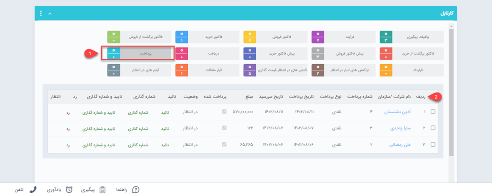

# تایید و شماره گذاری پرداخت ها
در صورتی که از قسمت [تنظیمات، شخصی سازی](https://github.com/1stco/PayamGostarDocs/tree/master/Help/Settings/Personalization-crm/Factor-management/Factor-management.md) CRM ، تیک مربوط به نیاز به تایید یا نیاز به شماره گذاری پرداخت را انتخاب نموده باشید، بعد از صدور هر کدام از این آیتم ها توسط کارشناسان به تایید/شماره گذاری نیاز خواهند داشت. کاربر دارای مجوز تایید و/یا شماره گذاری آن آیتم شخصی است که می تواند از طریق این صفحه کلیه آیتم های صادر شده را مشاهده، بررسی و تایید و یا شماره گذاری و یا رد نماید.

> **نکته** 
 پس از تایید پرداخت، این آیتم قابلیت ویرایش و حذف نخواهد داشت مگر کاربر دارنده مجوز ویرایش  پس از شماره گذاری/ تایید ،  حذف  پس از شماره گذاری/ تایید و یا  " مجوز مدیر مالی". 

پرداخت‌هایی که به تایید/رد و یا شماره‌گذاری نیاز داشته باشند، از طریق کارتابل به شخص مسئول نمایش داده می‌شوند. برای مشاهده این پرداخت‌ها می‌توانید از طریق **ویجت کارتابل** و یا **کارتابل من** > **پرداخت** (در نوار بالا) اقدام نمایید. کافیست، در یکی از دو مسیر بر روی کارتابل **پرداخت** کلیک نمایید. پرداخت‌های در انتظار تایید در قسمت پایین نمایش داده می‌شود. با کلیک بر روی هر ردیف، پرداخت مربوط به مشتری باز خواهد شد. با زدن دکمه‌های شماره‌گذاری، تایید و رد در بالای صفحه، اقدام مورد نیاز را انجام دهید. البته امکان تایید/رد و شماره‌‌گذای از طریق کلیدهای نمایش داده شده در هر سطر نیز امکان‌پذیر می‌باشد.
 
 
 
 > **نکته** 
  می‌توانید برای اطلاع مسئول و یا ثبت کننده آیتم از تایید و یا رد آیتم موردنظر، پیامی را از طریق اطلاعات پایه ، [ مدیریت پیام‌های سیستم](https://github.com/1stco/PayamGostarDocs/blob/master/Help/Basic-Information/Manage-system-messages/Manage-system-messages.md) تنظیم کنید. 

- پس از شماره‌گذاری توسط مسئول
، تنها کاربر دارای مجوز «ویرایش شماره پس از شماره گذاری» یا «مدیر مالی» قادر به ویرایش شماره‌ی پرداخت خواهد بود.
- پس از تایید 
پرداخت توسط مسئول، تنها کاربر دارای مجوز «بازگشت به وضعیت در انتظار تایید» یا «مدیر مالی» می‌تواند آن را به وضعیت در انتظار تایید بازگرداند.
- پس از تایید/رد و شماره‌گذاری پرداخت توسط مسئول، تنها کاربر دارای مجوز «ویرایش پس از شماره گذاری، تایید یا رد» یا «مدیر مالی» امکان ویرایش آن را خواهد داشت.
- پس از تایید/رد و شماره‌گذاری پرداخت توسط مسئول، تنها کاربر دارای مجوز «حذف پس از شماره گذاری، تایید یا رد» یا «مدیر مالی» امکان حذف آن را خواهد داشت.
