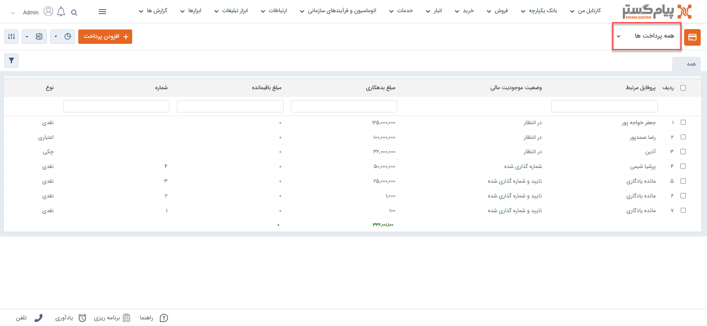
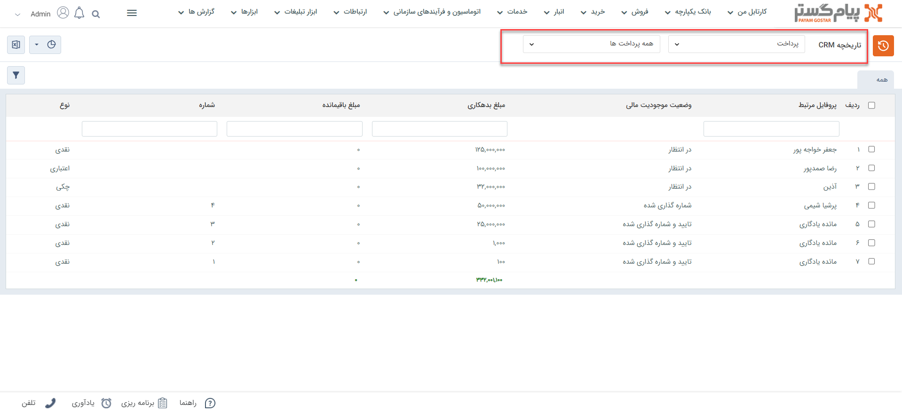
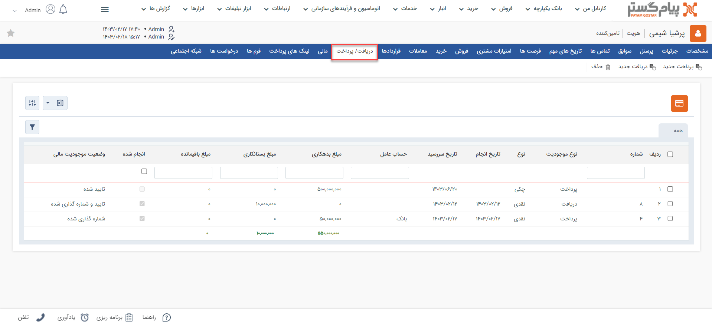
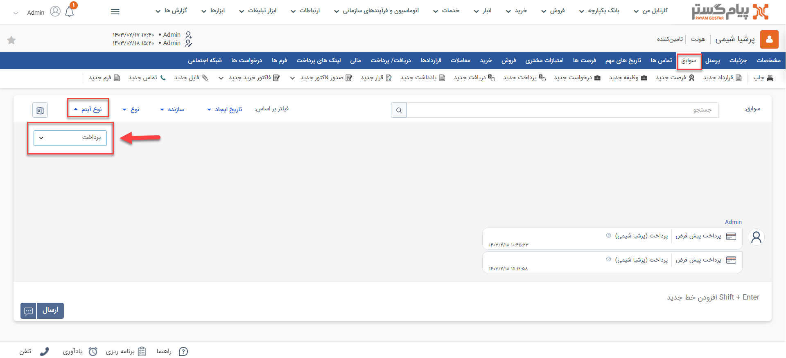
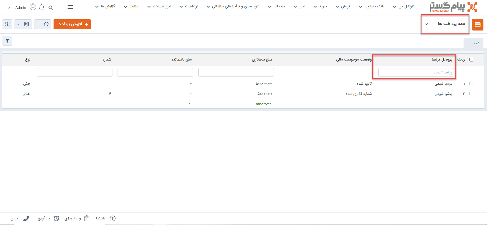
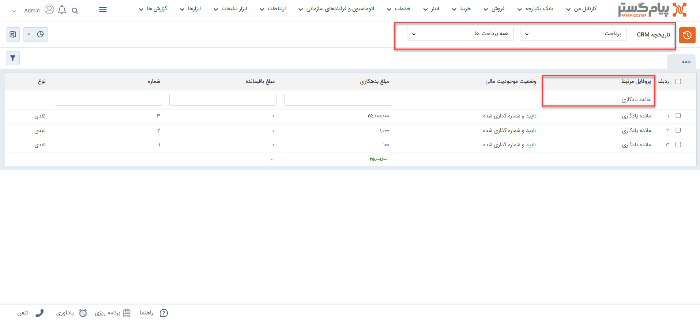

# مشاهده لیست پرداخت‌ها
دراین مقاله روش‌های مشاهده‌ی لیست پرداخت‌ها در دو حالت بررسی می‌شود: 
- [مشاهده لیست تمامی پرداخت‌های ثبت شده](#AllPayments)
- [مشاهده پرداخت‌های ثبت شده برای یک هویت](#customerPayments)

## مشاهده لیست همه پرداخت‌ها{#AllPayments}
برای مشاهده لیست همه پرداخت‌های ثبت شده در سیستم، می‌توانید از دو مسیر اقدام نمایید: 

- از مسیر **تب فروش** > **پرداخت** > **زیرنوع پرداخت** با انتخاب یکی از زیرنوع‌های پرداخت، وارد صفحه پرداخت‌ها می‌شوید. در این حالت، تمامی پرداخت‌های ثبت‌شده از زیرنوع انتخابی به شما نمایش داده‌می‌شود. 

از قسمت بالای صفحه می‌توانید سایر زیرنوع‌ها و یا همه را برای نمایش انتخاب نمایید. با انتخاب همه، تمامی پرداخت‌ها (از همه زیرنوع‌ها) در لیست به شما نمایش داده‌می‌شود.

- از مسیر **تب بانک یکپارچه** > **تاریخچه CRM**  می توانید با اعمال فیلتر «نوع» بر روی پرداخت و انتخاب زیرنوع مورد نظر/همه در فیلتر کناری، تمامی پرداخت‌های ثبت شده را مشاهده نمایید.

> **نکته** 
> در صورت داشتن مجوز مشاهده لیست زیرنوع‌های پرداخت، شما می‌توانید تمامی پرداخت‌های ثبت شده را در این قسمت‌ها مشاهده نمایید. در غیراین صورت تنها مجاز به مشاهده پرداخت‌هایی که خودتان ثبت کرده‌اید، خواهید بود. 

## مشاهده لیست پرداخت‌های یک هویت{#customerPayments}
برای مشاهده لیست پرداخت‌های ثبت شده برای یک مخاطب می‌توانید یکی از چهار مسیر زیر را انتخاب نمایید: 

- از طریق صفحه **پروفایل مخاطب** > **تب دریافت/پرداخت** می‌توانید به پرداخت‌‌های مشتری دسترسی داشته‌باشید. بدین منظور با استفاده از ویجت جستجوی سریع، وارد صفحه پروفایل هویت مورد نظر شوید. در صفحه اصلی پروفایل هویت از قسمت «دریافت/پرداخت» می‌توانید تمامی پرداخت‌‌های مخاطب را مشاهده نمایید.  
توجه داشته‌باشید که در این صفحه همه‌‌ی دریافت‌ها و پرداخت‌ها در کنار هم به شما نمایش داده‌می‌شود. برای اینکه فقط پرداخت‌‌ها را مشاهده نمایید، با استفاده از فیلتر بالای صفحه، در قسمت نوع، «پرداخت‌» را انتخاب نمایید. 

- از طریق صفحه **پروفایل مخاطب** > **تب سوابق** نیز می‌توانید به پرداخت‌های ثبت شده برای مخاطب دسترسی داشته‌باشید. بدین منظور با استفاده از ویجت جستجوی سریع، وارد صفحه پروفایل هویت مورد نظر شوید. در صفحه اصلی پروفایل هویت، در تب سوابق، گزینه «پرداخت‌» را در لیست «نوع آیتم» انتخاب نمایید تا پرداخت‌‌های  ثبت‌شده برای هویت مورد نظر را مشاهده کنید. 

- از طریق **تب فروش** > **پرداخت** > **زیرنوع پرداخت** به صفحه لیست پرداخت‌ها رفته و در صورت نیاز، زیرنوع پرداخت را به «همه پرداخت‌ها» تغییر دهید. با استفاده از جستجوی «پروفایل مرتبط» پرداخت‌های ثبت شده برای هویت مورد نظر را جدا کنید. بدین منظور کافیست نام هویت را در  قسمت مربوطه نوشته و Enter کنید.

- از طریق **تب بانک یکپارچه** > **تاریخچه CRM** با اعمال فیلتر،  پرداخت‌ها را یافته  و با استفاده از جستجوی «پروفایل مرتبط» پرداخت‌های هویت مورد نظر را جدا کنید. بدین منظور کافیست نام هویت را در قسمت مربوطه نوشته و Enter کنید.

> **نکته** 
> برای مشاهده پرداخت‌ها در سابقه یک هویت باید مجوز مشاهده سوابق را بر روی آن زیرنوع هویت و همچنین مشاهده آیتم را در زیرنوع‌های پرداخت داشته‌باشید.  