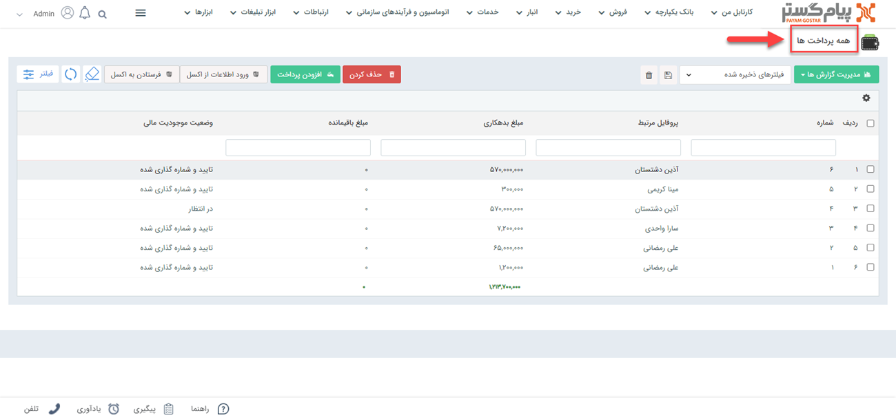
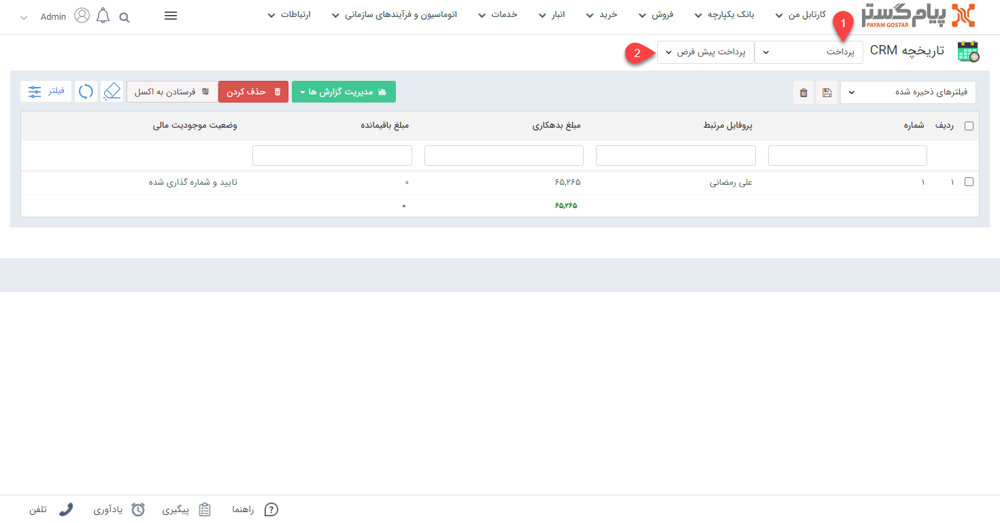
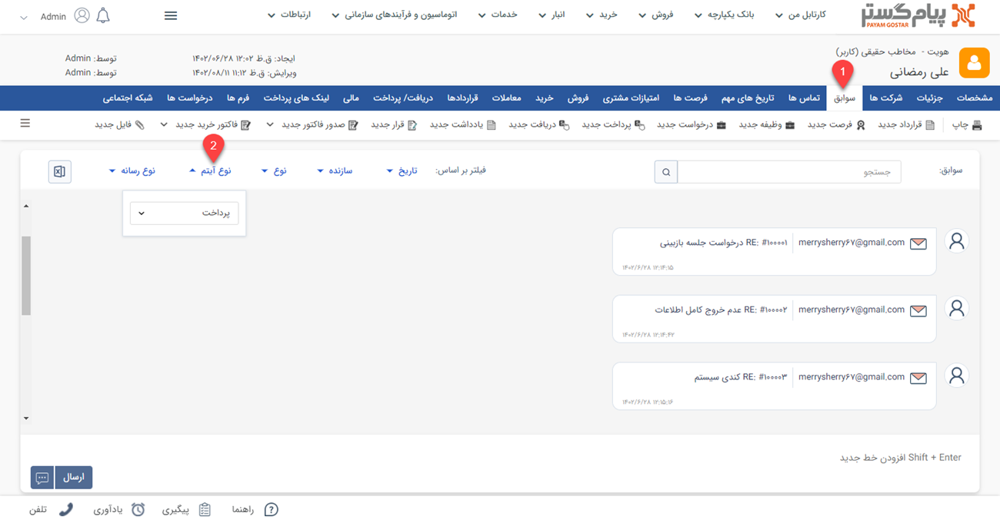
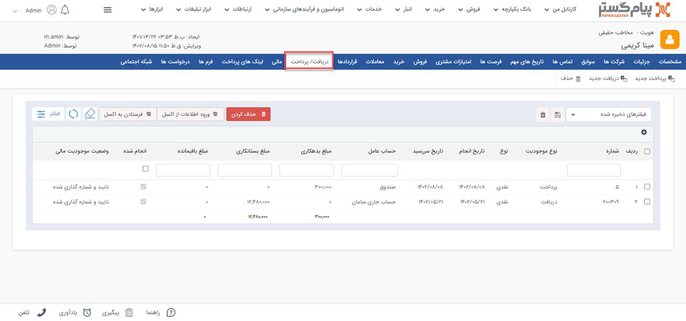
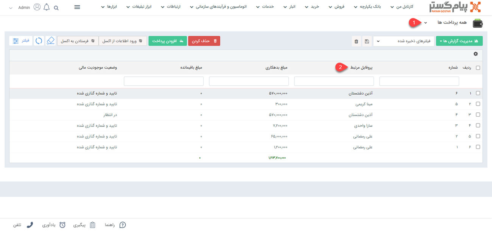
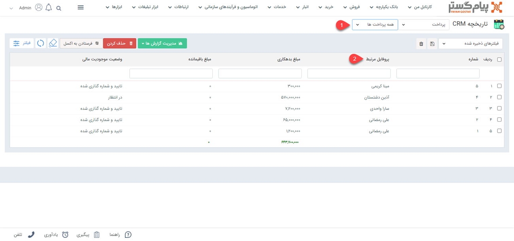

# مشاهده لیست پرداخت‌ها
دراین مقاله روش‌های مشاهده‌ی لیست پرداخت‌ها در دو حالت بررسی می‌شود:
- [مشاهده لیست تمامی پرداخت‌های ثبت شده](#AllPayments)
- [مشاهده پرداخت‌های ثبت شده برای یک هویت](#CostumerPayments)

{#AllPayments}
## مشاهده لیست همه پرداخت‌ها 
برای مشاهده لیست همه پرداخت‌های ثبت شده دو روش وجود دارد: 
- از طریق **تب فروش** > **پرداخت** > **زیرنوع پرداخت**، تمامی پرداخت‌های ثبت شده از نوع زیرنوع انتخابی شما،‌ نمایش داده می‌شود.

از قسمت بالای صفحه می‌توانید سایر زیرنوع‌ها و یا همه را برای نمایش انتخاب نمایید. با انتخاب همه، تمامی پرداخت‌ها (از همه زیرنوع‌ها) در لیست به شما نمایش داده می‌شود.

- از طریق **تب بانک یکپارچه** > **تاریخچه CRM**  می توانید با اعمال فیلتر نوع (شماره ۱) بر روی پرداخت و انتخاب زیرنوع مورد نظر/همه (شماره ۲)، تمامی پرداخت‌های ثبت شده را مشاهده نمایید.

{#CostumerPayments}
## مشاهده لیست پرداخت‌های یک هویت
برای مشاهده لیست پرداخت‌های ثبت شده برای یک مخاطب (پرداخت از جانب شما به مخاطب) می‌توانید از چهار روش زیر اقدام نمایید:
- از طریق صفحه **پروفایل مخاطب** > **تب سوابق** می‌توانید به پرداخت‌های مخاطب دسترسی داشته باشید. بدین منظور با استفاده از ویجت جستجوی سریع، صفحه پروفایل هویت مورد نظر را باز کنید. در صفحه اصلی پروفایل هویت از قسمت سوابق (شماره ۱) با اعمال فیلتر روی "نوع آیتم" (شماره ۲) و انتخاب «پرداخت» می‌توانید پرداخت‌های هویت مورد نظر خود را مشاهده نمایید.

- از طریق صفحه **پروفایل مخاطب** > **تب دریافت/پرداخت** می‌توانید به پرداخت‌های مشتری دسترسی داشته باشید. بدین منظور با استفاده از ویجت جستجوی سریع صفحه پروفایل هویت مورد نظر را باز کنید. در صفحه اصلی پروفایل هویت از قسمت دریافت/پرداخت می‌توانید تمامی پرداخت‌های مخاطب را (در کنار دریافت‌های وی) مشاهده نمایید.

- از طریق **تب فروش** > **پرداخت** > **زیرنوع پرداخت** به صفحه لیست پرداخت‌ها رفته و در صورت نیاز زیرنوع پرداخت (شماره ۱) را به «همه پرداخت‌ها» تغییر دهید. با استفاده از جستجوی «پروفایل مرتبط» (شماره ۲) پرداخت‌های 
ثبت شده برای هویت مورد نظر را جدا کنید. بدین منظور کافیست نام هویت را در  قسمت مربوطه نوشته و Enter کنید.

- از طریق **تب بانک یکپارچه** > **تاریخچه CRM** با اعمال فیلتر(شماره ۱)،  پرداخت‌ها را یافته  و با استفاده از جستجوی «پروفایل مرتبط» (شماره ۲) پرداخت‌های 
هویت مورد نظر را جدا کنید. بدین منظور کافیست نام هویت را در قسمت مربوطه نوشته و Enter کنید.

> **نکته** 
> در پرداخت‌هایی که در سابقه هویت ثبت می‌شود، مخاطب (مرتبط با در پرداخت)‌ دریافت‌کننده و شما پرداخت‌کننده هستید.