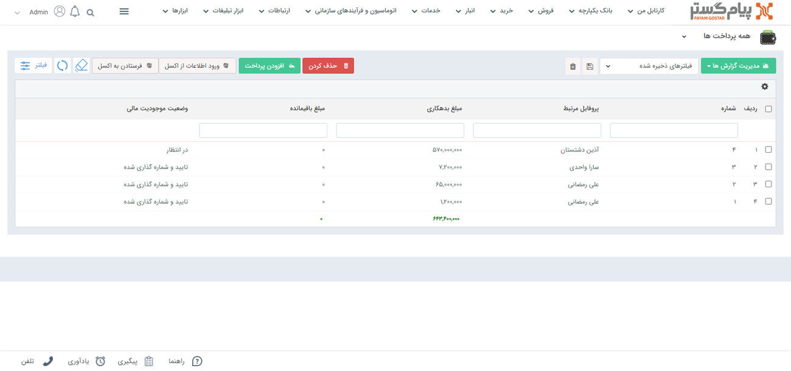
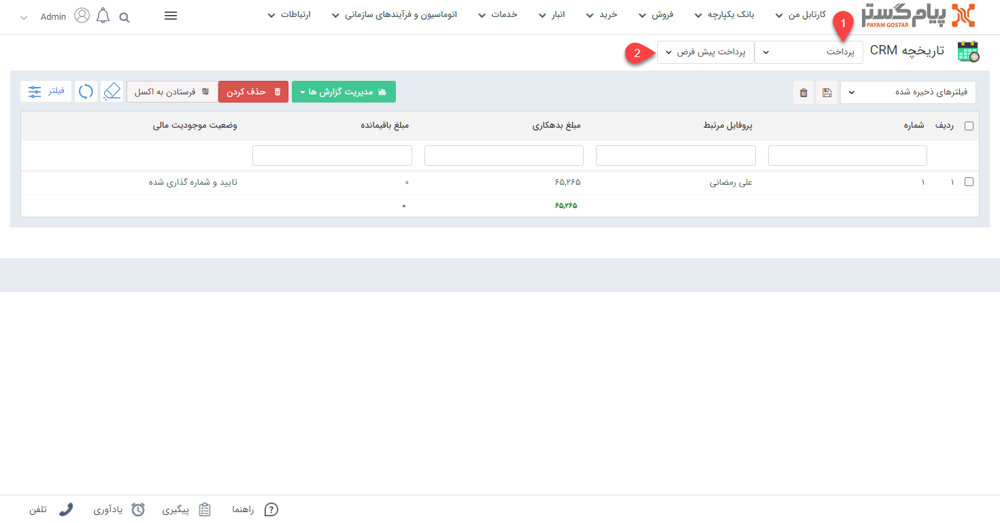
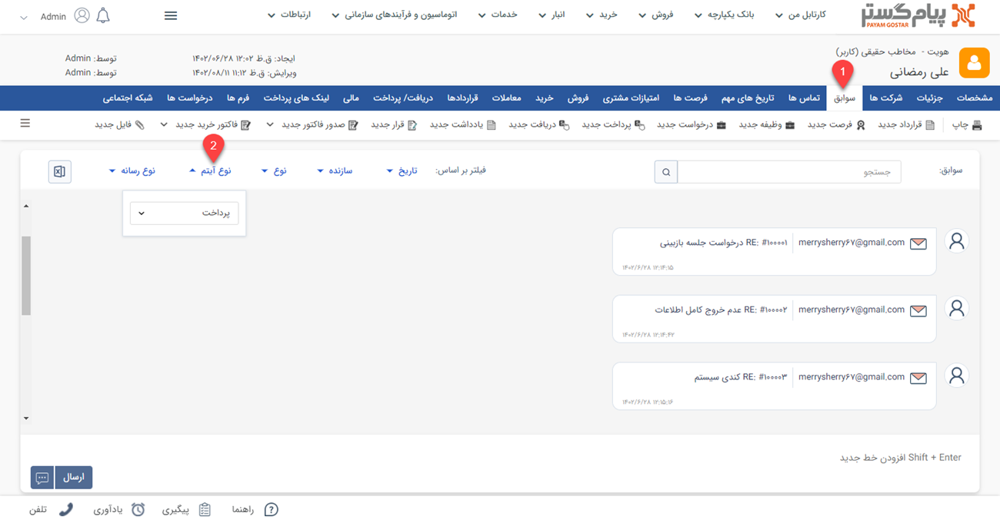
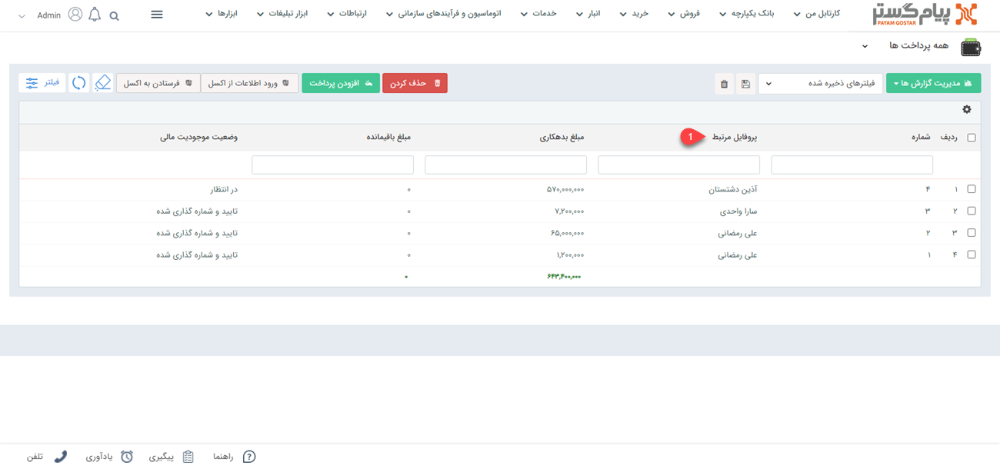
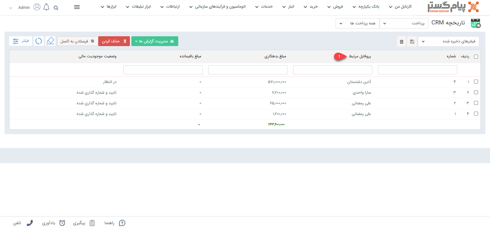

# مشاهده لیست پرداخت‌ها
دراین مقاله روش‌های مشاهده‌ی لیست پرداخت‌ها در دو حالت بررسی می‌شود:
- [مشاهده لیست تمامی پرداخت‌های ثبت شده](#AllPaymentList)
- [مشاهده پرداخت‌های ثبت شده برای یک هویت](#CostumerPaymentList)

## مشاهده لیست همه پرداخت‌ها {#AllPaymentList}
برای مشاهده لیست همه پرداخت‌های ثبت شده دو روش وجود دارد:
- از طریق **تب فروش** > **پرداخت**، تمامی زیرنوع‌های پرداخت‌  قابل مشاهده است. با کلیک بر روی هر زیرنوع، لیست آن به شما نمایش داده می‌شود.

البته از قسمت بالای صفحه می‌توانید سایر زیرنوع‌ها و یا همه را برای نمایش انتخاب نمایید. با انتخاب همه، تمامی پرداخت‌ها (از همه زیرنوع‌ها) در لیست به شما نمایش داده می‌شود.

- از طریق **تب بانک یکپارچه** > **تاریخچه CRM**  می توانید با اعمال فیلتر نوع (شماره ۱) بر روی پرداخت و انتخاب زیرنوع مورد نظر/همه (شماره ۲)، تمامی پرداخت‌های ثبت شده را مشاهده نمایید.

## مشاهده لیست پرداخت‌های یک هویت{#CostumerPaymentList}
برای مشاهده لیست پرداخت‌های ثبت شده برای یک مشتری می‌توانید از سه روش زیر اقدام نمایید:
- از طریق صفحه **پروفایل مشتری** > **تب سوابق** می‌توانید به پرداخت‌های مشتری دسترسی داشته باشید. بدین منظور با استفاده از ویجت جستجوی سریع صفحه پروفایل هویت مورد نظر را باز کنید. در صفحه اصلی پروفایل هویت از قسمت سوابق (شماره ۱) با اعمال فیلتر روی "نوع آیتم" (شماره ۲) و انتخاب پرداخت می‌توانید پرداخت‌های هویت مورد نظر خود را مشاهده نمایید.

- از طریق صفحه **پروفایل مشتری** > **تب دریافت/پرداخت** می‌توانید به پرداخت‌های مشتری دسترسی داشته باشید. بدین منظور با استفاده از ویجت جستجوی سریع صفحه پروفایل هویت مورد نظر را باز کنید. در صفحه اصلی پروفایل هویت از قسمت دریافت/پرداخت می‌توانید تمامی پرداخت‌های مشتری را (در کنار دریافت‌های وی) مشاهده نمایید.

- برای مشاهده لیست پرداخت از طریق **تب فروش** > **پرداخت** > **زیرنوع پرداخت** به صفحه لیست پرداخت‌ها رفته و در صورت نیاز زیرنوع پرداخت را به «همه پرداخت‌ها» (شماره ۱) تغییر دهید. با استفاده از جستجوی «پروفایل مرتبط» (شماره ۲) پرداخت‌های 
هویت مورد نظر را جدا کنید. بدین منظور کافیست نام هویت را در این قسمت نوشته و Enter کنید.

- برای مشاهده لیست پرداخت از طریق **تب بانک یکپارچه** > **تاریخچه CRM** با اعمال فیلتر  پرداخت‌ها را جدا کرده (شماره ۱) و با استفاده از جستجوی «پروفایل مرتبط» (شماره ۲) پرداخت‌های 
هویت مورد نظر را جدا کنید. بدین منظور کافیست نام هویت را در این قسمت نوشته و Enter کنید.

