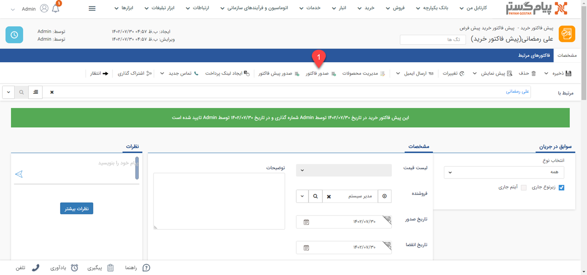

#  تبدیل پیش فاکتور خرید به فاکتور خرید

معمولا قبل از خرید نهایی، خریدار برای تامین کننده پیش فاکتور خرید ارسال می‌کند و در صورت تایید تامین کننده پیش فاکتور خرید صادر شده به فاکتور خرید تبدیل می‌شود. پیش فاکتور تعهدی برای خریدار به منظور پرداخت مبلغ قرارداد ایجاد نمی کند اما پس از صدور فاکتور مشتری به تامین کننده بستانکار خواهد شد.
 در پیام‌گستر دو روش برای تبدیل پیش فاکتور فروش به فاکتور فروش وجود دارد:
- در پیش فاکتور با انتخاب گزینه **صدور فاکتور** می‌توان آن پیش فاکتور را به فاکتور تبدیل کرد. 

- در لیست پیش فاکتورها هم می‌توان با راست کلیک بر روی آن‌ها و انتخاب صدور فاکتور فروش، آن پیش فاکتور را به نوع فاکتور مورد نظر تبدیل کرد. 

> **نکته**  
در تبدیل پیش فاکتور به فاکتور، در صورتیکه فیلد های اضافه شده یا نام فیلدهای اضافه پیش فاکتور و فاکتور یکسان باشد، مقادیر وارد شده آن فیلد ها نیز از پیش فاکتور به فاکتور منتقل می شود. 
